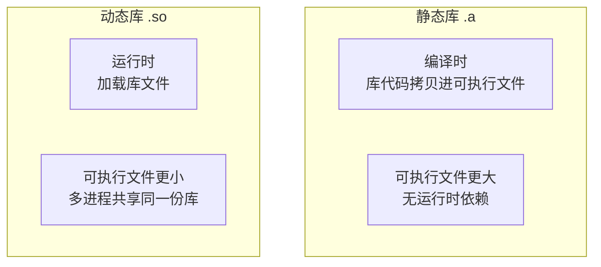

# 编译、链接与 CMake

## C++ 编译全流程


```bash
# 手动执行每个阶段（了解过程用）
g++ -E main.cpp -o main.i    # 预处理
g++ -S main.i  -o main.s    # 编译为汇编
g++ -c main.s  -o main.o    # 汇编为目标文件
g++ main.o     -o main      # 链接

# 实际开发一步到位
g++ -std=c++17 -O2 main.cpp -o main
```

常用编译选项：

| 选项 | 含义 |
|------|------|
| `-std=c++17` | 指定 C++ 标准 |
| `-O0 / -O2 / -O3` | 优化级别（0=无优化，2=推荐，3=激进）|
| `-g` | 生成调试信息（gdb 用）|
| `-Wall -Wextra` | 开启警告 |
| `-I<dir>` | 添加头文件搜索路径 |
| `-L<dir>` | 添加库文件搜索路径 |
| `-l<name>` | 链接库（`-lpthread` 链接 pthread）|

---

## 静态库 vs 动态库



```bash
# 创建静态库
g++ -c math.cpp -o math.o
ar rcs libmath.a math.o         # 打包成 .a
g++ main.cpp -L. -lmath -o main # 链接

# 创建动态库
g++ -fPIC -c math.cpp -o math.o # -fPIC：位置无关代码
g++ -shared -o libmath.so math.o
g++ main.cpp -L. -lmath -o main
export LD_LIBRARY_PATH=.:$LD_LIBRARY_PATH  # 运行时找到 .so
```

| | 静态库 `.a` | 动态库 `.so` |
|--|--|--|
| 链接时机 | 编译时 | 运行时 |
| 可执行文件大小 | 大 | 小 |
| 更新库 | 需要重新编译 | 替换 .so 即可 |
| 运行依赖 | 无 | 需要 .so 文件 |

---

## CMake 基础

### 最小工程结构

```
project/
├── CMakeLists.txt
├── src/
│   └── main.cpp
└── include/
    └── robot.h
```

```cmake
cmake_minimum_required(VERSION 3.16)
project(MyRobot VERSION 1.0 LANGUAGES CXX)

set(CMAKE_CXX_STANDARD 17)
set(CMAKE_CXX_STANDARD_REQUIRED ON)

# 添加可执行文件
add_executable(my_robot src/main.cpp)

# 添加头文件路径
target_include_directories(my_robot PRIVATE include/)

# 链接系统库
target_link_libraries(my_robot PRIVATE pthread)
```

```bash
mkdir build && cd build
cmake ..        # 生成构建文件
cmake --build . # 编译（等价于 make）
```

### 多目标与库

```cmake
# 创建静态库
add_library(robot_lib STATIC
    src/sensor.cpp
    src/controller.cpp
)
target_include_directories(robot_lib PUBLIC include/)

# 主程序链接库
add_executable(robot_app src/main.cpp)
target_link_libraries(robot_app PRIVATE robot_lib)
```

### 引入第三方库

```cmake
# 方式 1：find_package（系统已安装的库）
find_package(OpenCV REQUIRED)
target_link_libraries(my_target PRIVATE ${OpenCV_LIBS})
target_include_directories(my_target PRIVATE ${OpenCV_INCLUDE_DIRS})

# 方式 2：find_package（现代 CMake 写法，库提供 targets）
find_package(Eigen3 REQUIRED)
target_link_libraries(my_target PRIVATE Eigen3::Eigen)

# 方式 3：pkg-config
find_package(PkgConfig REQUIRED)
pkg_check_modules(ZMQ REQUIRED libzmq)
target_link_libraries(my_target PRIVATE ${ZMQ_LIBRARIES})
```

### ROS2 CMakeLists 典型写法

```cmake
cmake_minimum_required(VERSION 3.16)
project(my_node)

find_package(ament_cmake REQUIRED)
find_package(rclcpp REQUIRED)
find_package(std_msgs REQUIRED)

add_executable(my_node src/my_node.cpp)
ament_target_dependencies(my_node rclcpp std_msgs)

install(TARGETS my_node DESTINATION lib/${PROJECT_NAME})
ament_package()
```

---

## 常见链接错误

**undefined reference**：链接时找不到符号定义。

```bash
# 错误：undefined reference to `Robot::move()'
# 原因：.cpp 没有加入编译，或者库没有链接

# 修复：
add_executable(app main.cpp robot.cpp)  # 把 robot.cpp 加进来
# 或者
target_link_libraries(app PRIVATE robot_lib)
```

**multiple definition**：同一个符号定义了多次。

```cpp
// 常见原因：在头文件里定义了函数（而不是声明）
// robot.h
int get_id() { return 42; }  // ← 错误，多个 .cpp include 后重复定义

// 修复方案 1：声明放头文件，定义放 .cpp
// robot.h:   int get_id();
// robot.cpp: int get_id() { return 42; }

// 修复方案 2：加 inline
inline int get_id() { return 42; }  // 允许多次定义
```

---

## 面试常问

**Q：头文件为什么要加 `#pragma once` 或 include guard？**

同一个头文件被多个源文件包含，或间接被包含多次时，没有保护会导致类型重复定义编译报错。

```cpp
// 传统方式
#ifndef ROBOT_H
#define ROBOT_H
// ... 内容
#endif

// 现代方式（几乎所有编译器支持）
#pragma once
```

**Q：`-O2` 和 `-O0` 调试时有什么区别？**

`-O2` 下编译器会内联函数、重排指令、消除变量，gdb 调试时行号对不上、变量看不到。调试时用 `-O0 -g`，发布时用 `-O2`。

**Q：动态库升级时需要重新编译用它的程序吗？**

接口（函数签名）没变时不需要，直接替换 `.so` 文件即可，这也是动态库的主要优势。但如果改了类的成员变量布局（影响 `sizeof`），即使函数签名没变也需要重新编译。
