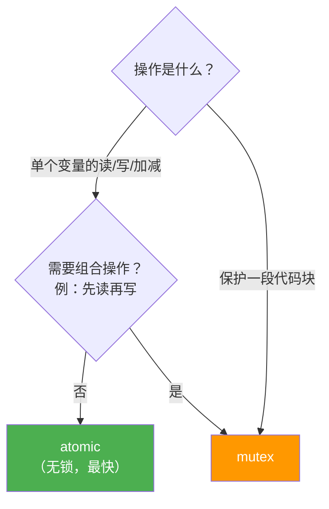
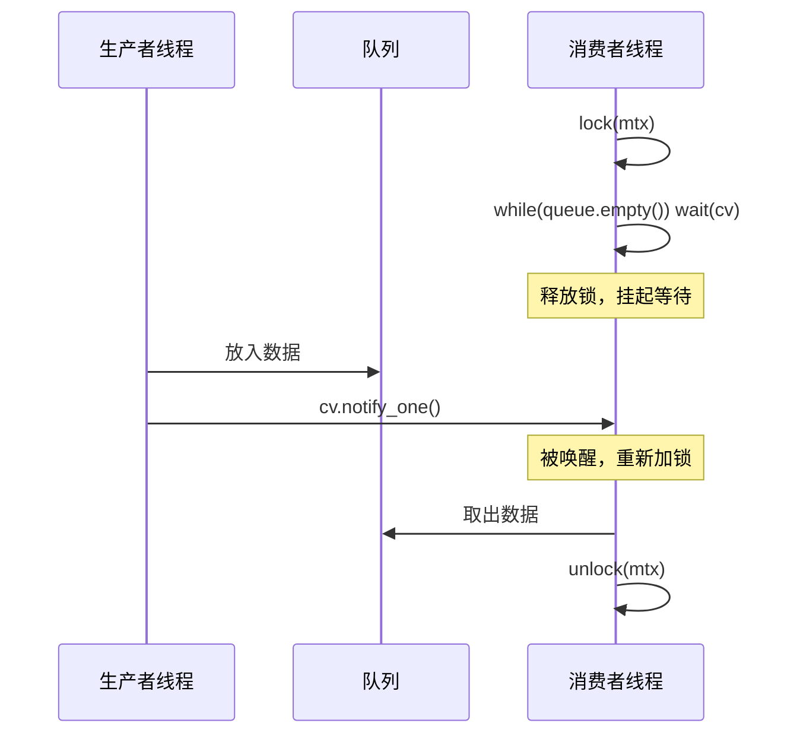
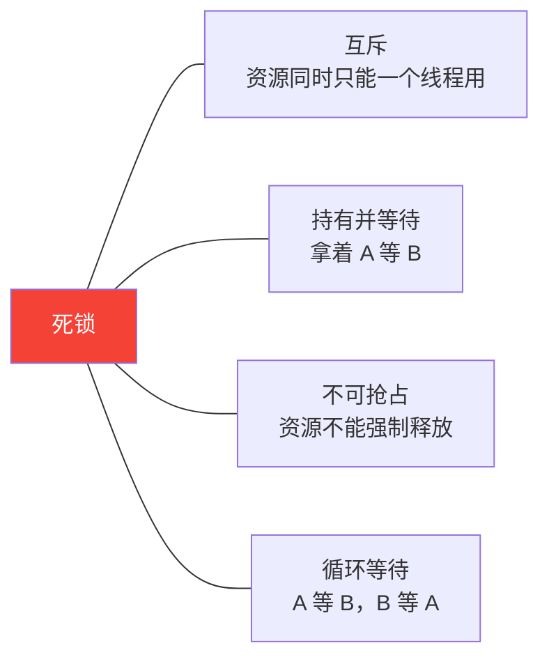

# 并发

## mutex vs atomic 怎么选



| | `atomic` | `mutex` |
|--|--|--|
| 适用 | 单个变量的原子读写 | 保护一段临界区代码 |
| 开销 | 低（CPU 指令级） | 高（可能陷入内核） |
| 能做组合操作 | 否 | 是 |

```cpp
// atomic：计数器自增，不需要 mutex
std::atomic<int> counter{0};
counter++;           // 原子操作，线程安全
counter.fetch_add(1, std::memory_order_relaxed);  // 显式指定内存序

// mutex：先判断再修改，必须是原子的整体
std::mutex mtx;
std::map<int, int> cache;

void update(int key, int val) {
    std::lock_guard<std::mutex> lock(mtx);
    if (cache.count(key) == 0)   // 判断
        cache[key] = val;        // 修改  ← 这两步必须原子，用 mutex
}
```

---

## lock_guard vs unique_lock

```cpp
// lock_guard：作用域内自动加锁/解锁，不能手动控制，开销更小
{
    std::lock_guard<std::mutex> lock(mtx);
    // ... 临界区
}  // 自动解锁

// unique_lock：可以手动 lock/unlock，支持条件变量，开销稍大
{
    std::unique_lock<std::mutex> lock(mtx);
    lock.unlock();   // 可以提前解锁
    // ... 非临界区工作
    lock.lock();     // 重新加锁
}
```

**原则**：不需要手动控制锁，用 `lock_guard`；需要配合条件变量或中途释放锁，用 `unique_lock`。

---

## 条件变量

用于线程间通知，典型场景：生产者-消费者。



```cpp
std::mutex mtx;
std::condition_variable cv;
std::queue<int> q;

// 生产者
void producer() {
    {
        std::lock_guard<std::mutex> lock(mtx);
        q.push(42);
    }
    cv.notify_one();  // 唤醒一个等待的消费者
}

// 消费者
void consumer() {
    std::unique_lock<std::mutex> lock(mtx);
    cv.wait(lock, [] { return !q.empty(); });  // 虚假唤醒安全
    int val = q.front();
    q.pop();
}
```

**`cv.wait` 的第二个参数（谓词）为什么重要**：线程可能被虚假唤醒（spurious wakeup），谓词会在每次唤醒后重新检查条件，等价于：

```cpp
while (q.empty())
    cv.wait(lock);
```

---

## 死锁

### 四个必要条件（缺一不可）



**打破任意一个就能避免死锁。**

### 典型死锁场景

```cpp
std::mutex mtxA, mtxB;

// 线程 1            线程 2
lock(mtxA);          lock(mtxB);
lock(mtxB); // 等    lock(mtxA); // 等
// ← 互相等待，死锁
```

### 三种解决方案

**方案 1：固定加锁顺序**（最简单）
```cpp
// 所有线程都按 A → B 的顺序加锁
lock(mtxA);
lock(mtxB);
```

**方案 2：`std::lock` 同时加锁**（两把锁都拿到才继续）
```cpp
std::unique_lock<std::mutex> la(mtxA, std::defer_lock);
std::unique_lock<std::mutex> lb(mtxB, std::defer_lock);
std::lock(la, lb);  // 原子地同时获取两个锁，内部自动处理顺序
```

**方案 3：`std::scoped_lock`（C++17，推荐）**
```cpp
std::scoped_lock lock(mtxA, mtxB);  // 同时加多个锁，自动解锁
```

---

## thread_local

每个线程拥有自己独立的副本，不需要加锁。

```cpp
thread_local int counter = 0;  // 每个线程有自己的 counter

void worker() {
    counter++;  // 不需要 mutex，各线程互不干扰
}
```

---

## 面试常问

**Q：`mutex` 加锁失败时线程会怎样？**

调用 `lock()` 时如果锁已被持有，线程会**阻塞**（陷入内核态等待），直到锁被释放。`try_lock()` 不阻塞，失败直接返回 `false`。

**Q：`atomic<bool>` 能替代 `mutex` 吗？**

不能完全替代。`atomic` 只保证单个变量的操作是原子的，无法保证多个变量或多步操作的原子性。需要保护一段逻辑时还是要用 `mutex`。

**Q：`notify_one` 和 `notify_all` 怎么选？**

只有一个消费者、或唤醒一个就够用 `notify_one`（更高效）；多个消费者都需要被通知用 `notify_all`。
