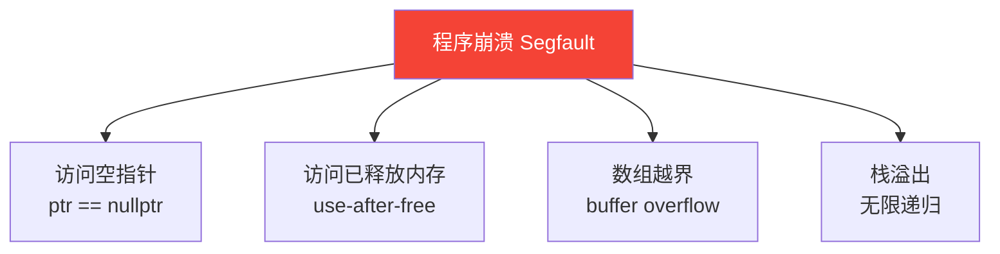
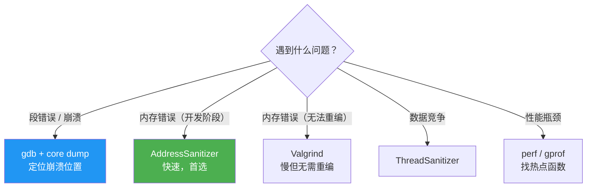

# 调试工具

## GDB 基础

```bash
g++ -g -O0 main.cpp -o main   # 必须加 -g 生成调试信息，-O0 关闭优化
gdb ./main
```

### 常用命令

| 命令 | 缩写 | 作用 |
|------|------|------|
| `run [args]` | `r` | 运行程序 |
| `break main` | `b` | 在 main 函数设断点 |
| `break file.cpp:42` | `b` | 在第 42 行设断点 |
| `next` | `n` | 执行下一行（不进入函数）|
| `step` | `s` | 执行下一行（进入函数）|
| `continue` | `c` | 继续运行到下一个断点 |
| `print var` | `p` | 打印变量值 |
| `backtrace` | `bt` | 打印调用栈 |
| `frame 2` | `f` | 切换到第 2 帧查看局部变量 |
| `info locals` | | 显示当前帧所有局部变量 |
| `watch var` | | 变量值改变时暂停 |
| `quit` | `q` | 退出 |

```bash
# 实际调试流程示例
(gdb) b main.cpp:25      # 第 25 行打断点
(gdb) r                  # 运行
(gdb) p robot.pos_       # 打印成员变量
(gdb) bt                 # 崩溃时看调用栈
(gdb) f 1                # 切到第 1 帧
(gdb) info locals        # 看局部变量
```

---

## Core Dump 分析

程序崩溃时操作系统将进程内存快照保存为 core 文件，事后分析崩溃原因。

```bash
# 开启 core dump（默认大小限制为 0，即不生成）
ulimit -c unlimited

# 运行程序，崩溃后生成 core 文件
./my_robot
# Segmentation fault (core dumped)

# 用 gdb 分析
gdb ./my_robot core

(gdb) bt           # 立刻看调用栈，定位崩溃位置
(gdb) f 0          # 切换到崩溃帧
(gdb) info locals  # 看崩溃时的局部变量
(gdb) p *ptr       # 看指针指向的内容
```

**最常见的崩溃原因：**



---

## AddressSanitizer（ASan）

编译时插桩，运行时检测内存错误，比 valgrind 快 2 倍，**开发阶段首选**。

```bash
g++ -fsanitize=address -g main.cpp -o main
./main
# 发现错误时打印详细报告 + 调用栈
```

能检测：
- **堆缓冲区溢出** heap-buffer-overflow
- **use-after-free** 访问已释放内存
- **use-after-return** 访问已销毁的栈变量
- **内存泄漏**（配合 LeakSanitizer）

```bash
# 同时开启多种 sanitizer
g++ -fsanitize=address,undefined -g main.cpp -o main
#                        ↑ UBSan：检测未定义行为（整数溢出、空指针解引用等）
```

---

## Valgrind

不需要重新编译，直接检测内存问题，但速度慢（约 10-50 倍）。

```bash
valgrind --leak-check=full --show-leak-kinds=all ./main
```

输出解读：

```
==12345== LEAK SUMMARY:
==12345==    definitely lost: 24 bytes in 1 blocks   ← 确认泄漏
==12345==    indirectly lost: 0 bytes in 0 blocks
==12345==      possibly lost: 0 bytes in 0 blocks    ← 可能泄漏
```

---

## perf 性能分析

找热点函数，定位性能瓶颈。

```bash
# 采样分析（不需要重新编译）
perf record ./my_robot
perf report            # 交互式查看热点函数

# 统计事件
perf stat ./my_robot   # 显示 cache miss、分支预测失败等硬件计数器
```

输出示例：
```
  52.3%  my_robot  my_robot        [.] process_scan
  18.1%  my_robot  my_robot        [.] build_map
   9.4%  my_robot  libc.so         [.] memcpy
```

说明 `process_scan` 占了 52% 的 CPU，是优化首要目标。

---

## 常见 Bug 模式与排查

### 段错误（Segmentation Fault）

```bash
# 第一步：加 -g 重新编译，复现崩溃
# 第二步：gdb bt 看调用栈
# 第三步：如果无法复现，分析 core dump
```

### 内存泄漏

```bash
# 优先用 ASan（快）
g++ -fsanitize=address -g main.cpp -o main && ./main

# 无法重新编译时用 valgrind
valgrind --leak-check=full ./main
```

### 数据竞争

```bash
# ThreadSanitizer（TSan）
g++ -fsanitize=thread -g main.cpp -o main
./main
# 检测到竞争时打印两个线程的访问位置
```

### 死锁排查

```bash
# 运行时卡住，gdb attach 到进程
gdb -p <pid>
(gdb) thread apply all bt  # 看所有线程的调用栈
# 找到互相等待 mutex 的线程
```

---

## 工具选型



---

## 面试常问

**Q：程序崩溃但没有 core 文件怎么办？**

先检查 `ulimit -c`（值为 0 时不生成），再检查 `/proc/sys/kernel/core_pattern` 确认 core 文件路径。容器环境里 core 文件路径可能指向宿主机，需要额外配置。

**Q：ASan 和 Valgrind 怎么选？**

能重新编译时用 ASan：速度快（2x 慢），CI 里跑。不能重新编译、或分析第三方库的内存问题时用 Valgrind。两者发现问题的能力大致相当，ASan 还能检测栈溢出。

**Q：发现内存泄漏但不知道在哪泄漏怎么办？**

ASan 报告里会给出分配内存时的调用栈（不只是泄漏点）。也可以用 `heaptrack` 或 Valgrind 的 `--track-origins=yes` 追踪分配来源。
