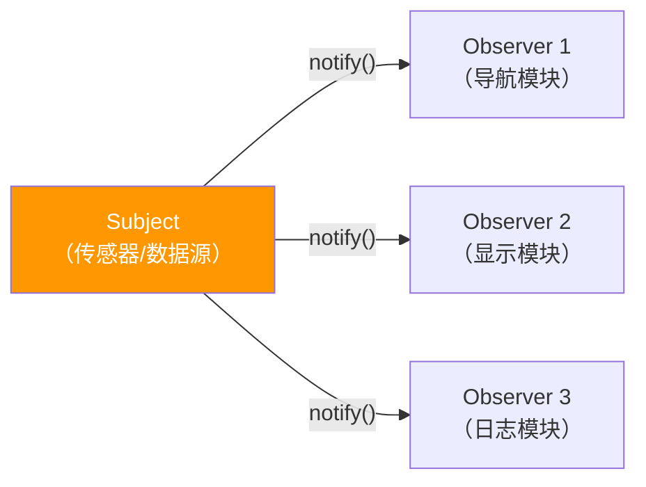
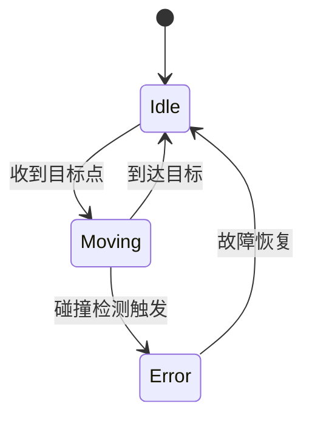

# 设计模式

机器人软件中最常用的几个模式，面试和实际开发都会遇到。

## 单例模式（Singleton）

保证一个类只有一个实例，全局访问点。常见于：配置管理、日志系统、设备管理器。

```cpp
class Logger {
public:
    static Logger& instance() {
        static Logger inst;   // C++11 保证线程安全的局部静态初始化
        return inst;
    }

    void log(const std::string& msg) {
        std::cout << msg << "\n";
    }

    // 禁止拷贝和移动
    Logger(const Logger&)            = delete;
    Logger& operator=(const Logger&) = delete;

private:
    Logger() = default;   // 构造函数私有
};

Logger::instance().log("hello");
```

**线程安全**：C++11 起，局部静态变量的初始化由编译器保证线程安全，不需要额外加锁。

---

## 观察者模式（Observer）

对象状态变化时自动通知所有订阅者。常见于：传感器数据分发、ROS Topic 的底层思想、UI 数据绑定（Qt 信号槽）。



```cpp
class Observer {
public:
    virtual void update(float value) = 0;
    virtual ~Observer() = default;
};

class Subject {
    std::vector<Observer*> observers_;
    float value_;
public:
    void subscribe(Observer* o)   { observers_.push_back(o); }
    void unsubscribe(Observer* o) {
        observers_.erase(std::remove(observers_.begin(), observers_.end(), o),
                         observers_.end());
    }

    void set_value(float v) {
        value_ = v;
        for (auto* o : observers_) o->update(v);  // 通知所有订阅者
    }
};

class NavModule : public Observer {
public:
    void update(float value) override {
        std::cout << "导航收到传感器数据: " << value << "\n";
    }
};
```

---

## 工厂模式（Factory）

把对象的创建和使用分离，调用方不需要知道具体类型。常见于：机器人驱动加载、插件系统、跨平台适配。

```cpp
class Robot {
public:
    virtual void move() = 0;
    virtual ~Robot() = default;
};

class ArmRobot : public Robot {
public:
    void move() override { std::cout << "机械臂运动\n"; }
};

class MobileRobot : public Robot {
public:
    void move() override { std::cout << "移动底盘运动\n"; }
};

// 工厂函数：根据字符串创建对应对象
std::unique_ptr<Robot> create_robot(const std::string& type) {
    if (type == "arm")    return std::make_unique<ArmRobot>();
    if (type == "mobile") return std::make_unique<MobileRobot>();
    return nullptr;
}

auto robot = create_robot("arm");
robot->move();
```

---

## 状态机模式（State Machine）

对象的行为随状态变化。机器人软件中极为常见：任务调度、夹爪控制、导航状态管理。



```cpp
enum class State { Idle, Moving, Error };

class RobotFSM {
    State state_ = State::Idle;
public:
    void on_goal_received() {
        if (state_ == State::Idle) {
            state_ = State::Moving;
            std::cout << "开始移动\n";
        }
    }

    void on_arrived() {
        if (state_ == State::Moving) {
            state_ = State::Idle;
            std::cout << "到达目标\n";
        }
    }

    void on_collision() {
        state_ = State::Error;
        std::cout << "碰撞，进入错误状态\n";
    }

    State state() const { return state_; }
};
```

---

## 命令模式（Command）

把操作封装成对象，支持撤销、队列、日志。常见于：机器人指令队列、操作回放。

```cpp
class Command {
public:
    virtual void execute() = 0;
    virtual void undo()    = 0;
    virtual ~Command() = default;
};

class MoveCommand : public Command {
    Robot& robot_;
    Point target_, prev_;
public:
    MoveCommand(Robot& r, Point target) : robot_(r), target_(target) {}
    void execute() override { prev_ = robot_.pos(); robot_.move_to(target_); }
    void undo()    override { robot_.move_to(prev_); }
};

// 指令队列
class CommandQueue {
    std::vector<std::unique_ptr<Command>> history_;
public:
    void push(std::unique_ptr<Command> cmd) {
        cmd->execute();
        history_.push_back(std::move(cmd));
    }
    void undo() {
        if (!history_.empty()) {
            history_.back()->undo();
            history_.pop_back();
        }
    }
};
```

---

## CRTP（奇异递归模板模式）

用模板实现编译期多态，避免虚函数开销。常见于：高性能传感器数据处理。

```cpp
template<typename Derived>
class Sensor {
public:
    void read() {
        static_cast<Derived*>(this)->read_impl();  // 编译期派发，无 vtable
    }
};

class Lidar : public Sensor<Lidar> {
public:
    void read_impl() { std::cout << "读取激光雷达数据\n"; }
};

Lidar lidar;
lidar.read();  // 直接调用 Lidar::read_impl，无虚函数开销
```

---

## 面试常问

**Q：单例模式有什么缺点？**

全局状态难以测试（单元测试互相污染）、依赖隐式、多线程销毁顺序不可控。能用依赖注入替代时尽量替代。

**Q：观察者模式和 Qt 信号槽有什么关系？**

Qt 信号槽是观察者模式的工程化实现，增加了线程安全传递、自动断连（对象销毁时自动 disconnect）、跨线程队列派发等能力。

**Q：工厂模式和 `new` 直接创建对象的区别？**

工厂隐藏了具体类型，调用方只依赖接口，方便替换实现（测试时换 Mock、运行时根据配置选类型）。直接 `new` 把具体类型硬编码到调用方，耦合度高。
