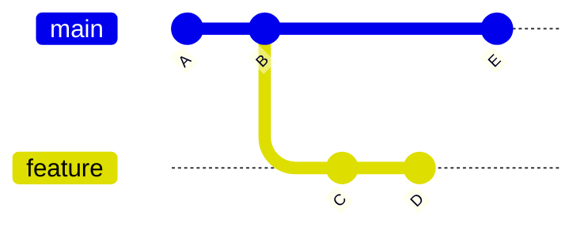
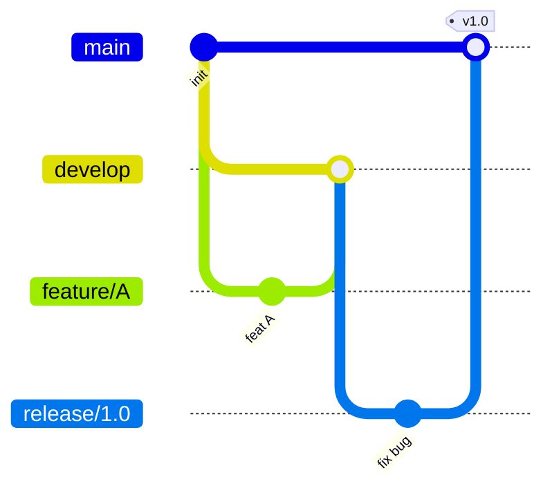

# Git 工作流

## 核心概念


```bash
git status                    # 查看工作区状态
git diff                      # 工作区 vs 暂存区
git diff --staged             # 暂存区 vs 最新提交
git log --oneline --graph     # 紧凑图形化日志
```

---

## 分支操作

```bash
# 创建与切换
git branch feature/sensor-driver     # 创建
git checkout feature/sensor-driver   # 切换
git checkout -b feature/sensor-driver # 创建+切换（一步）
git switch -c feature/sensor-driver   # 现代写法

# 合并
git checkout main
git merge feature/sensor-driver       # 合并（保留分支历史）
git merge --squash feature/xxx        # 压缩所有提交为一个

# 删除
git branch -d feature/sensor-driver   # 已合并才能删
git branch -D feature/sensor-driver   # 强制删除
git push origin --delete feature/xxx  # 删除远程分支
```

---

## merge vs rebase



**merge**：创建新的合并提交，保留完整历史

```bash
git checkout main
git merge feature
# 结果：main → A → B → E → M（M 是合并提交，有两个父节点）
```

**rebase**：把 feature 的提交"接"到 main 最新提交之后，历史更线性

```bash
git checkout feature
git rebase main
# 结果：feature → A → B → E → C' → D'（C/D 被重写，hash 变了）
```

| | merge | rebase |
|--|--|--|
| 历史 | 完整保留，有合并节点 | 线性整洁 |
| 冲突处理 | 一次性解决 | 逐个提交解决 |
| 适用 | 主干合并、保留来源 | 本地整理、PR 前清理提交 |
| 黄金规则 | 公共分支不要 rebase | ✅ |

---

## 常用操作

### stash：临时保存未完成的工作

```bash
git stash              # 把工作区改动压栈
git stash list         # 查看所有 stash
git stash pop          # 弹出最新 stash（恢复 + 删除）
git stash apply stash@{1}  # 恢复指定 stash（不删除）
git stash drop stash@{0}   # 删除指定 stash
```

### cherry-pick：只摘取某个提交

```bash
git cherry-pick abc1234   # 把 abc1234 这个提交应用到当前分支
git cherry-pick A..B      # 应用 A 到 B 之间的提交（不含 A）
```

### reset：回退提交

```bash
git reset --soft HEAD~1   # 回退 1 个提交，改动保留在暂存区
git reset --mixed HEAD~1  # 回退 1 个提交，改动退回工作区（默认）
git reset --hard HEAD~1   # 回退 1 个提交，改动全部丢弃（危险！）
```

### reflog：后悔药

```bash
git reflog               # 查看所有 HEAD 的历史移动记录
git reset --hard HEAD@{2} # 恢复到 2 步前的状态
```

---

## 提交规范（Conventional Commits）

```
<类型>(<范围>): <简短描述>

类型：
  feat     新功能
  fix      修复 bug
  docs     文档
  refactor 重构
  perf     性能优化
  test     测试
  chore    构建/工具链

示例：
  feat(sensor): 添加 RealSense 深度相机驱动
  fix(ipc): 修复 ZMQ 发布者内存泄漏
  docs(ros2): 补充 launch 文件说明
```

---

## 团队分支策略

### Git Flow（传统，适合版本发布软件）



### Trunk-based（现代，CI/CD 友好）

- 只有一个主干 `main`
- 功能用短生命周期分支（1-2 天内合并）
- 通过 feature flag 控制功能上线
- 适合机器人软件的持续集成场景

---

## Code Review 要点

作为 **提交者**：
- 一个 PR 只做一件事，不要把无关改动混进去
- PR 描述清楚：做了什么、为什么、怎么测试的
- 自己先 review 一遍再发出去

作为 **reviewer**：
- 优先关注：逻辑错误、边界条件、资源泄漏、线程安全
- 其次关注：命名、可读性、重复代码
- 给出可操作的建议，不要只说"这里有问题"

---

## 面试常问

**Q：`git pull` 和 `git fetch` 的区别？**

`git fetch` 只下载远程变更到本地，不修改工作区；`git pull` = `git fetch` + `git merge`（或 `rebase`），直接把远程变更合并进当前分支。不确定远程有什么改动时先 `fetch` 再决定怎么整合。

**Q：如何撤销已经 push 到远程的提交？**

```bash
# 方式 1：revert（安全，新增一个"反操作"提交，不改历史）
git revert abc1234
git push

# 方式 2：reset + force push（改写历史，公共分支慎用）
git reset --hard HEAD~1
git push --force-with-lease  # 比 --force 安全，会检查远程有无他人新提交
```

**Q：.gitignore 已经 commit 了的文件怎么忽略？**

```bash
git rm --cached filename     # 从暂存区删除（不删本地文件）
# 然后在 .gitignore 里加入该文件，再 commit
```
