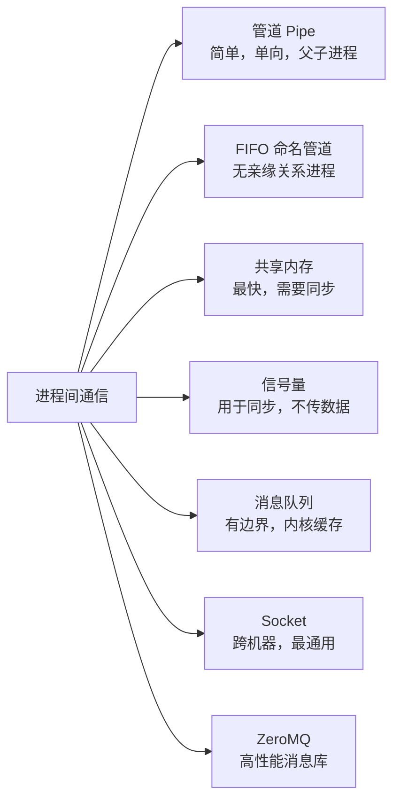
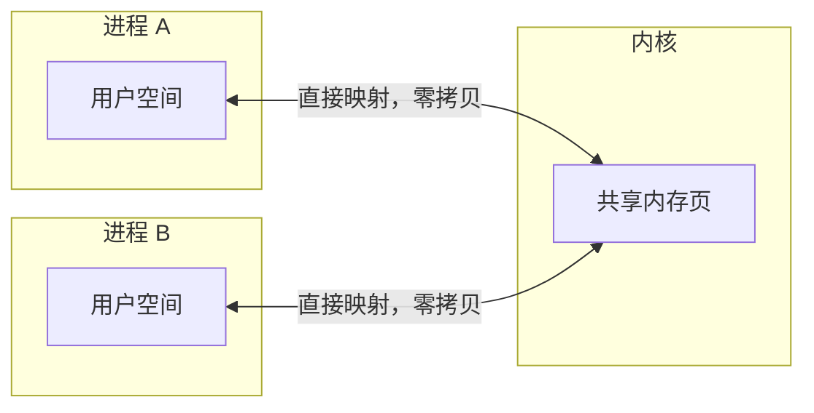
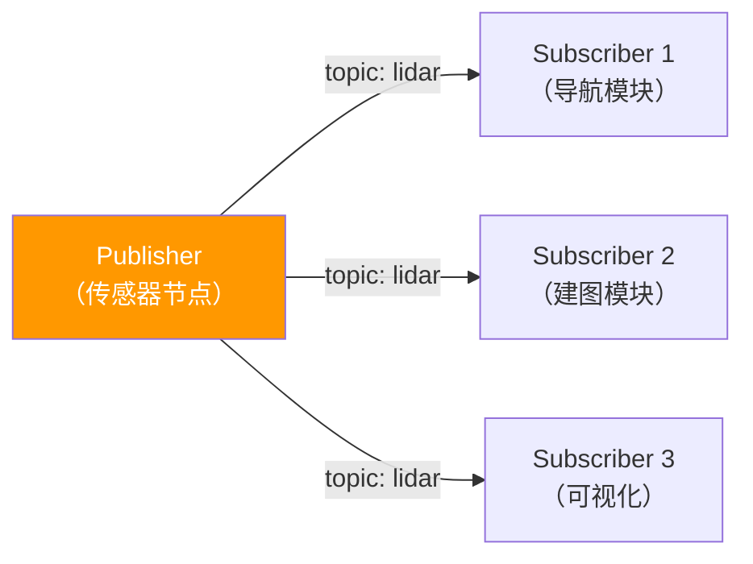
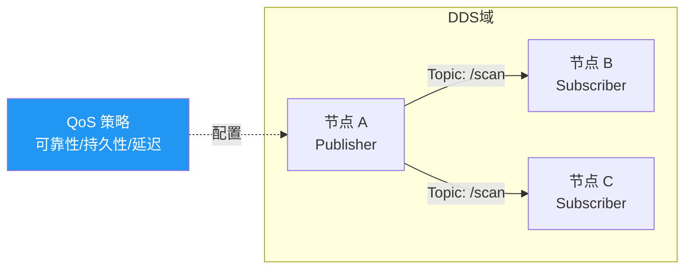

# 进程间通信（IPC）

## 各方式对比



| 方式 | 速度 | 适用场景 |
|------|------|----------|
| 共享内存 | ★★★★★ | 大数据量，同机器，需要加信号量同步 |
| 管道 / FIFO | ★★★ | 简单数据流，父子或无关进程 |
| Socket | ★★★ | 跨机器，通用，有网络开销 |
| ZeroMQ | ★★★★ | 多种模式，开发效率高，跨机器 |
| DDS | ★★★★ | ROS2 底层，实时性好，QoS 丰富 |

---

## 管道（Pipe）

```cpp
// 匿名管道：只能用于父子进程
int fd[2];
pipe(fd);  // fd[0] 读端，fd[1] 写端

if (fork() == 0) {
    // 子进程：写数据
    close(fd[0]);
    write(fd[1], "hello", 5);
    close(fd[1]);
} else {
    // 父进程：读数据
    close(fd[1]);
    char buf[64];
    read(fd[0], buf, sizeof(buf));
    close(fd[0]);
}
```

---

## FIFO（命名管道）

无亲缘关系的进程也能用，通过文件路径访问。

```cpp
// 进程 A：创建并写入
mkfifo("/tmp/robot_pipe", 0666);
int fd = open("/tmp/robot_pipe", O_WRONLY);
write(fd, "sensor_data", 11);
close(fd);

// 进程 B：读取（open 会阻塞直到另一端打开）
int fd = open("/tmp/robot_pipe", O_RDONLY);
char buf[64];
read(fd, buf, sizeof(buf));
close(fd);
```

---

## 共享内存（最快的 IPC）

数据不需要在内核和用户空间之间拷贝，但需要用信号量做同步。



```cpp
#include <sys/mman.h>
#include <sys/stat.h>
#include <fcntl.h>

struct SensorData { float x, y, z; int timestamp; };

// 进程 A：创建共享内存
int fd = shm_open("/robot_shm", O_CREAT | O_RDWR, 0666);
ftruncate(fd, sizeof(SensorData));
auto* data = (SensorData*)mmap(nullptr, sizeof(SensorData),
                                PROT_READ | PROT_WRITE, MAP_SHARED, fd, 0);
data->x = 1.0f; data->y = 2.0f; data->z = 3.0f;

// 进程 B：附加共享内存
int fd = shm_open("/robot_shm", O_RDONLY, 0666);
auto* data = (SensorData*)mmap(nullptr, sizeof(SensorData),
                                PROT_READ, MAP_SHARED, fd, 0);
float x = data->x;  // 直接读，零拷贝

// 清理
munmap(data, sizeof(SensorData));
shm_unlink("/robot_shm");
```

**共享内存 + 信号量配合使用：**

```cpp
#include <semaphore.h>

sem_t* sem = sem_open("/robot_sem", O_CREAT, 0666, 1);  // 初始值 1

// 写者
sem_wait(sem);   // P 操作，加锁
data->x = new_value;
sem_post(sem);   // V 操作，解锁

// 读者
sem_wait(sem);
float v = data->x;
sem_post(sem);

sem_close(sem);
sem_unlink("/robot_sem");
```

---

## ZeroMQ

不是消息队列，是**消息传输层**，封装了 Socket 的复杂性，提供多种通信模式。

### Pub/Sub 模式（最常用于传感器数据分发）



```cpp
#include <zmq.hpp>

// 发布者
zmq::context_t ctx;
zmq::socket_t pub(ctx, zmq::socket_type::pub);
pub.bind("tcp://*:5555");

while (true) {
    std::string msg = "lidar " + get_scan_data();
    pub.send(zmq::buffer(msg), zmq::send_flags::none);
}

// 订阅者
zmq::socket_t sub(ctx, zmq::socket_type::sub);
sub.connect("tcp://localhost:5555");
sub.set(zmq::sockopt::subscribe, "lidar");  // 只接收 lidar 开头的消息

zmq::message_t msg;
sub.recv(msg);
```

### Req/Rep 模式（请求-响应，控制指令）

```cpp
// 服务端（Rep）
zmq::socket_t rep(ctx, zmq::socket_type::rep);
rep.bind("tcp://*:5556");

zmq::message_t req;
rep.recv(req);                                        // 收请求
rep.send(zmq::buffer("ok"), zmq::send_flags::none);  // 发响应

// 客户端（Req）
zmq::socket_t req(ctx, zmq::socket_type::req);
req.connect("tcp://localhost:5556");
req.send(zmq::buffer("move_to 1.0 2.0"), zmq::send_flags::none);
zmq::message_t rep;
req.recv(rep);
```

---

## DDS（ROS2 底层）

**Data Distribution Service**，面向实时系统的发布-订阅中间件，ROS2 默认使用。



**DDS vs ZMQ 核心区别：**

| | ZMQ | DDS |
|--|--|--|
| 服务发现 | 手动配置地址 | 自动发现（无需知道对方 IP）|
| QoS | 无 | 丰富（可靠性、历史、截止期限）|
| 数据格式 | 原始字节，自己序列化 | IDL 定义，自动序列化 |
| 学习成本 | 低 | 高 |
| 适用 | 快速原型，简单场景 | ROS2，工业实时系统 |

---

## 面试常问

**Q：共享内存为什么是最快的 IPC？**

其他 IPC（管道、Socket、消息队列）都需要数据在用户空间和内核空间之间来回拷贝。共享内存把同一块物理页同时映射到两个进程的虚拟地址空间，读写直接操作内存，零拷贝。

**Q：ZMQ 和原生 Socket 编程比有什么优势？**

ZMQ 封装了重连、消息边界（无粘包）、多种拓扑模式（Pub/Sub、Push/Pull、Req/Rep），还支持 inproc（线程间）/ ipc（进程间）/ tcp（跨机器）三种传输层透明切换，只改连接字符串不改代码。

**Q：ROS2 为什么选 DDS 而不是 ZMQ？**

DDS 支持自动节点发现（零配置），提供 QoS（可靠性、实时性），是 OMG 标准（多厂商互操作），适合机器人这种多进程、分布式、强实时要求的场景。ZMQ 更轻量但缺乏自动发现和标准化。
