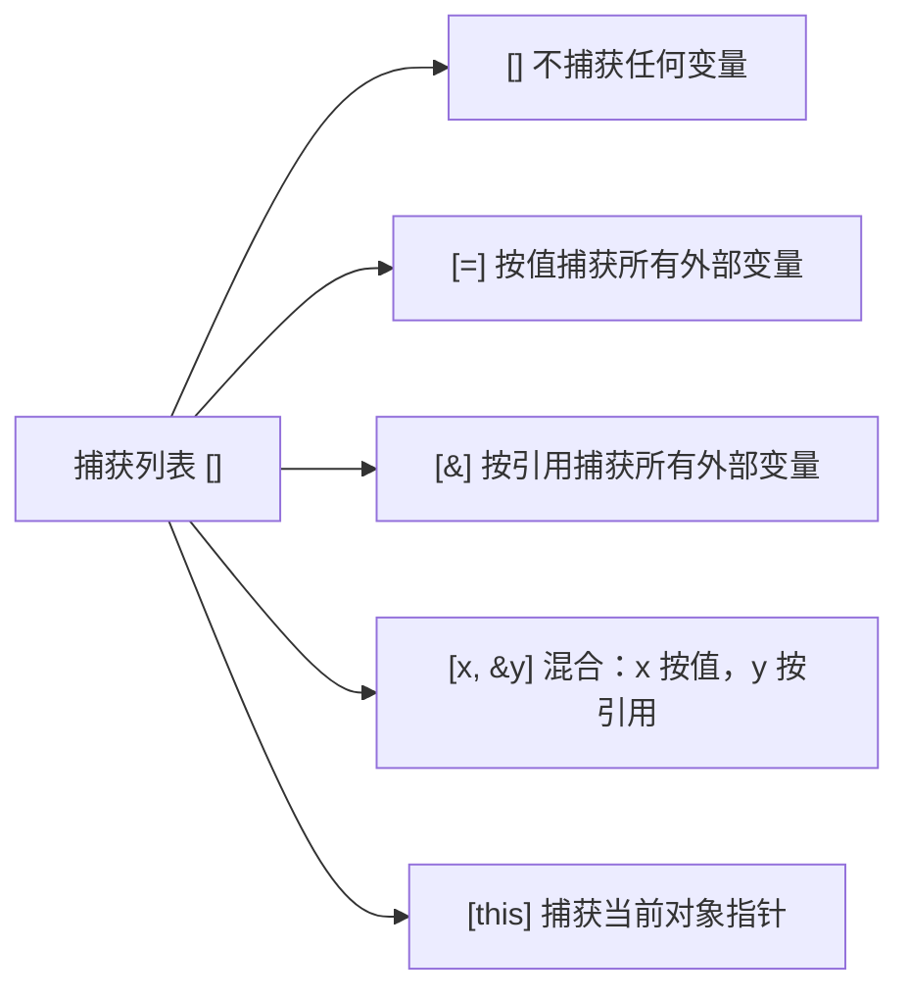

# Lambda 与函数式编程

## Lambda 基本语法

```cpp
// [捕获列表](参数列表) -> 返回类型 { 函数体 }

auto add = [](int a, int b) -> int { return a + b; };
auto add = [](int a, int b) { return a + b; };  // 返回类型可省略，编译器推导

add(1, 2);  // 3
```

Lambda 本质上是编译器生成的**匿名类**，`operator()` 实现调用逻辑。

---

## 捕获列表



```cpp
int base = 10;

// 按值捕获：lambda 内部有 base 的副本，外部修改不影响 lambda
auto f1 = [base](int x) { return x + base; };
base = 99;
f1(1);  // 还是 11，不是 100

// 按引用捕获：lambda 持有引用，外部修改会反映进来
auto f2 = [&base](int x) { return x + base; };
base = 99;
f2(1);  // 100

// 注意：按引用捕获时，如果 lambda 生命周期长于被捕获变量，会悬空引用
auto danger = [&base]() { return base; };  // 如果 base 销毁后再调用，UB
```

**mutable**：按值捕获默认是 const，加 `mutable` 才能修改副本：

```cpp
int count = 0;
auto counter = [count]() mutable { return ++count; };  // 修改的是副本
counter();  // 1
counter();  // 2
count;      // 还是 0，外部未变
```

---

## std::function

类型擦除的通用函数包装器，能存储任意可调用对象（函数指针、Lambda、成员函数）。

```cpp
#include <functional>

std::function<int(int, int)> op;

op = [](int a, int b) { return a + b; };
op(1, 2);  // 3

op = std::plus<int>{};  // 标准库函数对象
op(1, 2);  // 3
```

**代价**：`std::function` 有类型擦除的开销（堆分配 + 虚调用），性能敏感路径慎用。如果类型在编译期已知，用模板参数或 `auto` 存储 Lambda 更快。

```cpp
// 快：直接用 auto，编译器知道确切类型，可内联
auto fast = [](int x) { return x * 2; };

// 慢：类型擦除，无法内联
std::function<int(int)> slow = [](int x) { return x * 2; };
```

---

## 成员函数作为回调

```cpp
class Robot {
public:
    void on_sensor_data(float val) {
        std::cout << "收到: " << val << "\n";
    }
};

Robot robot;

// 用 std::bind 绑定成员函数（旧风格）
auto cb1 = std::bind(&Robot::on_sensor_data, &robot, std::placeholders::_1);
cb1(3.14f);

// 用 Lambda 包装（现代风格，更清晰）
auto cb2 = [&robot](float val) { robot.on_sensor_data(val); };
cb2(3.14f);
```

Lambda 包装比 `std::bind` 更推荐：可读性好，编译器更容易内联。

---

## 在 STL 算法中使用

```cpp
std::vector<int> v = {3, 1, 4, 1, 5, 9, 2, 6};

// 排序
std::sort(v.begin(), v.end(), [](int a, int b) { return a > b; });  // 降序

// 查找
auto it = std::find_if(v.begin(), v.end(), [](int x) { return x > 4; });

// 过滤计数
int cnt = std::count_if(v.begin(), v.end(), [](int x) { return x % 2 == 0; });

// 变换
std::transform(v.begin(), v.end(), v.begin(), [](int x) { return x * 2; });

// 范围 for + Lambda（C++20）
std::ranges::sort(v, std::greater<>{});
```

---

## ROS2 中的典型用法

ROS2 的回调几乎都用 Lambda，理解捕获列表在这里很重要：

```cpp
class MyNode : public rclcpp::Node {
public:
    MyNode() : Node("my_node") {
        // 订阅者回调：捕获 this 访问成员
        sub_ = create_subscription<std_msgs::msg::Float32>(
            "sensor", 10,
            [this](const std_msgs::msg::Float32::SharedPtr msg) {
                process(msg->data);
            }
        );

        // 定时器回调
        timer_ = create_wall_timer(
            std::chrono::milliseconds(100),
            [this]() { publish_status(); }
        );
    }

private:
    void process(float val) { /* ... */ }
    void publish_status() { /* ... */ }

    rclcpp::Subscription<std_msgs::msg::Float32>::SharedPtr sub_;
    rclcpp::TimerBase::SharedPtr timer_;
};
```

---

## 面试常问

**Q：Lambda 和普通函数的区别？**

Lambda 是编译器生成的匿名类的实例，可以捕获上下文变量；普通函数不能捕获局部变量。无捕获的 Lambda 可以隐式转换为函数指针。

**Q：`[=]` 和 `[&]` 怎么选？**

- Lambda 生命周期短、在当前作用域内用完就抛：`[&]` 更方便
- Lambda 需要存储起来（存入 `std::function`、传给异步任务）：必须 `[=]` 按值捕获，否则引用可能悬空

**Q：`std::function` 为什么有性能开销？**

存储可调用对象时需要类型擦除：小对象可能触发堆分配，调用时需要通过虚函数表派发，阻止编译器内联。性能敏感场景用模板参数传递可调用对象（如 STL 算法的比较器）。
