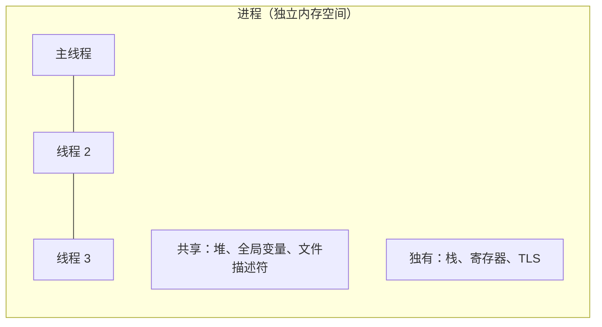
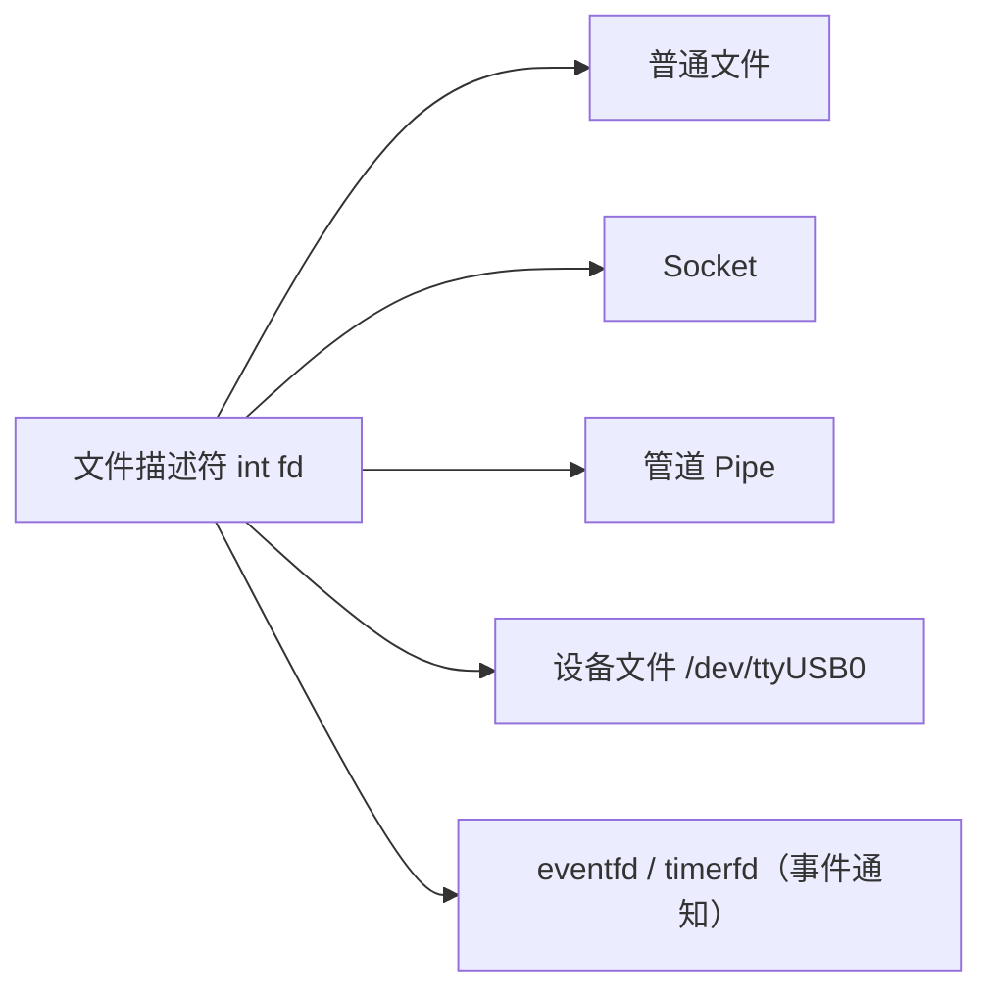

# Linux 系统编程

## 进程与线程



```cpp
// 创建进程：fork + exec
pid_t pid = fork();
if (pid == 0) {
    // 子进程：完整复制父进程内存（COW 写时复制）
    execv("/usr/bin/ros2", args);  // 替换为新程序
    _exit(1);
} else {
    // 父进程
    int status;
    waitpid(pid, &status, 0);  // 等待子进程结束，防止僵尸进程
}

// 创建线程：pthread（或用 std::thread）
#include <pthread.h>
void* worker(void* arg) { return nullptr; }
pthread_t tid;
pthread_create(&tid, nullptr, worker, nullptr);
pthread_join(tid, nullptr);
```

**进程 vs 线程选择**：
- 需要隔离（崩溃不影响主进程）→ 多进程
- 需要低通信开销、共享数据 → 多线程
- ROS2：每个节点可以是独立进程，也可以在一个进程里用 `MultiThreadedExecutor` 跑多个节点

---

## 信号（Signal）

内核向进程发送的异步通知。

```cpp
#include <signal.h>
#include <atomic>

std::atomic<bool> running{true};

// 注册信号处理函数
void handle_sigint(int sig) {
    running = false;   // 安全：atomic 赋值是异步信号安全的
}

int main() {
    signal(SIGINT,  handle_sigint);  // Ctrl+C
    signal(SIGTERM, handle_sigint);  // kill 命令默认信号

    while (running) {
        // 主循环，ROS2 节点也是这样优雅退出的
        do_work();
    }
    cleanup();
}
```

常见信号：

| 信号 | 值 | 默认行为 | 触发 |
|------|----|----------|------|
| `SIGSEGV` | 11 | 终止+core | 非法内存访问 |
| `SIGABRT` | 6 | 终止+core | `abort()` / `assert` 失败 |
| `SIGINT` | 2 | 终止 | Ctrl+C |
| `SIGTERM` | 15 | 终止 | `kill <pid>` |
| `SIGKILL` | 9 | 终止（不可捕获）| `kill -9 <pid>` |
| `SIGPIPE` | 13 | 终止 | 写入已关闭的管道/socket |

**`SIGPIPE` 坑**：Socket 对端断开后继续 `send()`，进程会收到 `SIGPIPE` 直接崩溃。解决：`signal(SIGPIPE, SIG_IGN)` 忽略，然后通过 `send` 返回值判断错误。

---

## 文件描述符

Linux 一切皆文件，fd 是统一抽象。



```cpp
// 标准 fd：0=stdin, 1=stdout, 2=stderr

// 操作文件
int fd = open("/data/scan.bin", O_RDONLY);
read(fd, buf, sizeof(buf));
close(fd);

// 非阻塞
fcntl(fd, F_SETFL, O_NONBLOCK);

// 查看进程打开的所有 fd
// ls -la /proc/<pid>/fd
```

**fd 泄漏**：`open()` 了不 `close()`，累积后进程无法再打开新文件（默认上限 1024）。使用 RAII 管理：

```cpp
struct FdGuard {
    int fd;
    explicit FdGuard(int fd) : fd(fd) {}
    ~FdGuard() { if (fd >= 0) close(fd); }
    FdGuard(const FdGuard&) = delete;
};
```

---

## /proc 文件系统

运行时查看进程、系统状态，调试利器。

```bash
# 查看进程信息
cat /proc/<pid>/status       # 进程状态、内存使用
cat /proc/<pid>/maps         # 虚拟内存映射（查看 .so 是否加载）
ls  /proc/<pid>/fd           # 打开的文件描述符
cat /proc/<pid>/cmdline      # 启动命令行

# 系统级信息
cat /proc/cpuinfo            # CPU 信息
cat /proc/meminfo            # 内存信息
cat /proc/net/tcp            # TCP 连接状态
```

---

## 系统问题排查工具

### 进程/CPU

```bash
top                          # 实时进程监控，按 M 按内存排序，P 按 CPU
htop                         # top 的增强版（推荐）
ps aux | grep my_robot       # 查找进程
pidstat -p <pid> 1           # 每秒显示进程 CPU/内存变化
```

### 内存

```bash
free -h                      # 系统内存使用
cat /proc/<pid>/status | grep VmRSS   # 进程物理内存使用
valgrind --leak-check=full ./app      # 内存泄漏检测
```

### 网络

```bash
ss -tlnp                     # 查看监听的端口（替代 netstat）
ss -tp | grep <pid>          # 查看某进程的连接
tcpdump -i lo port 5555      # 抓包（调试 ZMQ/Socket 通信）
```

### 系统调用追踪

```bash
strace ./my_robot            # 打印所有系统调用（调试神器）
strace -p <pid>              # attach 到运行中的进程
strace -e trace=network ./app  # 只追踪网络相关系统调用
ltrace ./app                 # 追踪库函数调用
```

### IO

```bash
iostat -x 1                  # 磁盘 IO 统计
lsof -p <pid>                # 进程打开的所有文件
```

---

## 优雅退出模式

机器人软件必须处理好退出：保存状态、停止硬件、释放资源。

```cpp
// ROS2 节点优雅退出
#include <rclcpp/rclcpp.hpp>

int main(int argc, char* argv[]) {
    rclcpp::init(argc, argv);
    auto node = std::make_shared<MyNode>();

    // rclcpp 内部处理 SIGINT，spin 收到信号后返回
    rclcpp::spin(node);

    // spin 返回后做清理
    node->stop_hardware();
    rclcpp::shutdown();
    return 0;
}
```

---

## 面试常问

**Q：僵尸进程是什么，怎么避免？**

子进程退出后，父进程没有调用 `wait()` 读取退出状态，子进程变成僵尸（占用 PID，但不占内存）。避免：父进程调用 `waitpid()`；或注册 `SIGCHLD` 处理函数中调用 `wait()`；或 `signal(SIGCHLD, SIG_IGN)` 让内核自动回收。

**Q：`kill -9` 和 `kill -15` 的区别？**

`SIGTERM`（15）可以被捕获，程序有机会做清理再退出，是优雅关闭的正确方式。`SIGKILL`（9）内核直接终止，程序无法捕获和忽略，用于程序不响应时的强制终止，可能导致文件损坏或硬件状态异常。

**Q：`strace` 发现进程卡在哪个系统调用怎么处理？**

常见卡点：`futex`（等锁，可能死锁）、`read`/`recv`（等数据，检查对端是否发送）、`epoll_wait`（等事件，检查 fd 注册是否正确）。结合 `gdb attach` 看调用栈确认原因。
