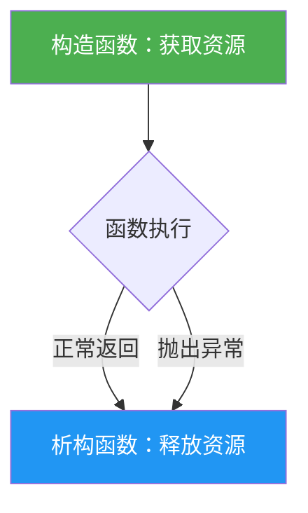
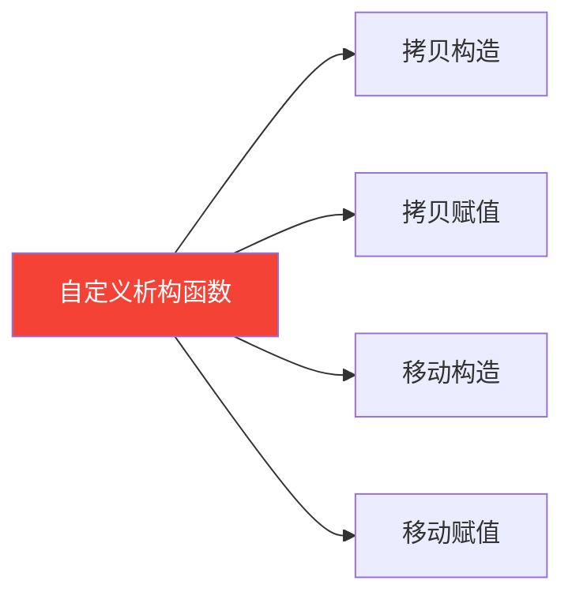
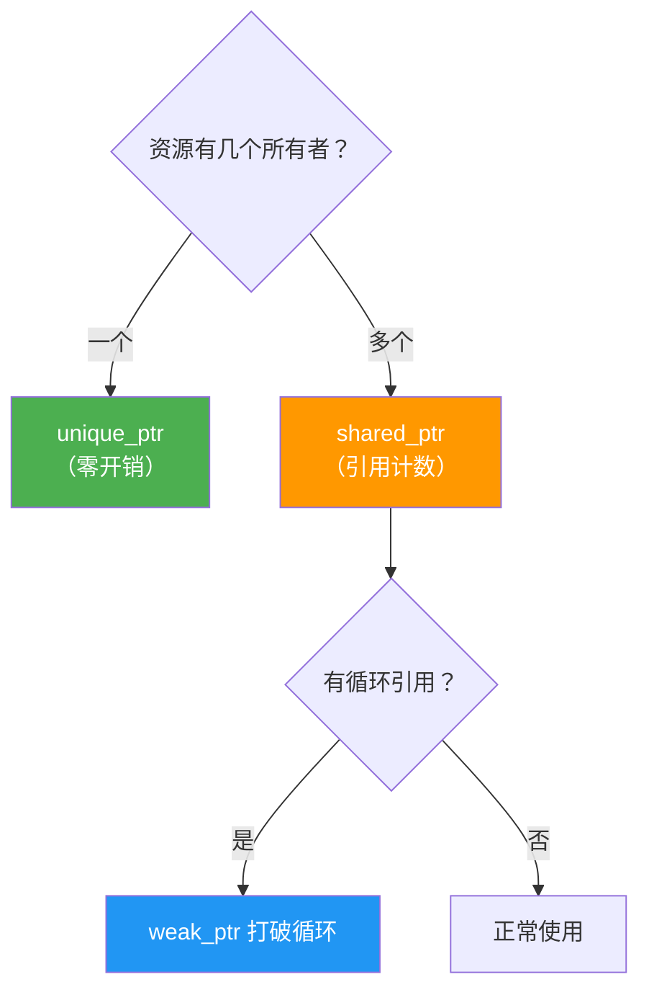
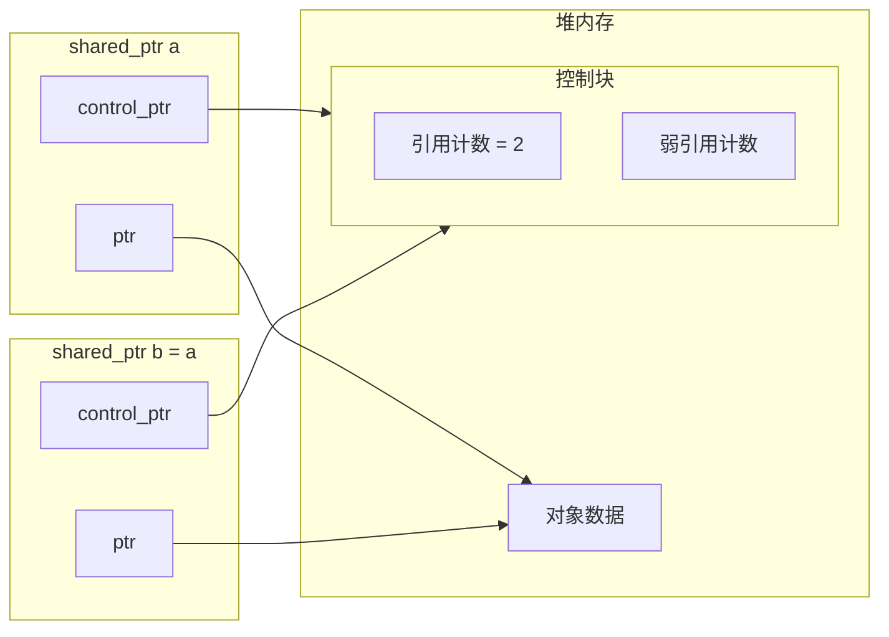
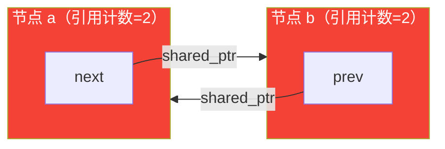
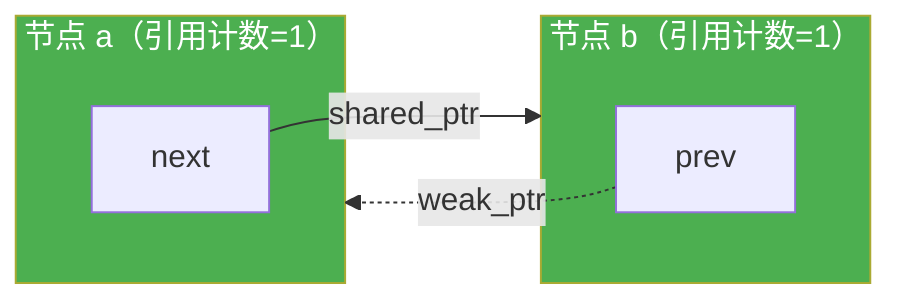

# 内存管理 & RAII

## RAII 是什么

**Resource Acquisition Is Initialization**——把资源的释放绑定到析构函数，让编译器保证资源不泄漏。

不管函数正常返回还是抛异常，局部对象的析构函数一定会执行。



**没有 RAII 的问题：**

```cpp
void foo() {
    FILE* f = fopen("a.txt", "r");
    if (some_error) return;  // fclose 没执行，泄漏！
    fclose(f);
}
```

**有 RAII：**

```cpp
void foo() {
    std::ifstream f("a.txt");
    if (some_error) return;  // 没问题，f 析构时自动关文件
}
```

工作中最常见的 RAII：`std::lock_guard`——进入作用域自动加锁，退出自动解锁，即使中途异常也不会死锁。

---

## 自己实现一个 RAII 类

要求：管理裸指针，构造时获取资源，析构时释放，**禁止拷贝，允许移动**。

```cpp
class Resource {
public:
    explicit Resource(int* ptr) : ptr_(ptr) {}

    ~Resource() {
        delete ptr_;
    }

    // 禁止拷贝——两个对象不能管同一块内存，否则 double free
    Resource(const Resource&)            = delete;
    Resource& operator=(const Resource&) = delete;

    // 允许移动——转移所有权，原对象置空
    Resource(Resource&& other) noexcept
        : ptr_(other.ptr_) {
        other.ptr_ = nullptr;   // 关键：防止 other 析构时 delete 已转移的指针
    }

    Resource& operator=(Resource&& other) noexcept {
        if (this != &other) {
            delete ptr_;            // 先释放自己持有的
            ptr_       = other.ptr_;
            other.ptr_ = nullptr;
        }
        return *this;
    }

    int* get() const { return ptr_; }

private:
    int* ptr_;
};
```

### Rule of Five

析构函数、拷贝构造、拷贝赋值、移动构造、移动赋值——**自定义其中一个，就要考虑全部五个**。



| 函数 | 为什么这样写 |
|------|------------|
| 拷贝构造 `= delete` | 两个对象析构时 `delete` 同一指针 → undefined behavior |
| 移动后 `other.ptr_ = nullptr` | 防止 `other` 析构时对已转移的指针再次 `delete` |
| 移动函数加 `noexcept` | `vector` 扩容时只有 `noexcept` 的移动才会被使用，否则退化为拷贝 |
| 移动赋值先 `delete ptr_` | 自己原来持有的资源要先释放，否则泄漏 |

---

## 智能指针选型

**默认用 `unique_ptr`，真的需要共享所有权才用 `shared_ptr`。**



### unique_ptr

```cpp
auto p = std::make_unique<int>(42);
// 出作用域自动 delete，不能拷贝，可以移动
auto p2 = std::move(p);  // p 变成 nullptr
```

### shared_ptr 的内存结构



`make_shared` 把对象和控制块分配在**一块连续内存**，只有一次 `malloc`；`shared_ptr<T>(new T)` 有两次。**优先用 `make_shared`。**

### weak_ptr — 不增加引用计数

```cpp
std::weak_ptr<int> w = a;  // 引用计数不变
if (auto sp = w.lock()) {  // 使用前必须 lock()，检查对象是否还活着
    *sp = 100;
}
```

---

## 循环引用问题

### 有问题的版本

```cpp
struct Node {
    std::shared_ptr<Node> next;
    std::shared_ptr<Node> prev;  // 问题在这
};

auto a = std::make_shared<Node>();  // a 引用计数 = 1
auto b = std::make_shared<Node>();  // b 引用计数 = 1
a->next = b;   // b 引用计数 = 2
b->prev = a;   // a 引用计数 = 2
// a 离开作用域：2→1，不析构
// b 离开作用域：2→1，不析构  ← 永远泄漏
```



### 修复：反向用 weak_ptr

```cpp
struct Node {
    std::shared_ptr<Node> next;
    std::weak_ptr<Node>   prev;  // 不增加引用计数
};
```



---

## 面试常问

**Q：`shared_ptr` 线程安全吗？**

引用计数的增减是原子操作，是线程安全的。但指针指向的**对象本身**不是线程安全的，并发读写需要自己加锁。

**Q：`make_shared` 和 `new` 有什么区别？**

`make_shared` 一次 `malloc` 分配对象 + 控制块；`shared_ptr<T>(new T)` 两次 `malloc`。优先用 `make_shared`。

**Q：`unique_ptr` 怎么传给函数？**

- 需要转移所有权 → `std::move` 传值
- 只是借用一下 → 传裸指针 `ptr.get()` 或引用 `*ptr`，不转移所有权
