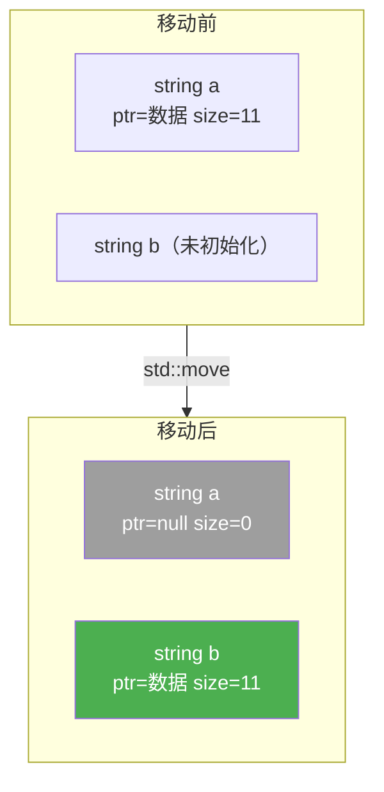
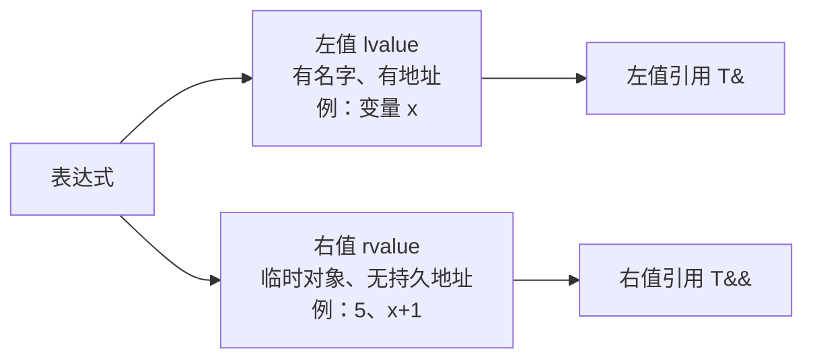
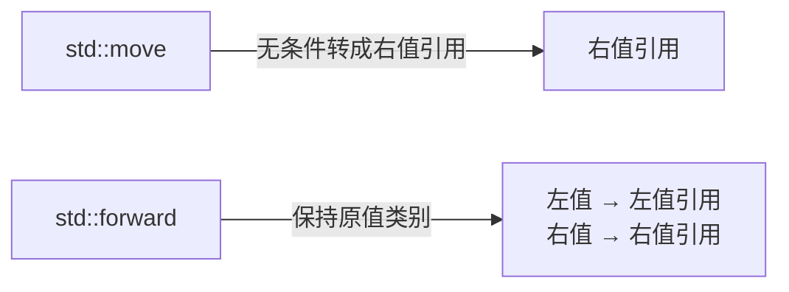

# 移动语义

## 为什么比拷贝快

拷贝是复制数据，移动是转移所有权——只复制指针，不复制数据本身。



```cpp
std::string a = "hello world";

std::string b = a;             // 拷贝：分配新内存，复制所有字符
std::string c = std::move(a);  // 移动：把 a 的指针直接给 c，a 置空
```

移动的代价是固定的（几个指针赋值），**与数据大小无关**。拷贝的代价随数据量线性增长。

---

## 左值和右值



```cpp
int x = 5;
int& lref   = x;            // 左值引用
int&& rref  = 5;            // 右值引用，绑定临时值
int&& rref2 = std::move(x); // 强制把左值转成右值引用
```

---

## 什么时候触发移动

对象是**右值**（临时值、即将销毁）时，编译器自动选移动构造而不是拷贝构造。

```cpp
std::string make() {
    return std::string("hello");  // 返回临时对象，触发移动
}
std::string s = make();  // 移动构造
```

`std::move` 的本质：把左值**强制转成右值引用**，告诉编译器"这个对象我不要了"。它本身不移动任何东西，只是一个类型转换。

---

## std::move vs std::forward



| | `std::move` | `std::forward` |
|--|--|--|
| 作用 | 无条件转成右值引用 | 保持原来的值类别 |
| 用途 | 明确放弃对象所有权 | 模板函数中转发参数 |

`std::forward` 用在**完美转发**：

```cpp
template<typename T>
void wrapper(T&& arg) {
    // 不用 forward：arg 有名字，变成左值，永远走拷贝
    real_function(arg);

    // 用 forward：保持 arg 原来是左值还是右值
    real_function(std::forward<T>(arg));
}
```

---

## 移动后的对象能用吗

能用，但值不确定。标准保证移动后对象处于"**有效但未指定**"状态——可以安全析构和重新赋值，但不能依赖它的值。

```cpp
std::string a = "hello";
std::string b = std::move(a);

a = "world";  // 重新赋值，完全没问题
a.clear();    // 可以
// std::cout << a  ← 能编译，但值不确定，不要依赖
```

---

## 什么时候用 / 不该用 std::move

**该用：**

```cpp
// 1. 把大对象转移给容器，避免拷贝
std::vector<std::string> v;
std::string s = "a long string...";
v.push_back(std::move(s));  // s 被掏空，更快

// 2. 明确不再需要某个对象，转移所有权
auto p = std::make_unique<Foo>();
bar(std::move(p));  // p 变 nullptr
```

**不该用（反而有害）：**

```cpp
std::string make() {
    std::string result = "hello";
    return result;            // ✅ 正确，编译器自动做 NRVO
    return std::move(result); // ❌ 阻止 NRVO，反而更慢
}
```

---

## 面试常问

**Q：右值引用变量本身是左值还是右值？**

是左值。有名字的东西都是左值。所以模板里才需要 `std::forward`。

```cpp
void foo(std::string&& s) {
    bar(s);             // s 有名字，传给 bar 的是左值
    bar(std::move(s));  // 才能传右值
}
```

**Q：哪些类型移动和拷贝一样快？**

内置类型（`int`、`double`、裸指针）没有移动语义，移动等于拷贝。移动优化只对**持有堆内存的类型**有意义（`string`、`vector`、`unique_ptr` 等）。
