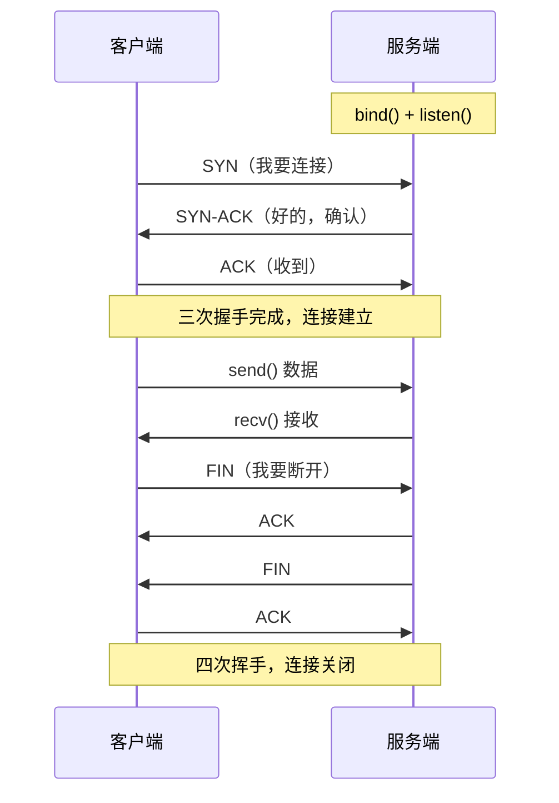
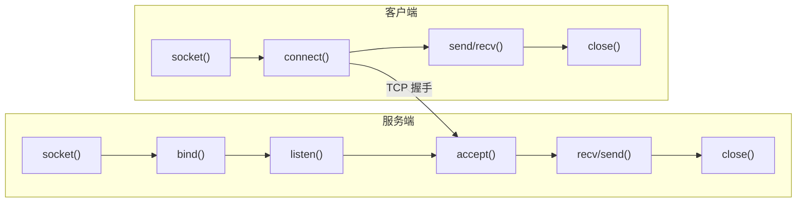
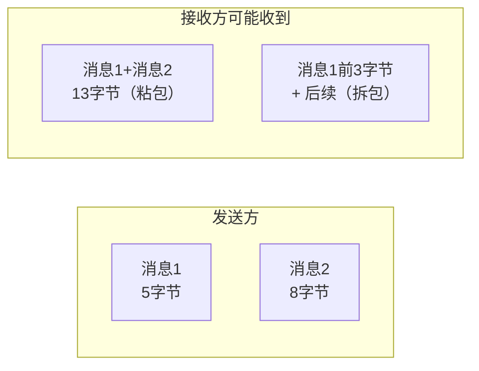

# 网络编程

## TCP 基础



**TCP 特点**：有连接、可靠传输、有序、字节流（没有消息边界）。

---

## Socket API 流程



```cpp
// 服务端
int server_fd = socket(AF_INET, SOCK_STREAM, 0);

// 允许端口复用（防止重启时 "Address already in use"）
int opt = 1;
setsockopt(server_fd, SOL_SOCKET, SO_REUSEADDR, &opt, sizeof(opt));

sockaddr_in addr{};
addr.sin_family      = AF_INET;
addr.sin_addr.s_addr = INADDR_ANY;
addr.sin_port        = htons(8080);   // 主机字节序 → 网络字节序

bind(server_fd, (sockaddr*)&addr, sizeof(addr));
listen(server_fd, 5);

int client_fd = accept(server_fd, nullptr, nullptr);  // 阻塞等待连接

char buf[1024];
int n = recv(client_fd, buf, sizeof(buf), 0);
send(client_fd, "ok", 2, 0);
close(client_fd);
close(server_fd);

// 客户端
int sock = socket(AF_INET, SOCK_STREAM, 0);
sockaddr_in server{};
server.sin_family = AF_INET;
server.sin_port   = htons(8080);
inet_pton(AF_INET, "127.0.0.1", &server.sin_addr);
connect(sock, (sockaddr*)&server, sizeof(server));
send(sock, "hello", 5, 0);
```

---

## 粘包问题

TCP 是字节流，没有消息边界。连续发送两条消息，接收方可能一次收到两条拼在一起，或者一条被分成两次收到。



### 三种解决方案

**方案 1：固定长度**（简单，适合定长协议）
```cpp
// 每次发送/接收固定 256 字节，不足补零
char buf[256] = {};
memcpy(buf, data, data_len);
send(fd, buf, 256, 0);
```

**方案 2：分隔符**（适合文本协议）
```cpp
// 用 '\n' 作为消息结束标志（HTTP 头部用 \r\n）
send(fd, "hello\n", 6, 0);
// 接收方找到 '\n' 才认为一条消息完整
```

**方案 3：TLV / 长度前缀**（最通用，推荐）
```cpp
// 消息格式：[4字节长度][消息体]
struct Header { uint32_t len; };

// 发送
void send_msg(int fd, const std::string& msg) {
    Header hdr{ htonl(msg.size()) };   // 转网络字节序
    send(fd, &hdr, sizeof(hdr), 0);
    send(fd, msg.data(), msg.size(), 0);
}

// 接收（需要循环读，直到读满为止）
std::string recv_msg(int fd) {
    Header hdr;
    recv_full(fd, &hdr, sizeof(hdr));
    uint32_t len = ntohl(hdr.len);
    std::string buf(len, '\0');
    recv_full(fd, buf.data(), len);
    return buf;
}

// 确保读够 n 字节（recv 可能返回少于请求的字节数）
void recv_full(int fd, void* buf, size_t n) {
    size_t received = 0;
    while (received < n) {
        int r = recv(fd, (char*)buf + received, n - received, 0);
        if (r <= 0) throw std::runtime_error("connection closed");
        received += r;
    }
}
```

---

## 非阻塞 I/O 与 epoll

默认 socket 是阻塞的，`accept`/`recv` 会挂起线程。多客户端场景用 **epoll**（Linux）实现单线程处理多连接。

```cpp
// 设置非阻塞
int flags = fcntl(fd, F_GETFL, 0);
fcntl(fd, F_SETFL, flags | O_NONBLOCK);

// epoll 基本用法
int epfd = epoll_create1(0);

epoll_event ev{};
ev.events  = EPOLLIN;   // 监听可读事件
ev.data.fd = server_fd;
epoll_ctl(epfd, EPOLL_CTL_ADD, server_fd, &ev);

epoll_event events[64];
while (true) {
    int n = epoll_wait(epfd, events, 64, -1);  // 阻塞等待事件
    for (int i = 0; i < n; i++) {
        if (events[i].data.fd == server_fd) {
            int client = accept(server_fd, nullptr, nullptr);
            // 把 client 也加入 epoll 监听
        } else {
            // 处理客户端数据
        }
    }
}
```

| | select | poll | epoll |
|--|--|--|--|
| 监听上限 | 1024（FD_SETSIZE）| 无限制 | 无限制 |
| 时间复杂度 | O(N) | O(N) | O(1) |
| 适用 | 跨平台 | 较多连接 | Linux 高并发首选 |

---

## WebSocket 简介

HTTP 协议升级，建立后全双工通信，客户端和服务端都可以主动推送。

```
客户端发送 HTTP 升级请求：
GET /ws HTTP/1.1
Upgrade: websocket
Connection: Upgrade
Sec-WebSocket-Key: xxx

服务端回应：
HTTP/1.1 101 Switching Protocols
Upgrade: websocket
Sec-WebSocket-Accept: yyy
```

握手完成后就是帧格式的二进制通信，常用库：
- C++：`websocketpp`、`libwebsockets`、`uWebSockets`
- ROS2：`rosbridge_server`（把 ROS2 Topic 通过 WebSocket 暴露给外部）

---

## 面试常问

**Q：`send` 返回值小于发送长度怎么办？**

TCP 发送缓冲区满时 `send` 会返回实际写入的字节数，不保证一次发完。需要循环发送：

```cpp
void send_full(int fd, const void* buf, size_t n) {
    size_t sent = 0;
    while (sent < n) {
        int r = send(fd, (const char*)buf + sent, n - sent, 0);
        if (r <= 0) throw std::runtime_error("send failed");
        sent += r;
    }
}
```

**Q：`TIME_WAIT` 是什么，为什么要有它？**

主动关闭连接的一方在发出最后一个 ACK 后进入 `TIME_WAIT` 状态，等待 2MSL（约 60 秒）。目的是确保对方收到最后的 ACK（如果丢失，对方会重发 FIN，此时还能响应）。服务器重启时遇到 "Address already in use" 就是因为这个，加 `SO_REUSEADDR` 可以绕过。

**Q：UDP 什么时候比 TCP 合适？**

对延迟敏感、能容忍少量丢包的场景：机器人传感器实时数据流、视频流、游戏状态同步。DDS（ROS2 底层）默认用 UDP，可以配置可靠性 QoS。
