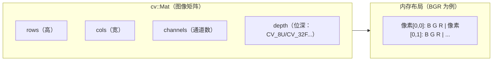
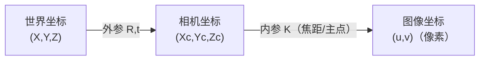

# OpenCV 基础

## Mat：图像的内存表示



```cpp
#include <opencv2/opencv.hpp>

// 创建
cv::Mat img(480, 640, CV_8UC3);               // 480×640，3通道，uint8
cv::Mat gray(480, 640, CV_8UC1, cv::Scalar(0)); // 灰度图，初始化为0
cv::Mat f = cv::Mat::zeros(3, 3, CV_32FC1);   // 3×3 float 零矩阵

// 基本属性
img.rows;      // 高 480
img.cols;      // 宽 640
img.channels();// 通道数 3
img.type();    // CV_8UC3

// 访问像素（慢，调试用）
img.at<cv::Vec3b>(y, x)[0];   // B 通道
img.at<cv::Vec3b>(y, x)[1];   // G 通道
img.at<cv::Vec3b>(y, x)[2];   // R 通道

// 访问像素（快，批量处理用）
for (int y = 0; y < img.rows; y++) {
    auto* row = img.ptr<cv::Vec3b>(y);
    for (int x = 0; x < img.cols; x++) {
        row[x][2] = 255;  // 设置 R 通道
    }
}
```

**注意：OpenCV 默认是 BGR，不是 RGB。** 和 PyTorch/TensorFlow 混用时要转换。

---

## 读写与显示

```cpp
// 读取
cv::Mat img = cv::imread("image.jpg");           // BGR
cv::Mat gray = cv::imread("image.jpg", cv::IMREAD_GRAYSCALE);

if (img.empty()) { std::cerr << "读取失败\n"; return -1; }

// 写入
cv::imwrite("output.png", img);

// 显示（需要 GUI 支持，嵌入式设备上可能没有）
cv::imshow("窗口名", img);
cv::waitKey(0);   // 0=等待按键，>0=等待毫秒数

// 视频流
cv::VideoCapture cap(0);  // 0=默认摄像头，或传入文件路径
cv::Mat frame;
while (cap.read(frame)) {
    cv::imshow("Camera", frame);
    if (cv::waitKey(30) == 'q') break;
}
```

---

## 颜色空间转换

```cpp
cv::Mat gray, hsv, rgb;
cv::cvtColor(img, gray, cv::COLOR_BGR2GRAY);    // BGR → 灰度
cv::cvtColor(img, hsv,  cv::COLOR_BGR2HSV);     // BGR → HSV（颜色分割常用）
cv::cvtColor(img, rgb,  cv::COLOR_BGR2RGB);     // BGR → RGB（给其他库用）
```

---

## 常用图像处理

```cpp
// 高斯滤波（去噪）
cv::Mat blurred;
cv::GaussianBlur(img, blurred, cv::Size(5, 5), 1.5);

// Canny 边缘检测
cv::Mat edges;
cv::Canny(gray, edges, 50, 150);  // 低阈值、高阈值

// 形态学操作
cv::Mat kernel = cv::getStructuringElement(cv::MORPH_RECT, cv::Size(3, 3));
cv::dilate(binary, binary, kernel);   // 膨胀
cv::erode(binary, binary, kernel);    // 腐蚀

// 阈值分割
cv::Mat binary;
cv::threshold(gray, binary, 128, 255, cv::THRESH_BINARY);
cv::adaptiveThreshold(gray, binary, 255,
    cv::ADAPTIVE_THRESH_GAUSSIAN_C, cv::THRESH_BINARY, 11, 2);

// 查找轮廓
std::vector<std::vector<cv::Point>> contours;
cv::findContours(binary, contours, cv::RETR_EXTERNAL, cv::CHAIN_APPROX_SIMPLE);

// 在图像上绘制
cv::rectangle(img, cv::Rect(10, 10, 100, 50), cv::Scalar(0, 255, 0), 2);
cv::circle(img, cv::Point(320, 240), 5, cv::Scalar(0, 0, 255), -1);
cv::putText(img, "hello", cv::Point(50, 50),
            cv::FONT_HERSHEY_SIMPLEX, 1.0, cv::Scalar(255, 0, 0), 2);
```

---

## 相机标定与坐标变换

### 针孔相机模型



```cpp
// 相机内参矩阵
// K = [[fx, 0, cx],
//      [0, fy, cy],
//      [0,  0,  1]]
cv::Mat K = (cv::Mat_<double>(3,3) <<
    fx, 0,  cx,
    0,  fy, cy,
    0,  0,  1);
cv::Mat dist_coeffs;  // 畸变系数 [k1, k2, p1, p2, k3]

// 标定（需要棋盘格图片）
cv::calibrateCamera(object_points, image_points, img.size(),
                    K, dist_coeffs, rvecs, tvecs);

// 去畸变
cv::Mat undistorted;
cv::undistort(img, undistorted, K, dist_coeffs);

// 3D 点投影到图像
std::vector<cv::Point2f> projected;
cv::projectPoints(points_3d, rvec, tvec, K, dist_coeffs, projected);

// PnP：已知 3D-2D 对应点，求相机位姿
cv::Mat rvec, tvec;
cv::solvePnP(points_3d, points_2d, K, dist_coeffs, rvec, tvec);
```

---

## 与 ROS2 集成（cv_bridge）

ROS2 用 `sensor_msgs/Image` 传图像，`cv_bridge` 负责和 OpenCV `Mat` 互转。

```cpp
#include <cv_bridge/cv_bridge.h>
#include <sensor_msgs/msg/image.hpp>

// ROS2 Image → cv::Mat
void image_callback(const sensor_msgs::msg::Image::SharedPtr msg) {
    cv::Mat frame;
    try {
        frame = cv_bridge::toCvShare(msg, "bgr8")->image;
    } catch (cv_bridge::Exception& e) {
        RCLCPP_ERROR(get_logger(), "cv_bridge 错误: %s", e.what());
        return;
    }
    process(frame);
}

// cv::Mat → ROS2 Image
cv::Mat result;
auto out_msg = cv_bridge::CvImage(header, "bgr8", result).toImageMsg();
pub_->publish(*out_msg);
```

---

## NumPy ↔ OpenCV（Python）

```python
import cv2
import numpy as np

# 读取
img = cv2.imread("image.jpg")   # ndarray, shape=(H, W, 3), dtype=uint8

# OpenCV BGR → RGB（给 matplotlib 显示）
rgb = cv2.cvtColor(img, cv2.COLOR_BGR2RGB)

# numpy 操作直接生效
gray = img.mean(axis=2).astype(np.uint8)

# YOLO / 深度学习前处理
blob = cv2.dnn.blobFromImage(img, 1/255.0, (640, 640), swapRB=True)
# shape: (1, 3, 640, 640)，NCHW 格式
```

---

## 面试常问

**Q：OpenCV 的 `Mat` 是深拷贝还是浅拷贝？**

默认是**浅拷贝**（引用计数），`Mat b = a` 后两者共享数据，修改 b 会影响 a。需要独立副本用 `b = a.clone()` 或 `a.copyTo(b)`。

**Q：图像处理为什么用 HSV 而不是 RGB 做颜色分割？**

RGB 三个通道都混合了亮度信息，光照变化会同时影响三个通道，颜色分割阈值难以固定。HSV 把色调（H）、饱和度（S）、亮度（V）分离，光照变化只影响 V，H 和 S 相对稳定，阈值更容易设定。

**Q：相机标定的目的是什么？**

求内参（焦距、主点）和畸变系数，使得像素坐标和真实三维坐标之间可以互相变换。有了内参才能做：深度估计、位姿估计（PnP）、AR、3D 重建。
