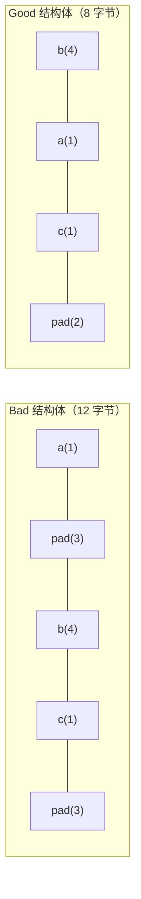

# 性能优化

## CPU Cache 与 Cache Miss

现代 CPU 访问内存的速度差异极大：


**Cache Line**：CPU 每次从内存读取数据是以 **64 字节**为单位（一个 cache line），不是按单个变量读。

### 顺序访问 vs 随机访问

```cpp
// 顺序访问：每次读取下一个元素时大概率已在 cache 里
for (int i = 0; i < N; i++)
    sum += arr[i];   // 快，cache 友好

// 随机访问：每次都可能 cache miss，去内存取数据
for (int i = 0; i < N; i++)
    sum += arr[rand() % N];  // 慢，cache 不友好
```

### 二维数组：行优先 vs 列优先

```cpp
int mat[1000][1000];

// 行优先（C++ 内存布局）：连续访问，cache 友好
for (int i = 0; i < 1000; i++)
    for (int j = 0; j < 1000; j++)
        sum += mat[i][j];   // 快

// 列优先：每次跨 1000 个 int 跳跃，大量 cache miss
for (int j = 0; j < 1000; j++)
    for (int i = 0; i < 1000; i++)
        sum += mat[i][j];   // 慢（差距可达 10 倍）
```

---

## 内存对齐

CPU 读取数据时要求地址对齐到数据大小的整数倍，否则需要两次读取。编译器会自动在结构体成员间插入 **padding**。

```cpp
struct Bad {
    char  a;   // 1 字节，偏移 0
    // 3 字节 padding
    int   b;   // 4 字节，偏移 4
    char  c;   // 1 字节，偏移 8
    // 3 字节 padding
};  // sizeof = 12

struct Good {
    int   b;   // 4 字节，偏移 0
    char  a;   // 1 字节，偏移 4
    char  c;   // 1 字节，偏移 5
    // 2 字节 padding
};  // sizeof = 8
```

**原则：成员按从大到小排列，减少 padding。**



查看对齐：
```cpp
std::cout << alignof(int);    // 4
std::cout << alignof(double); // 8
std::cout << sizeof(Bad);     // 12
std::cout << sizeof(Good);    // 8
```

---

## False Sharing（伪共享）

多个线程的变量落在**同一个 cache line**（64字节）内，一个线程修改时会导致另一个线程的 cache 失效，即使它们访问不同变量。

```cpp
// 有伪共享：两个计数器相邻，可能在同一 cache line
struct Counters {
    std::atomic<int> a;  // 线程 1 用
    std::atomic<int> b;  // 线程 2 用
};

// 消除伪共享：用 alignas 强制对齐到 cache line 边界
struct Counters {
    alignas(64) std::atomic<int> a;
    alignas(64) std::atomic<int> b;
};
```

---

## 避免不必要的拷贝

### 返回值优化（RVO / NRVO）

编译器直接在调用方的栈空间构造返回值，完全消除拷贝：

```cpp
std::vector<int> make() {
    std::vector<int> v = {1, 2, 3};
    return v;   // NRVO：编译器直接在调用方构造，不拷贝
}

auto v = make();  // 零拷贝
```

**不要在 return 语句里加 `std::move`**，会阻止 NRVO。

### 传参策略

```cpp
// 只读大对象：传 const 引用，不拷贝
void process(const std::vector<int>& v);

// 需要副本：直接传值，让调用方决定拷贝还是移动
void store(std::vector<int> v) {
    data_ = std::move(v);  // 函数内移动，不额外拷贝
}

store(v);             // 调用方拷贝一次
store(std::move(v));  // 调用方移动，零拷贝
```

### emplace_back vs push_back

```cpp
std::vector<std::string> v;

v.push_back("hello");           // 构造临时 string，再移动进去
v.emplace_back("hello");        // 直接在 vector 内部原地构造，少一次移动
```

---

## 分支预测

CPU 会预测 if/else 的走向，预测失败需要刷新流水线（约 15-20 个时钟周期的代价）。

```cpp
// 规律性强的条件，CPU 预测命中率高
for (int i = 0; i < N; i++)
    if (arr[i] > 0) sum += arr[i];

// 随机条件，预测命中率约 50%，性能较差
for (int i = 0; i < N; i++)
    if (rand() % 2) sum += arr[i];
```

C++20 提供 `[[likely]]` / `[[unlikely]]` 提示编译器：

```cpp
if (ptr != nullptr) [[likely]] {
    ptr->process();
}
```

---

## 面试常问

**Q：`std::vector` 扩容时为什么是 2 倍（或 1.5 倍）？**

每次扩容需要分配新内存并移动所有元素。2 倍扩容使均摊复杂度为 O(1)。1.5 倍的好处是旧内存释放后，可以被后续扩容复用（2 倍时新大小永远大于所有旧内存之和）。

**Q：`reserve` 和 `resize` 的区别？**

- `reserve(n)`：只分配内存，不改变 `size`，不构造元素，避免多次扩容
- `resize(n)`：分配内存且改变 `size`，新增元素默认构造

**Q：什么时候用 `std::array` 而不是 `std::vector`？**

大小编译期已知、栈上分配、不需要动态增长时用 `std::array`。它没有堆分配开销，访问和原始数组一样快，而且有边界检查（`.at()`）和 STL 接口。
