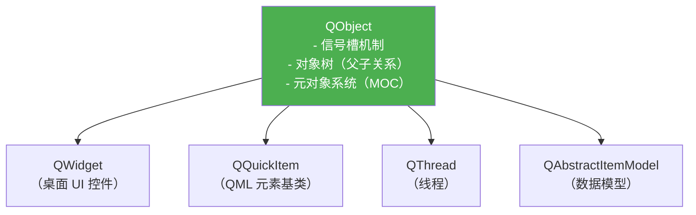

# Qt 与 QML

## Qt 对象模型

Qt 在标准 C++ 之上构建了一套对象系统，核心是 `QObject`。



**MOC（元对象编译器）**：Qt 的预处理工具，扫描含 `Q_OBJECT` 宏的头文件，生成信号槽、属性系统所需的额外代码。`moc_xxx.cpp` 是自动生成的，不要手动修改。

**对象树**：`QObject` 有父子关系，父对象析构时自动删除所有子对象，这是 Qt 的资源管理方式。

```cpp
auto* parent = new QWidget();
auto* child  = new QPushButton(parent);  // parent 析构时 child 自动删除
```

---

## 信号与槽

Qt 的观察者模式实现，比函数指针回调类型安全，比虚函数更灵活。

```cpp
// 定义
class Sensor : public QObject {
    Q_OBJECT
signals:
    void dataReady(float value);       // 信号：只声明，不定义
public slots:
    void onTimeout() { emit dataReady(3.14f); }  // emit 触发信号
};

class Display : public QObject {
    Q_OBJECT
public slots:
    void showValue(float v) { qDebug() << v; }
};

// 连接
Sensor sensor;
Display display;
QObject::connect(&sensor, &Sensor::dataReady,
                 &display, &Display::showValue);

// 现代 Lambda 连接（无需声明 slot）
QObject::connect(&sensor, &Sensor::dataReady, [](float v) {
    qDebug() << "Lambda 收到:" << v;
});
```

### 连接类型

| 类型 | 触发时机 | 适用 |
|------|----------|------|
| `Qt::DirectConnection` | 同步，信号线程直接调用 | 同线程 |
| `Qt::QueuedConnection` | 异步，投递到槽所在线程的事件队列 | 跨线程（默认）|
| `Qt::AutoConnection` | 同线程用 Direct，跨线程用 Queued | **默认值，推荐** |

**跨线程信号槽**：Qt 保证 `QueuedConnection` 是线程安全的，不需要手动加锁传递数据。

---

## Qt Widgets vs Qt Quick

| | Qt Widgets | Qt Quick / QML |
|--|--|--|
| 技术栈 | C++ | QML + JavaScript + C++ |
| 渲染 | 原生控件 | OpenGL / Metal / Vulkan |
| 适用 | 传统桌面应用 | 现代 UI、嵌入式、动画丰富 |
| 学习曲线 | 平缓 | 较陡（需学 QML）|
| 目标 JD 要求 | 基础 | **重点**（QML 是加分项）|

---

## QML 基础

QML 是声明式语言，描述 UI 结构和行为。

```qml
// Main.qml
import QtQuick
import QtQuick.Controls

Window {
    width: 640; height: 480
    visible: true
    title: "机器人监控"

    Column {
        anchors.centerIn: parent
        spacing: 10

        Text {
            id: statusText
            text: "等待数据..."
            font.pixelSize: 24
        }

        Button {
            text: "连接"
            onClicked: {
                statusText.text = "已连接"
                backend.startSensor()   // 调用 C++ 方法
            }
        }

        Rectangle {
            width: 200; height: 20
            color: "gray"
            Rectangle {
                width: parent.width * dataModel.progress  // 绑定 C++ 属性
                height: parent.height
                color: "#4ade80"
                Behavior on width { NumberAnimation { duration: 200 } }
            }
        }
    }
}
```

---

## C++ 与 QML 互操作

### Q_PROPERTY：暴露属性给 QML

```cpp
class RobotBackend : public QObject {
    Q_OBJECT
    // QML 可以读写 speed，值变化时发 speedChanged 信号
    Q_PROPERTY(float speed READ speed WRITE setSpeed NOTIFY speedChanged)
    Q_PROPERTY(float progress READ progress NOTIFY progressChanged)

public:
    explicit RobotBackend(QObject* parent = nullptr) : QObject(parent) {}

    float speed()    const { return speed_; }
    float progress() const { return progress_; }

    void setSpeed(float s) {
        if (qFuzzyCompare(speed_, s)) return;
        speed_ = s;
        emit speedChanged();
    }

signals:
    void speedChanged();
    void progressChanged();

public slots:
    Q_INVOKABLE void startSensor() {   // Q_INVOKABLE：QML 可直接调用
        // 启动传感器逻辑
    }

private:
    float speed_    = 0.0f;
    float progress_ = 0.0f;
};
```

### 注册并在 QML 中使用

```cpp
// main.cpp
int main(int argc, char* argv[]) {
    QGuiApplication app(argc, argv);

    RobotBackend backend;

    QQmlApplicationEngine engine;
    // 方式 1：作为上下文属性（简单，适合单例）
    engine.rootContext()->setContextProperty("backend", &backend);

    // 方式 2：注册为 QML 类型（可在 QML 中 new）
    qmlRegisterType<RobotBackend>("Robot", 1, 0, "RobotBackend");

    engine.load(QUrl("qrc:/Main.qml"));
    return app.exec();
}
```

```qml
// QML 中直接使用上下文属性
Text { text: backend.speed.toFixed(2) + " m/s" }
Button { onClicked: backend.startSensor() }
```

---

## Qt 中的多线程

**不要在非主线程操作 UI**，耗时操作移到工作线程。

```cpp
// 推荐方式：QThread + moveToThread
class Worker : public QObject {
    Q_OBJECT
public slots:
    void doWork() {
        // 耗时计算（在工作线程执行）
        auto result = heavy_computation();
        emit resultReady(result);
    }
signals:
    void resultReady(float result);
};

// 主线程
auto* thread = new QThread;
auto* worker = new Worker;
worker->moveToThread(thread);

// 线程启动时开始工作
connect(thread, &QThread::started, worker, &Worker::doWork);
// 工作完成后更新 UI（自动用 QueuedConnection 跨线程）
connect(worker, &Worker::resultReady, this, &MainWindow::updateUI);
// 工作完成后清理
connect(worker, &Worker::resultReady, thread, &QThread::quit);
connect(thread, &QThread::finished, worker, &QObject::deleteLater);
connect(thread, &QThread::finished, thread, &QObject::deleteLater);

thread->start();
```

---

## 面试常问

**Q：Qt 信号槽和直接函数调用有什么区别？**

信号槽通过元对象系统运行时派发，支持跨线程、一对多连接、运行时动态连接/断开；直接调用是编译期绑定，无法跨线程安全传递、无法一信号多槽。代价是有轻微运行时开销（字符串查找 → 函数指针，现代写法用函数指针语法已很快）。

**Q：`Q_PROPERTY` 的 NOTIFY 信号为什么重要？**

QML 的属性绑定依赖 NOTIFY 信号感知 C++ 属性变化。没有 NOTIFY，QML 只能读取一次初始值，后续 C++ 改变时 UI 不会更新。

**Q：`deleteLater` 和 `delete` 的区别？**

`deleteLater` 把删除操作投递到事件循环，在当前事件处理完后才执行。在槽函数里或信号处理中直接 `delete this` 会在调用栈还在该对象上时销毁它，导致崩溃；`deleteLater` 是安全的延迟删除。
