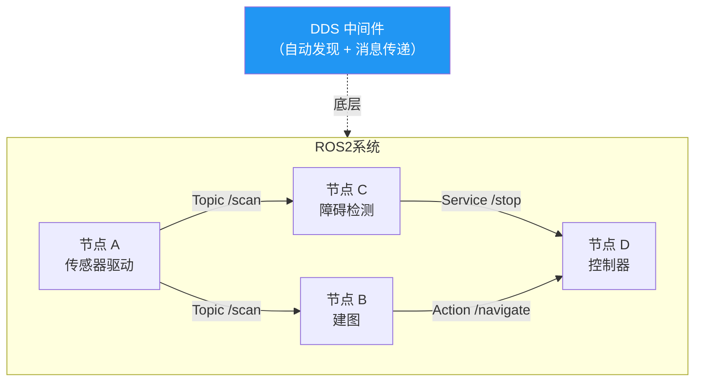
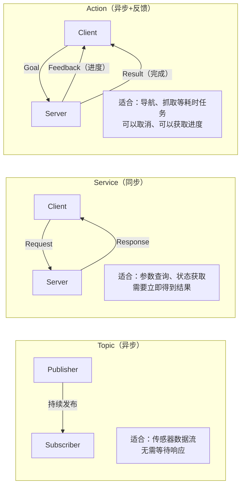
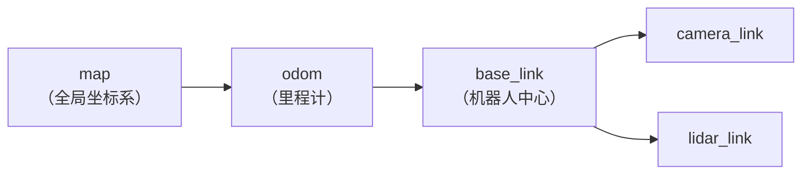

# ROS2 基础

> 概念理解在这里，实际操作在 Windows（WSL2 + Ubuntu 22.04）上进行。

## ROS2 整体架构



**节点（Node）**：最小执行单元，一个进程可以有多个节点。
**话题（Topic）**：异步发布/订阅，发布者不知道谁在订阅。
**服务（Service）**：同步请求/响应，类似 RPC。
**动作（Action）**：长时间异步任务，支持中间反馈和取消。

---

## rclcpp 节点基础

```cpp
#include <rclcpp/rclcpp.hpp>
#include <std_msgs/msg/float32.hpp>

class SensorNode : public rclcpp::Node {
public:
    SensorNode() : Node("sensor_node") {
        // 创建发布者：话题名、队列深度
        pub_ = create_publisher<std_msgs::msg::Float32>("/sensor/value", 10);

        // 创建定时器：100ms 发布一次
        timer_ = create_wall_timer(
            std::chrono::milliseconds(100),
            [this]() {
                auto msg = std_msgs::msg::Float32();
                msg.data = read_sensor();
                pub_->publish(msg);
            }
        );

        // 创建订阅者
        sub_ = create_subscription<std_msgs::msg::Float32>(
            "/cmd/speed", 10,
            [this](const std_msgs::msg::Float32::SharedPtr msg) {
                RCLCPP_INFO(get_logger(), "收到速度指令: %.2f", msg->data);
            }
        );
    }

private:
    float read_sensor() { return 3.14f; }

    rclcpp::Publisher<std_msgs::msg::Float32>::SharedPtr pub_;
    rclcpp::Subscription<std_msgs::msg::Float32>::SharedPtr sub_;
    rclcpp::TimerBase::SharedPtr timer_;
};

int main(int argc, char* argv[]) {
    rclcpp::init(argc, argv);
    rclcpp::spin(std::make_shared<SensorNode>());
    rclcpp::shutdown();
}
```

---

## Topic / Service / Action 对比



### Service 示例

```cpp
// 自定义 srv 文件：AddTwoInts.srv
// int64 a
// int64 b
// ---
// int64 sum

// 服务端
auto server = create_service<example_interfaces::srv::AddTwoInts>(
    "add_two_ints",
    [](const auto& req, auto& res) {
        res->sum = req->a + req->b;
    }
);

// 客户端
auto client = create_client<example_interfaces::srv::AddTwoInts>("add_two_ints");
auto request = std::make_shared<example_interfaces::srv::AddTwoInts::Request>();
request->a = 3; request->b = 5;

auto future = client->async_send_request(request);
// rclcpp::spin_until_future_complete(node, future);
// future.get()->sum == 8
```

---

## QoS（服务质量）

ROS2 通过 QoS 控制话题的可靠性、历史记录等，关键参数：

```cpp
rclcpp::QoS qos(10);  // 队列深度 10

// 可靠传输（类似 TCP，保证送达，默认）
qos.reliable();

// 尽力传输（类似 UDP，低延迟，允许丢包）
qos.best_effort();

// 保持最新 N 条消息
qos.keep_last(5);

// 传感器数据通常用：尽力 + 只保留最新
rclcpp::QoS sensor_qos = rclcpp::SensorDataQoS();

auto pub = create_publisher<Msg>("/scan", sensor_qos);
```

| 场景 | 推荐 QoS |
|------|----------|
| 传感器数据（激光雷达/相机）| best_effort + keep_last(1) |
| 控制指令 | reliable |
| 地图数据（大、重要）| reliable + transient_local（后来的订阅者也能收到）|

---

## TF2（坐标变换）

机器人系统中各传感器、关节的坐标系变换，ROS2 用 TF2 统一管理。



```cpp
#include <tf2_ros/transform_broadcaster.h>
#include <tf2_ros/buffer.h>
#include <tf2_ros/transform_listener.h>

// 发布坐标变换
auto tf_broadcaster = std::make_shared<tf2_ros::TransformBroadcaster>(node);
geometry_msgs::msg::TransformStamped tf;
tf.header.stamp    = node->now();
tf.header.frame_id = "base_link";
tf.child_frame_id  = "camera_link";
tf.transform.translation.x = 0.2;  // 相机在机器人前方 0.2m
tf_broadcaster->sendTransform(tf);

// 查询坐标变换（把激光雷达点转换到 map 坐标系）
tf2_ros::Buffer tf_buffer(node->get_clock());
tf2_ros::TransformListener tf_listener(tf_buffer);

auto tf = tf_buffer.lookupTransform("map", "lidar_link", tf2::TimePointZero);
```

---

## Launch 文件

管理多节点启动，Python 格式（ROS2 推荐）：

```python
# launch/robot.launch.py
from launch import LaunchDescription
from launch_ros.actions import Node

def generate_launch_description():
    return LaunchDescription([
        Node(
            package='my_robot',
            executable='sensor_node',
            name='sensor',
            parameters=[{'publish_rate': 10.0}],
            remappings=[('/sensor/value', '/lidar/scan')],
        ),
        Node(
            package='my_robot',
            executable='control_node',
            name='controller',
        ),
    ])
```

```bash
ros2 launch my_robot robot.launch.py
```

---

## 常用命令速查

```bash
# 查看运行中的节点/话题/服务
ros2 node list
ros2 topic list
ros2 service list

# 查看话题数据
ros2 topic echo /scan
ros2 topic hz /scan       # 查看发布频率
ros2 topic info /scan     # 查看消息类型、发布者/订阅者数量

# 手动发布消息
ros2 topic pub /cmd_vel geometry_msgs/msg/Twist "{linear: {x: 0.5}}"

# 调用服务
ros2 service call /add_two_ints example_interfaces/srv/AddTwoInts "{a: 3, b: 5}"

# 构建
colcon build --symlink-install
source install/setup.bash
```

---

## 面试常问

**Q：ROS2 和 ROS1 的主要区别？**

| | ROS1 | ROS2 |
|--|--|--|
| 中间件 | 自研 TCPROS | DDS（工业标准）|
| Master 节点 | 需要 roscore | 无，自动发现 |
| 实时性 | 差 | 支持实时系统 |
| 安全 | 无 | DDS Security |
| Python | 2 | 3 |

**Q：Topic 和 Service 怎么选？**

数据需要持续流动（传感器、状态）用 Topic；需要同步应答（查询、触发动作并等结果）用 Service；长时间任务且需要中间反馈或取消用 Action。

**Q：`spin` 和 `spin_some` 的区别？**

`spin` 阻塞当前线程持续处理所有回调；`spin_some` 处理当前待处理的回调后立即返回，适合在已有主循环的程序里手动调用（如 Qt 主循环 + ROS2 的集成场景）。
