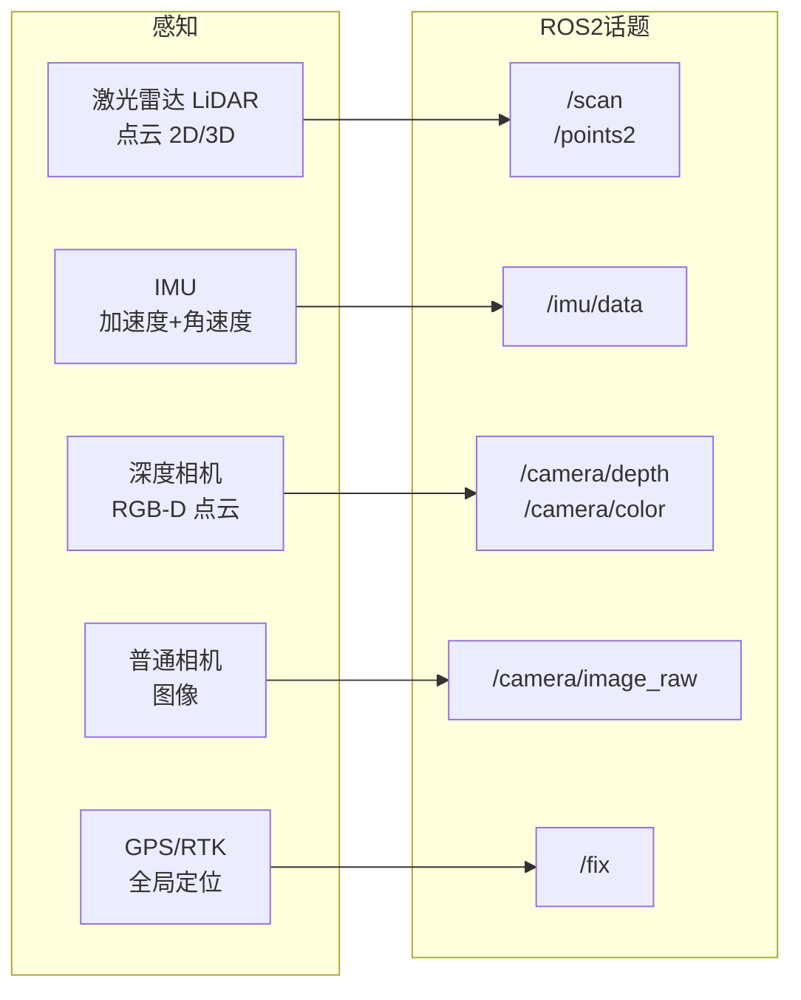
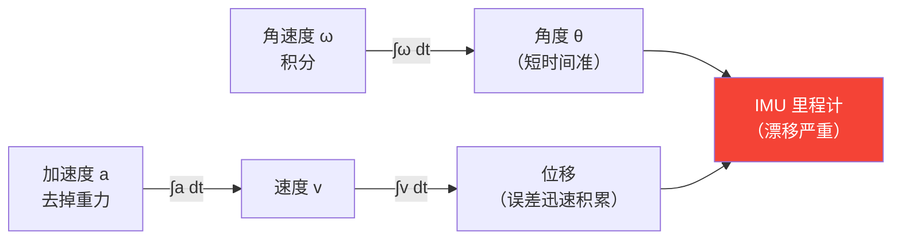
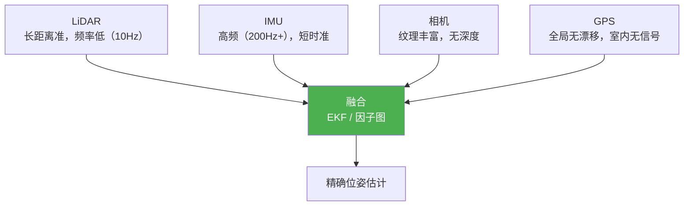

# 传感器基础

机器人软件工程师必须了解常用传感器的数据格式和接入方式。

## 传感器全景



---

## 激光雷达（LiDAR）

### 工作原理

发射激光脉冲，测量返回时间（TOF）计算距离。2D 雷达扫一个平面，3D 雷达（多线）扫整个空间。

```
常见型号：
- 2D：SICK TIM、Hokuyo URG（室内导航）
- 3D：Velodyne VLP-16（16线）、Ouster OS1-64（64线）、速腾聚创 RS-LiDAR
```

### 数据格式

```cpp
// ROS2 中 2D 雷达：sensor_msgs/LaserScan
sensor_msgs::msg::LaserScan scan;
scan.angle_min;       // 起始角度（rad）
scan.angle_max;       // 终止角度（rad）
scan.angle_increment; // 角分辨率
scan.ranges;          // 各角度的距离值（m），inf 表示超出量程

// 对应极坐标 → 直角坐标转换
for (int i = 0; i < scan.ranges.size(); i++) {
    float angle = scan.angle_min + i * scan.angle_increment;
    float r = scan.ranges[i];
    float x = r * std::cos(angle);
    float y = r * std::sin(angle);
}
```

```cpp
// ROS2 中 3D 雷达：sensor_msgs/PointCloud2
#include <pcl_conversions/pcl_conversions.h>
#include <pcl/point_cloud.h>
#include <pcl/point_types.h>

void lidar_callback(const sensor_msgs::msg::PointCloud2::SharedPtr msg) {
    pcl::PointCloud<pcl::PointXYZI>::Ptr cloud(new pcl::PointCloud<pcl::PointXYZI>);
    pcl::fromROSMsg(*msg, *cloud);

    for (auto& pt : cloud->points) {
        float x = pt.x, y = pt.y, z = pt.z;
        float intensity = pt.intensity;
        float dist = std::sqrt(x*x + y*y + z*z);
    }
}
```

### PCL 常用操作

```cpp
#include <pcl/filters/voxel_grid.h>
#include <pcl/filters/passthrough.h>

// 体素滤波（降采样，减少点数）
pcl::VoxelGrid<pcl::PointXYZI> vg;
vg.setInputCloud(cloud);
vg.setLeafSize(0.1f, 0.1f, 0.1f);  // 10cm 体素
pcl::PointCloud<pcl::PointXYZI>::Ptr filtered(new pcl::PointCloud<pcl::PointXYZI>);
vg.filter(*filtered);

// 直通滤波（只保留特定范围的点）
pcl::PassThrough<pcl::PointXYZI> pass;
pass.setInputCloud(cloud);
pass.setFilterFieldName("z");
pass.setFilterLimits(-0.5, 2.0);  // 只保留 z 在 [-0.5, 2.0] 的点
pass.filter(*filtered);
```

---

## IMU（惯性测量单元）

### 组成与数据

IMU = 加速度计（accelerometer）+ 陀螺仪（gyroscope），高端 IMU 还包含磁力计。

```cpp
// ROS2：sensor_msgs/Imu
sensor_msgs::msg::Imu imu_data;

// 线加速度（m/s²），包含重力
imu_data.linear_acceleration.x;
imu_data.linear_acceleration.y;
imu_data.linear_acceleration.z;  // 静止时约 9.8 m/s²

// 角速度（rad/s）
imu_data.angular_velocity.x;  // roll 速率
imu_data.angular_velocity.y;  // pitch 速率
imu_data.angular_velocity.z;  // yaw 速率

// 姿态四元数（有些 IMU 内部做了融合）
imu_data.orientation.x;
imu_data.orientation.y;
imu_data.orientation.z;
imu_data.orientation.w;
```

### IMU 积分与漂移



**IMU 单独用于定位误差会随时间积累（漂移），必须与其他传感器融合。**

---

## 深度相机

### 两种主流方案

| | 结构光（RealSense D435）| ToF（Azure Kinect）|
|--|--|--|
| 原理 | 投射红外图案，畸变推算深度 | 测量红外光飞行时间 |
| 优点 | 精度高，成本低 | 远距离，实时性好 |
| 缺点 | 强光下失效 | 分辨率较低 |

```cpp
// Intel RealSense SDK 基础
#include <librealsense2/rs.hpp>

rs2::pipeline pipe;
pipe.start();

while (true) {
    rs2::frameset frames = pipe.wait_for_frames();

    // 彩色图
    rs2::frame color = frames.get_color_frame();
    cv::Mat color_mat(cv::Size(640, 480), CV_8UC3,
                      (void*)color.get_data(), cv::Mat::AUTO_STEP);

    // 深度图（单位：毫米）
    rs2::depth_frame depth = frames.get_depth_frame();
    float dist = depth.get_distance(320, 240);  // 图像中心点的距离（米）

    // 生成点云
    rs2::pointcloud pc;
    rs2::points points = pc.calculate(depth);
}
```

### 深度图 → 3D 点云

```python
import numpy as np

# 给定内参，深度图转点云
def depth_to_pointcloud(depth, fx, fy, cx, cy):
    H, W = depth.shape
    u = np.arange(W)
    v = np.arange(H)
    uu, vv = np.meshgrid(u, v)

    z = depth / 1000.0            # mm → m
    x = (uu - cx) * z / fx
    y = (vv - cy) * z / fy

    points = np.stack([x, y, z], axis=-1)  # (H, W, 3)
    mask   = z > 0
    return points[mask]                    # 去掉无效点
```

---

## 传感器融合

单个传感器都有缺陷，融合多个传感器取长补短。



**EKF（扩展卡尔曼滤波）**：ROS2 中常用 `robot_localization` 包实现 IMU + GPS + 里程计融合。

**LiDAR-IMU 融合**（SLAM）：
- LOAM / LIO-SAM：利用 IMU 高频数据补偿 LiDAR 运动失真
- 开源项目：FAST-LIO2（港科大，精度高，被广泛使用）

---

## 面试常问

**Q：激光雷达和相机各有什么优缺点？**

| | LiDAR | 相机 |
|--|--|--|
| 深度 | 直接测量，精确 | 需要双目或结构光推算 |
| 纹理/颜色 | 无 | 丰富 |
| 光照影响 | 小（主动发射）| 大（依赖环境光）|
| 成本 | 高 | 低 |
| 点密度 | 稀疏（64线≈6万点/帧）| 密集（640×480=30万像素）|

**Q：IMU 为什么需要标定？**

IMU 出厂存在零偏（静止时输出不为零）、刻度误差、轴间不正交等系统误差。标定目的是测量并补偿这些误差，提高积分精度。常用工具：`imu_utils`（ROS 包）。

**Q：点云和图像在处理上有什么不同？**

图像是规则的二维网格，可以用卷积高效处理；点云是无序的三维点集，无法直接用 CNN，需要 PointNet、体素化后用 3D 卷积、或投影成距离图再用 2D CNN 处理。
