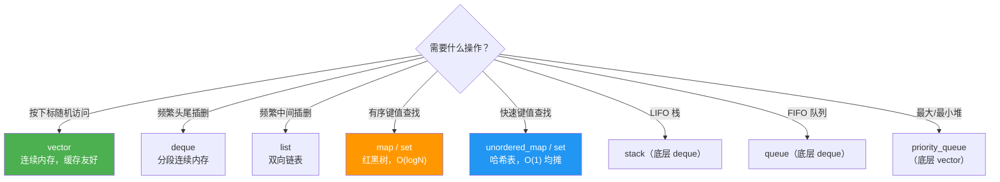

# STL 容器

## 容器选型速查



**默认选 `vector`**，有明确理由再换其他容器。

---

## vector

### 内部结构

```
[ ptr | size | capacity ]
  |
  ↓
[ 0 | 1 | 2 | 3 | _ | _ ]  ← 连续堆内存
                  ↑
                size=4, capacity=6
```

### 扩容机制

```cpp
std::vector<int> v;
// capacity 增长：0 → 1 → 2 → 4 → 8 → 16（每次 ×2）

v.reserve(100);   // 提前分配，避免多次扩容（push_back 不会重新分配）
v.resize(100);    // 分配内存并初始化为 0，size 变成 100
v.shrink_to_fit();// 释放多余容量（capacity 缩减到 size）
```

**扩容时发生什么**：分配新内存 → 移动（或拷贝）所有元素 → 释放旧内存。所以扩容时所有迭代器、指针、引用全部**失效**。

### 常见陷阱

```cpp
// 陷阱 1：扩容导致迭代器失效
auto it = v.begin();
v.push_back(99);   // 如果触发扩容，it 已经是悬空迭代器
*it;               // UB

// 陷阱 2：边遍历边删除
for (auto it = v.begin(); it != v.end(); ) {
    if (*it % 2 == 0)
        it = v.erase(it);  // erase 返回下一个有效迭代器
    else
        ++it;
}
```

---

## map vs unordered_map

| | `map` | `unordered_map` |
|--|--|--|
| 底层结构 | 红黑树 | 哈希表 |
| 查找复杂度 | O(log N) | O(1) 均摊，最坏 O(N) |
| 内存 | 每个节点单独分配，cache 不友好 | 桶数组，局部 cache 友好 |
| 有序 | 是，按 key 排序 | 否 |
| 何时用 | 需要有序遍历、范围查询 | 只需要快速查找 |

```cpp
// map：key 有序，可以做范围查询
std::map<int, std::string> m;
m[1] = "a";
m[3] = "c";
m[2] = "b";
// 遍历是有序的：1, 2, 3

// 范围查询：找所有 key 在 [2, 4) 的元素
auto lo = m.lower_bound(2);
auto hi = m.upper_bound(4);
for (auto it = lo; it != hi; ++it) { }

// unordered_map：只需要快速查找时用
std::unordered_map<std::string, int> freq;
for (auto& word : words) freq[word]++;
```

### unordered_map 的哈希冲突

```cpp
// 自定义类型作为 key，需要提供哈希函数
struct Point { int x, y; };

struct PointHash {
    size_t operator()(const Point& p) const {
        return std::hash<int>()(p.x) ^ (std::hash<int>()(p.y) << 32);
    }
};

std::unordered_map<Point, int, PointHash> map;
```

---

## deque

分段连续内存，头尾插入 O(1)，随机访问 O(1)，但常数比 `vector` 大。

```cpp
std::deque<int> dq;
dq.push_back(1);   // 尾部插入
dq.push_front(0);  // 头部插入，vector 做不到 O(1)
dq.pop_front();
dq[2];             // 随机访问
```

`std::stack` 和 `std::queue` 默认底层用 `deque`。

---

## priority_queue（堆）

默认最大堆，`top()` 始终是最大元素。

```cpp
// 最大堆
std::priority_queue<int> maxHeap;
maxHeap.push(3);
maxHeap.push(1);
maxHeap.push(4);
maxHeap.top();  // 4

// 最小堆
std::priority_queue<int, std::vector<int>, std::greater<int>> minHeap;

// 自定义比较：按距离排序（机器人路径规划常用）
using T = std::pair<float, int>;  // {距离, 节点id}
std::priority_queue<T, std::vector<T>, std::greater<T>> pq;  // 距离小的优先
```

---

## 常用 STL 算法

```cpp
#include <algorithm>

std::vector<int> v = {3, 1, 4, 1, 5, 9};

// 排序
std::sort(v.begin(), v.end());                        // 升序
std::sort(v.begin(), v.end(), std::greater<int>());   // 降序
std::stable_sort(v.begin(), v.end());                 // 稳定排序

// 查找
std::binary_search(v.begin(), v.end(), 4);            // 有序容器二分查找
auto it = std::lower_bound(v.begin(), v.end(), 4);    // 第一个 ≥ 4 的位置
auto it = std::find(v.begin(), v.end(), 4);           // 线性查找

// 统计
std::count(v.begin(), v.end(), 1);                    // 值为 1 的个数
auto [mn, mx] = std::minmax_element(v.begin(), v.end());

// 修改
std::reverse(v.begin(), v.end());
std::unique(v.begin(), v.end());                      // 去重（需先排序）
std::remove_if(v.begin(), v.end(), [](int x){ return x < 3; });

// 数值
#include <numeric>
std::accumulate(v.begin(), v.end(), 0);               // 求和
std::iota(v.begin(), v.end(), 0);                     // 填充 0,1,2,3...
```

---

## 面试常问

**Q：`vector<bool>` 有什么问题？**

`vector<bool>` 是特化版本，每个元素压缩到 1 位存储，`operator[]` 返回的是代理对象而非 `bool&`，行为和其他 `vector` 不同。需要存储 bool 序列时用 `vector<char>` 或 `deque<bool>`。

**Q：`map::operator[]` 和 `map::find` 的区别？**

`operator[]` 如果 key 不存在会**插入默认值**，`find` 不会。只查询不修改时用 `find` 或 `contains`（C++20）。

```cpp
std::map<std::string, int> m;
m["new_key"];          // 插入了 {"new_key", 0}，size 变大
m.find("other_key");   // 不存在返回 end()，不修改容器
```

**Q：`emplace` 和 `insert` 的区别？**

`insert` 需要先构造对象再拷贝/移动进容器；`emplace` 直接在容器内部原地构造，少一次移动。对于复杂对象优先用 `emplace`。
