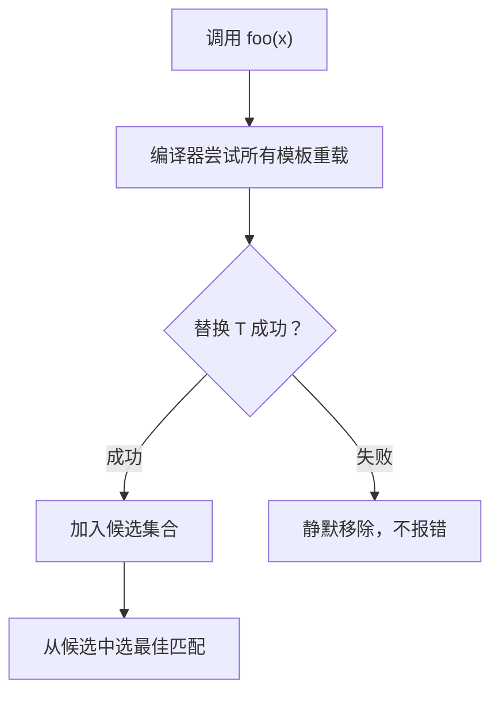

# 模板

## 函数模板 & 类模板

```cpp
// 函数模板
template<typename T>
T max(T a, T b) {
    return a > b ? a : b;
}

max(1, 2);          // T 推导为 int
max(1.0, 2.0);      // T 推导为 double
max<int>(1, 2);     // 显式指定

// 类模板
template<typename T>
class Stack {
    std::vector<T> data;
public:
    void push(const T& val) { data.push_back(val); }
    T pop() { T v = data.back(); data.pop_back(); return v; }
};

Stack<int> s;
```

模板在**编译期**为每种类型生成一份代码，运行期没有额外开销。

---

## if constexpr（C++17）

编译期的 if，根据条件**丢弃**不满足的分支，不参与编译。

```cpp
template<typename T>
void print(T val) {
    if constexpr (std::is_integral_v<T>) {
        std::cout << "整数: " << val << "\n";
    } else if constexpr (std::is_floating_point_v<T>) {
        std::cout << "浮点: " << val << "\n";
    } else {
        std::cout << "其他: " << val << "\n";
    }
}
```

**与普通 if 的区别**：普通 if 两个分支都要能编译通过；`if constexpr` 不满足条件的分支直接丢弃，即使那个分支对当前类型非法也没关系。

```cpp
template<typename T>
void process(T val) {
    if constexpr (std::is_pointer_v<T>) {
        std::cout << *val;   // 只有 T 是指针时才编译这行
    } else {
        std::cout << val;
    }
}
```

---

## SFINAE

**Substitution Failure Is Not An Error**——模板参数替换失败时，不报错，只是把这个候选函数从重载集合里移除。



```cpp
// 只对整数类型启用
template<typename T>
typename std::enable_if<std::is_integral<T>::value, void>::type
print(T val) {
    std::cout << "整数: " << val;
}

// 只对浮点类型启用
template<typename T>
typename std::enable_if<std::is_floating_point<T>::value, void>::type
print(T val) {
    std::cout << "浮点: " << val;
}

print(42);    // 调用整数版本
print(3.14);  // 调用浮点版本
// print("hi"); ← 编译错误，两个版本都被移除，没有匹配
```

现代写法用 `if constexpr` 或 Concepts（C++20）替代 SFINAE，更易读：

```cpp
// C++20 Concepts 写法，更清晰
template<std::integral T>
void print(T val) { std::cout << "整数: " << val; }

template<std::floating_point T>
void print(T val) { std::cout << "浮点: " << val; }
```

---

## 类型萃取（type traits）

编译期查询和变换类型属性，头文件 `<type_traits>`。

### 常用查询

```cpp
std::is_integral_v<int>         // true
std::is_pointer_v<int*>         // true
std::is_same_v<int, int>        // true
std::is_same_v<int, long>       // false
std::is_base_of_v<Base, Derived>// true
std::is_copy_constructible_v<T> // T 能拷贝构造？
std::is_trivially_copyable_v<T> // T 能 memcpy？
```

### 常用变换

```cpp
std::remove_const_t<const int>    // → int
std::remove_reference_t<int&>     // → int
std::add_pointer_t<int>           // → int*
std::decay_t<int[3]>              // → int*（数组退化）
std::conditional_t<true, int, double>  // → int
```

### 实际用途示例

```cpp
// 根据类型是否能 memcpy 选择不同的复制策略
template<typename T>
void copy_array(T* dst, const T* src, size_t n) {
    if constexpr (std::is_trivially_copyable_v<T>) {
        std::memcpy(dst, src, n * sizeof(T));  // 快路径
    } else {
        for (size_t i = 0; i < n; i++)
            dst[i] = src[i];                   // 逐个调用拷贝构造
    }
}
```

---

## 模板特化

### 全特化：为某个具体类型提供专门实现

```cpp
template<typename T>
struct Hash {
    size_t operator()(const T& val) { /* 通用实现 */ }
};

template<>
struct Hash<std::string> {       // 全特化，专门处理 string
    size_t operator()(const std::string& s) {
        size_t h = 0;
        for (char c : s) h = h * 31 + c;
        return h;
    }
};
```

### 偏特化：为一类类型提供实现

```cpp
template<typename T>
struct IsPointer { static constexpr bool value = false; };

template<typename T>
struct IsPointer<T*> { static constexpr bool value = true; };  // 偏特化：T 是指针

IsPointer<int>::value    // false
IsPointer<int*>::value   // true
```

---

## 变参模板（了解即可）

```cpp
template<typename... Args>
void log(Args&&... args) {
    (std::cout << ... << args) << "\n";  // 折叠表达式（C++17）
}

log(1, " hello ", 3.14);  // 输出：1 hello 3.14
```

---

## 面试常问

**Q：模板和虚函数都能实现多态，区别是什么？**

| | 模板（静态多态）| 虚函数（动态多态）|
|--|--|--|
| 时机 | 编译期 | 运行期 |
| 开销 | 无运行期开销，但代码膨胀 | 虚函数调用开销，灵活 |
| 适用 | 类型在编译期已知 | 类型在运行期才确定 |

**Q：`typename` 和 `class` 在模板里有区别吗？**

作为模板参数时没有区别，`template<typename T>` 和 `template<class T>` 完全等价。只有在嵌套类型时必须用 `typename`：

```cpp
template<typename T>
void foo() {
    typename T::iterator it;  // 告诉编译器 T::iterator 是类型，不是静态成员
}
```

**Q：头文件里为什么要写模板的实现？**

模板在实例化时才生成代码，编译器需要在使用处看到完整定义。如果把实现放在 `.cpp` 文件，其他编译单元看不到，链接时报"未定义的符号"。
