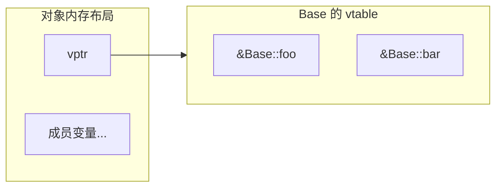

# 虚函数

## vtable 是什么

每个含虚函数的类，编译器会生成一张**虚函数表（vtable）**，存放该类所有虚函数的指针。每个对象内部有一个隐藏的 **vptr** 指向自己类的 vtable。



```cpp
class Base {
public:
    virtual void foo() {}
    virtual void bar() {}
    int x;
};

Base b;
// b 的内存：[ vptr | x ]
//           vptr → Base::vtable → [ &Base::foo, &Base::bar ]
```

**代价**：每个对象多一个指针（8 字节），每次虚函数调用多一次间接寻址。

---

## 虚函数的派发过程


```cpp
class Derived : public Base {
public:
    void foo() override {}  // 覆盖 Base::foo
};

Base* p = new Derived();
p->foo();
// 1. 取 p 指向对象的 vptr
// 2. 在 vtable 里找 foo 的槽位
// 3. 调用 Derived::foo（而不是 Base::foo）
```

派生类的 vtable 把被覆盖的槽位替换成自己的函数指针，未覆盖的槽位继承父类的。

---

## 为什么要虚析构

基类指针指向派生类对象时，如果析构函数不是虚的，`delete` 只会调用基类析构函数，派生类的资源**不会被释放**。

```cpp
class Base {
public:
    ~Base() { /* 非虚 */ }
};

class Derived : public Base {
    int* data = new int[100];
public:
    ~Derived() { delete[] data; }
};

Base* p = new Derived();
delete p;  // 只调用 ~Base()，data 泄漏！
```

**规则：只要类会被继承，析构函数就加 `virtual`。**

```cpp
class Base {
public:
    virtual ~Base() = default;  // 加上 virtual
};

Base* p = new Derived();
delete p;  // 先调用 ~Derived()，再调用 ~Base()，正确
```

---

## override 和 final

```cpp
class Base {
    virtual void foo(int x) {}
};

class Derived : public Base {
    void foo(int x) override {}  // override：让编译器检查签名是否匹配
    // void foo(float x) override {} ← 编译错误，签名不匹配
};

class Leaf final : public Derived {
    // final：禁止再被继承
};
```

**始终写 `override`**，不依赖隐式覆盖，可以防止签名写错导致的意外隐藏。

---

## 纯虚函数与抽象类

```cpp
class Shape {
public:
    virtual double area() = 0;  // 纯虚函数，= 0
    virtual ~Shape() = default;
};

// Shape s;  ← 编译错误，抽象类不能实例化

class Circle : public Shape {
    double r;
public:
    Circle(double r) : r(r) {}
    double area() override { return 3.14 * r * r; }
};
```

---

## 多态切片问题

用**值**（而不是指针/引用）传递多态对象时，派生类部分会被切掉。


```cpp
void print(Shape s) { ... }   // ← 按值传，发生切片

void print(Shape& s) { ... }  // ← 按引用传，正确
void print(Shape* s) { ... }  // ← 按指针传，正确
```

```cpp
Derived d;
Base b = d;      // 切片：b 只有 Base 部分，vptr 指向 Base::vtable
Base& ref = d;   // 没有切片：ref 的 vptr 还是 Derived 的
```

---

## 虚函数不能是 static / 模板函数

- `static` 函数没有 `this` 指针，无法通过 vptr 派发
- 模板函数在编译期展开，无法放入运行时的 vtable

---

## 面试常问

**Q：虚函数调用比普通函数慢多少？**

多一次指针解引用（vptr → vtable → 函数地址），现代 CPU 分支预测命中时几乎无感。真正的开销是**无法内联**——编译器不知道运行时调用哪个函数，无法做内联优化。

**Q：构造函数里调用虚函数会怎样？**

不会触发多态，调用的是**当前类**的版本。原因：构造基类时，vptr 还没有被派生类的 vtable 覆盖，指向的是基类自己的 vtable。

```cpp
class Base {
public:
    Base() { foo(); }          // 调用的是 Base::foo，不是 Derived::foo
    virtual void foo() { puts("Base"); }
};

class Derived : public Base {
public:
    void foo() override { puts("Derived"); }
};

Derived d;  // 输出 "Base"，不是 "Derived"
```

**Q：sizeof 一个有虚函数的空类是多少？**

至少 8 字节（64 位系统），因为有 vptr。没有虚函数的空类是 1 字节（C++ 规定对象地址唯一）。
