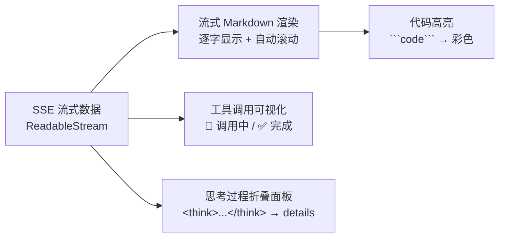

# AI 交互组件

> 流式 Markdown 渲染、代码高亮、工具调用可视化、思考过程折叠面板 —— 这些已经是标配，面试时能讲清楚就很加分。

::: tip 本地演示（离线可用）
`npm run dev` 后访问 → **[/demo-ai-components.html](http://localhost:5173/demo-ai-components.html)**（4 种场景，模拟流式输出效果）
:::

## 四个组件的职责



---

## 1. 流式 Markdown 渲染

模型逐字返回时，需要把**增量文本**实时渲染为格式化 HTML。

### 核心：SSE 读取流

```javascript
async function streamChat(prompt, onChunk) {
  const response = await fetch('/api/chat', {
    method: 'POST',
    headers: { 'Content-Type': 'application/json' },
    body: JSON.stringify({ messages: [{ role: 'user', content: prompt }] }),
  });

  const reader = response.body.getReader();
  const decoder = new TextDecoder();
  let buffer = '';

  while (true) {
    const { done, value } = await reader.read();
    if (done) break;

    buffer += decoder.decode(value, { stream: true });

    // 按行处理 SSE 格式：data: {"choices":[{"delta":{"content":"..."}}]}
    const lines = buffer.split('\n');
    buffer = lines.pop();  // 最后一行可能不完整，暂存

    for (const line of lines) {
      if (!line.startsWith('data: ') || line === 'data: [DONE]') continue;
      try {
        const json = JSON.parse(line.slice(6));
        const delta = json.choices?.[0]?.delta?.content ?? '';
        if (delta) onChunk(delta);
      } catch {}
    }
  }
}
```

### React 流式组件

```tsx
import { useState, useRef, useEffect } from 'react';
import { marked } from 'marked';

function StreamingMessage({ content }: { content: string }) {
  // 每次 content 更新时重新渲染 Markdown
  const html = marked.parse(content, { breaks: true, gfm: true });

  return (
    <div
      className="prose prose-sm max-w-none"
      dangerouslySetInnerHTML={{ __html: html }}
    />
  );
}

function ChatBox() {
  const [content, setContent] = useState('');
  const [loading, setLoading] = useState(false);

  const ask = async (prompt: string) => {
    setContent('');
    setLoading(true);
    await streamChat(prompt, (delta) => {
      setContent(prev => prev + delta);
    });
    setLoading(false);
  };

  return (
    <div>
      <StreamingMessage content={content} />
      {loading && <span className="animate-pulse">▌</span>}
    </div>
  );
}
```

---

## 2. 代码高亮

配合 Markdown 渲染，给 ` ``` ` 代码块自动上色。

### 方案 A：marked + highlight.js（轻量）

```html
<!-- CDN 引入 -->
<link rel="stylesheet" href="https://cdn.jsdelivr.net/npm/highlight.js/styles/github-dark.min.css">
<script src="https://cdn.jsdelivr.net/npm/highlight.js/lib/core.min.js"></script>
<script src="https://cdn.jsdelivr.net/npm/highlight.js/lib/languages/javascript.min.js"></script>
```

```javascript
import { marked } from 'marked';
import hljs from 'highlight.js';

// 配置 marked 的代码渲染器
marked.use({
  renderer: {
    code(code, lang) {
      const language = hljs.getLanguage(lang) ? lang : 'plaintext';
      const highlighted = hljs.highlight(code, { language }).value;
      return `<pre><code class="hljs language-${language}">${highlighted}</code></pre>`;
    },
  },
});
```

### 方案 B：react-markdown + react-syntax-highlighter（React 生态）

```tsx
import ReactMarkdown from 'react-markdown';
import { Prism as SyntaxHighlighter } from 'react-syntax-highlighter';
import { oneDark } from 'react-syntax-highlighter/dist/esm/styles/prism';

function MarkdownRenderer({ content }: { content: string }) {
  return (
    <ReactMarkdown
      components={{
        code({ inline, className, children }) {
          const lang = /language-(\w+)/.exec(className || '')?.[1] ?? '';
          return !inline ? (
            <SyntaxHighlighter style={oneDark} language={lang}>
              {String(children).trim()}
            </SyntaxHighlighter>
          ) : (
            <code className="bg-gray-100 px-1 rounded">{children}</code>
          );
        },
      }}
    >
      {content}
    </ReactMarkdown>
  );
}
```

---

## 3. 工具调用可视化

当模型调用工具时，要在 UI 上展示"正在调用 → 调用完成 → 结果"三个状态。

```tsx
// 工具调用的数据结构（AI SDK 格式）
type ToolInvocation = {
  toolCallId: string;
  toolName: string;
  args: Record<string, unknown>;
  state: 'partial-call' | 'call' | 'result';
  result?: unknown;
};

function ToolCallBadge({ tool }: { tool: ToolInvocation }) {
  const icons = { 'partial-call': '⏳', call: '🔧', result: '✅' };
  const labels = { 'partial-call': '准备中', call: '调用中', result: '完成' };

  return (
    <div className="flex items-start gap-2 my-2 p-3 bg-amber-50 border border-amber-200 rounded-lg text-sm">
      <span className="text-lg">{icons[tool.state]}</span>
      <div>
        <div className="font-mono font-semibold">{tool.toolName}</div>
        <div className="text-gray-600 text-xs mt-1">
          参数：<code>{JSON.stringify(tool.args)}</code>
        </div>
        {tool.state === 'result' && (
          <div className="text-green-700 text-xs mt-1">
            结果：<code>{JSON.stringify(tool.result)}</code>
          </div>
        )}
      </div>
      {tool.state === 'call' && (
        <div className="ml-auto w-4 h-4 border-2 border-amber-400 border-t-transparent rounded-full animate-spin" />
      )}
    </div>
  );
}

// 在消息列表里使用
function MessageList({ messages }) {
  return messages.map(m => (
    <div key={m.id}>
      {m.toolInvocations?.map(tool => (
        <ToolCallBadge key={tool.toolCallId} tool={tool} />
      ))}
      {m.content && <MarkdownRenderer content={m.content} />}
    </div>
  ));
}
```

---

## 4. 思考过程折叠面板

DeepSeek / QwQ / Claude 等支持 `<think>` 标签，把推理过程和最终回答分开。

### 解析 `<think>` 标签

```javascript
function parseThinking(rawContent) {
  const thinkMatch = rawContent.match(/<think>([\s\S]*?)<\/think>/);
  const thinking = thinkMatch?.[1]?.trim() ?? null;
  const answer = rawContent.replace(/<think>[\s\S]*?<\/think>/, '').trim();
  return { thinking, answer };
}
```

### React 折叠组件

```tsx
import { useState } from 'react';

function ThinkingPanel({ content }: { content: string }) {
  const [open, setOpen] = useState(false);
  const { thinking, answer } = parseThinking(content);

  return (
    <div>
      {thinking && (
        <div className="my-2 border border-gray-200 rounded-lg overflow-hidden">
          <button
            onClick={() => setOpen(o => !o)}
            className="w-full flex items-center gap-2 px-3 py-2 bg-gray-50 text-sm text-gray-600 hover:bg-gray-100"
          >
            <span>{open ? '▼' : '▶'}</span>
            <span className="font-medium">思考过程</span>
            <span className="text-gray-400 text-xs ml-auto">
              {thinking.length} 字
            </span>
          </button>
          {open && (
            <div className="px-4 py-3 text-sm text-gray-500 whitespace-pre-wrap bg-white border-t">
              {thinking}
            </div>
          )}
        </div>
      )}
      <MarkdownRenderer content={answer} />
    </div>
  );
}
```

### 流式场景下的状态机

```javascript
// 流式输出时 <think> 可能被分多次 chunk 到达，需要维护状态
function useThinkingState() {
  const [raw, setRaw] = useState('');
  const [phase, setPhase] = useState('thinking'); // 'thinking' | 'answering'

  const append = (delta) => {
    setRaw(prev => {
      const next = prev + delta;
      if (next.includes('</think>')) setPhase('answering');
      return next;
    });
  };

  const { thinking, answer } = parseThinking(raw);
  return { thinking, answer, phase, append };
}
```

---

## 完整可运行示例

```html
<!DOCTYPE html>
<html lang="zh">
<head>
  <meta charset="UTF-8" />
  <title>AI 交互组件演示</title>
  <link rel="stylesheet" href="https://cdn.jsdelivr.net/npm/highlight.js/styles/github-dark.min.css">
  <style>
    body { font-family: sans-serif; max-width: 700px; margin: 30px auto; padding: 0 20px; }
    .message { margin: 12px 0; padding: 12px; border-radius: 8px; }
    .user { background: #e3f2fd; text-align: right; }
    .assistant { background: #f5f5f5; }
    .thinking-header { cursor: pointer; padding: 8px; background: #fffde7; border-radius: 4px;
                       font-size: 13px; color: #666; display: flex; align-items: center; gap: 8px; }
    .thinking-body { padding: 8px; font-size: 12px; color: #888; border-top: 1px solid #eee;
                     white-space: pre-wrap; display: none; }
    .tool-call { padding: 8px; margin: 4px 0; background: #fff3e0; border-radius: 4px; font-size: 13px; }
    pre { margin: 8px 0; border-radius: 6px; overflow-x: auto; }
  </style>
</head>
<body>
  <h2>🎨 AI 交互组件演示</h2>
  <div id="messages"></div>
  <div style="display:flex;gap:8px;margin-top:12px">
    <input id="input" style="flex:1;padding:8px;" placeholder="输入消息..." />
    <button onclick="demo()">模拟 AI 回复</button>
  </div>

  <script src="https://cdn.jsdelivr.net/npm/marked/marked.min.js"></script>
  <script src="https://cdn.jsdelivr.net/npm/highlight.js/lib/core.min.js"></script>
  <script src="https://cdn.jsdelivr.net/npm/highlight.js/lib/languages/javascript.min.js"></script>
  <script src="https://cdn.jsdelivr.net/npm/highlight.js/lib/languages/python.min.js"></script>
  <script>
  // 配置 marked 代码高亮
  marked.use({
    renderer: {
      code(code, lang) {
        const l = hljs.getLanguage(lang) ? lang : 'plaintext';
        return `<pre><code class="hljs language-${l}">${hljs.highlight(code, {language: l}).value}</code></pre>`;
      }
    }
  });

  function parseThinking(raw) {
    const m = raw.match(/<think>([\s\S]*?)<\/think>/);
    return { thinking: m?.[1]?.trim(), answer: raw.replace(/<think>[\s\S]*?<\/think>/, '').trim() };
  }

  function addMessage(role, rawContent, toolCalls = []) {
    const wrap = document.createElement('div');
    wrap.className = `message ${role}`;

    // 工具调用
    toolCalls.forEach(tc => {
      const div = document.createElement('div');
      div.className = 'tool-call';
      div.innerHTML = `🔧 <strong>${tc.name}</strong>(${JSON.stringify(tc.args)}) → ${JSON.stringify(tc.result)}`;
      wrap.appendChild(div);
    });

    // 思考过程 + 回答
    const { thinking, answer } = parseThinking(rawContent);
    if (thinking) {
      const header = document.createElement('div');
      header.className = 'thinking-header';
      header.innerHTML = `▶ 思考过程 <span style="margin-left:auto;font-size:11px">${thinking.length} 字</span>`;
      const body = document.createElement('div');
      body.className = 'thinking-body';
      body.textContent = thinking;
      header.onclick = () => {
        const open = body.style.display === 'block';
        body.style.display = open ? 'none' : 'block';
        header.innerHTML = `${open ? '▶' : '▼'} 思考过程 <span style="margin-left:auto;font-size:11px">${thinking.length} 字</span>`;
      };
      wrap.appendChild(header);
      wrap.appendChild(body);
    }

    const contentDiv = document.createElement('div');
    contentDiv.innerHTML = marked.parse(answer || rawContent);
    wrap.appendChild(contentDiv);
    document.getElementById('messages').appendChild(wrap);
  }

  // 模拟各种组件场景
  const demos = [
    {
      user: '写一个 JavaScript 快速排序',
      ai: `好的！下面是快速排序的实现：

\`\`\`javascript
function quickSort(arr) {
  if (arr.length <= 1) return arr;
  const pivot = arr[Math.floor(arr.length / 2)];
  const left = arr.filter(x => x < pivot);
  const mid = arr.filter(x => x === pivot);
  const right = arr.filter(x => x > pivot);
  return [...quickSort(left), ...mid, ...quickSort(right)];
}

console.log(quickSort([3, 6, 8, 10, 1, 2, 1]));
// => [1, 1, 2, 3, 6, 8, 10]
\`\`\`

时间复杂度平均 O(n log n)，最坏 O(n²)。`,
      tools: []
    },
    {
      user: '北京今天天气怎么样？',
      ai: '根据查询结果，北京今天**晴天**，气温 **28°C**，空气质量良好，适合外出。',
      tools: [{ name: 'get_weather', args: { city: '北京' }, result: { temp: 28, weather: '晴' } }]
    },
    {
      user: '2+2等于几？请思考后回答',
      ai: `<think>
用户问 2+2 等于几。这是基础算术。
2+2 = 4，这是确定的数学事实。
</think>

**2 + 2 = 4**`,
      tools: []
    },
  ];

  let idx = 0;
  window.demo = function() {
    const d = demos[idx % demos.length];
    idx++;
    addMessage('user', d.user);
    setTimeout(() => addMessage('assistant', d.ai, d.tools), 300);
    document.getElementById('input').value = '';
  };
  </script>
</body>
</html>
```

---

## 核心要点总结

| 知识点 | 一句话 |
|---|---|
| 流式渲染 | `ReadableStream` + `TextDecoder` 逐行解析 SSE，state 累积拼接 |
| Markdown 安全 | `dangerouslySetInnerHTML` 前要用 DOMPurify 过滤 XSS |
| 代码高亮时机 | 流式过程中不高亮（影响性能），`isLoading=false` 后触发 `hljs.highlightAll()` |
| 工具调用状态 | `partial-call → call → result` 三阶段，用不同 UI 反馈 |
| `<think>` 解析 | 用正则 `/<think>([\s\S]*?)<\/think>/` 提取，流式时用状态机跟踪 |
