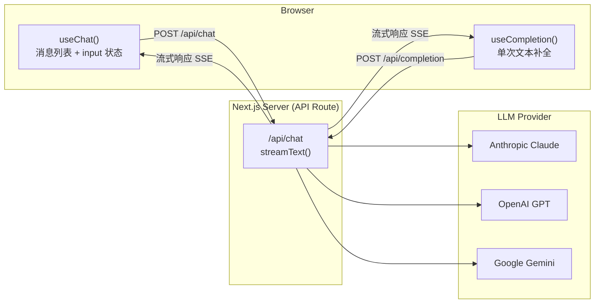

# AI SDK：Vercel AI SDK 快速上手

> Vercel AI SDK 是目前前端对接大模型的**事实标准**，`useChat` / `useCompletion` 两个 Hook 半天就能上手。

::: info 关于演示
AI SDK 需要 Next.js 后端 + API Key，无法做成纯浏览器演示。可以直接参考 [AI 交互组件演示](/demo-ai-components.html) 体验流式输出效果，原理完全一致。
:::

## 整体架构



---

## 安装

```bash
# Next.js 项目
npm install ai @ai-sdk/anthropic
# 或者 OpenAI
npm install ai @ai-sdk/openai
```

---

## useChat — 多轮对话

### 后端：`app/api/chat/route.ts`

```typescript
import { anthropic } from '@ai-sdk/anthropic';
import { streamText } from 'ai';

// Edge Runtime 让流式响应更低延迟
export const runtime = 'edge';

export async function POST(req: Request) {
  const { messages } = await req.json();

  const result = streamText({
    model: anthropic('claude-sonnet-4-6'),  // 换成 openai('gpt-4o') 也一样
    messages,                               // 把完整历史传进去，模型记住上下文
    system: '你是一个有帮助的 AI 助手，回复简洁。',
    maxTokens: 1024,
  });

  // toDataStreamResponse() 把 ReadableStream 包成 AI SDK 格式
  return result.toDataStreamResponse();
}
```

### 前端：`app/page.tsx`

```tsx
'use client';
import { useChat } from 'ai/react';

export default function ChatPage() {
  const {
    messages,    // 消息数组 [{ id, role, content }]
    input,       // 输入框的受控值
    handleInputChange,
    handleSubmit,
    isLoading,   // 模型还在生成时为 true
    stop,        // 中止生成
    error,
  } = useChat({
    api: '/api/chat',         // 对应后端路由
    initialMessages: [],      // 可以预置系统消息
    onFinish: (message) => {  // 每次生成完毕的回调
      console.log('Done:', message.content);
    },
  });

  return (
    <div className="flex flex-col h-screen max-w-2xl mx-auto p-4">
      {/* 消息列表 */}
      <div className="flex-1 overflow-y-auto space-y-4">
        {messages.map((m) => (
          <div key={m.id} className={m.role === 'user' ? 'text-right' : 'text-left'}>
            <span className={`inline-block px-3 py-2 rounded-lg ${
              m.role === 'user' ? 'bg-blue-500 text-white' : 'bg-gray-100'
            }`}>
              {m.content}
            </span>
          </div>
        ))}
        {isLoading && <div className="text-gray-400">AI 正在思考...</div>}
      </div>

      {/* 输入区域 */}
      <form onSubmit={handleSubmit} className="flex gap-2 mt-4">
        <input
          value={input}
          onChange={handleInputChange}
          placeholder="输入消息..."
          className="flex-1 border rounded px-3 py-2"
          disabled={isLoading}
        />
        {isLoading
          ? <button type="button" onClick={stop}>停止</button>
          : <button type="submit">发送</button>
        }
      </form>
    </div>
  );
}
```

---

## useCompletion — 单次文本补全

适合"文章续写""代码补全""一问一答"等场景，不需要维护多轮历史。

### 后端：`app/api/completion/route.ts`

```typescript
import { anthropic } from '@ai-sdk/anthropic';
import { streamText } from 'ai';

export const runtime = 'edge';

export async function POST(req: Request) {
  const { prompt } = await req.json();  // useCompletion 发的是 { prompt }

  const result = streamText({
    model: anthropic('claude-haiku-4-5-20251001'),  // 轻量任务用 Haiku 更便宜
    prompt,
    maxTokens: 512,
  });

  return result.toDataStreamResponse();
}
```

### 前端：`app/completion/page.tsx`

```tsx
'use client';
import { useCompletion } from 'ai/react';

export default function CompletionPage() {
  const {
    completion,   // 当前生成的文本（流式实时更新）
    input,
    handleInputChange,
    handleSubmit,
    isLoading,
  } = useCompletion({ api: '/api/completion' });

  return (
    <div className="max-w-xl mx-auto p-4 space-y-4">
      <h2>文章续写</h2>
      <form onSubmit={handleSubmit} className="space-y-2">
        <textarea
          value={input}
          onChange={handleInputChange}
          rows={4}
          placeholder="输入开头，让 AI 帮你续写..."
          className="w-full border rounded p-2"
        />
        <button type="submit" disabled={isLoading}>
          {isLoading ? '生成中...' : '续写'}
        </button>
      </form>

      {/* 流式输出区域 */}
      {completion && (
        <div className="border rounded p-3 bg-gray-50 whitespace-pre-wrap">
          {completion}
        </div>
      )}
    </div>
  );
}
```

---

## 两个 Hook 的关键状态对比

| 状态/方法 | `useChat` | `useCompletion` | 说明 |
|---|---|---|---|
| `messages` | ✅ | ❌ | 完整聊天历史 |
| `completion` | ❌ | ✅ | 当前补全文本 |
| `input` | ✅ | ✅ | 受控输入值 |
| `isLoading` | ✅ | ✅ | 请求进行中 |
| `stop()` | ✅ | ✅ | 中止流式生成 |
| `reload()` | ✅ | ✅ | 重新生成上一条 |
| `append()` | ✅ | ❌ | 手动追加消息 |

---

## 进阶：工具调用（Tool Use）

```typescript
// route.ts — 给模型提供工具
import { tool } from 'ai';
import { z } from 'zod';

const result = streamText({
  model: anthropic('claude-sonnet-4-6'),
  messages,
  tools: {
    getWeather: tool({
      description: '获取指定城市的当前天气',
      parameters: z.object({
        city: z.string().describe('城市名'),
      }),
      execute: async ({ city }) => {
        // 实际调用天气 API
        return { city, temp: 22, weather: '晴' };
      },
    }),
  },
  maxSteps: 5,  // 允许模型连续调用多次工具
});
```

```tsx
// 前端展示工具调用过程
{messages.map((m) => (
  <div key={m.id}>
    {m.role === 'assistant' && m.toolInvocations?.map((tool) => (
      <div key={tool.toolCallId} className="bg-yellow-50 p-2 text-sm">
        🔧 调用工具：{tool.toolName}({JSON.stringify(tool.args)})
        {tool.state === 'result' && <span> → {JSON.stringify(tool.result)}</span>}
      </div>
    ))}
    <p>{m.content}</p>
  </div>
))}
```

---

## 核心要点总结

| 知识点 | 一句话 |
|---|---|
| `streamText` vs `generateText` | 前者流式推送，后者等生成完整再返回 |
| `toDataStreamResponse()` | SDK 私有格式，前端 Hook 自动解析，含工具调用元数据 |
| `toTextStreamResponse()` | 纯文本 SSE，与 OpenAI 格式兼容 |
| Edge Runtime | 部署在 CDN 边缘节点，首字节延迟更低 |
| Provider 切换 | 只换第一行 `import`，其余代码不动 |
