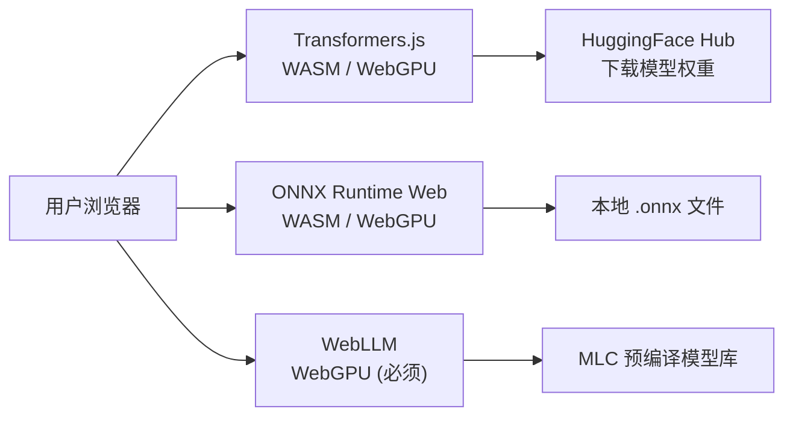
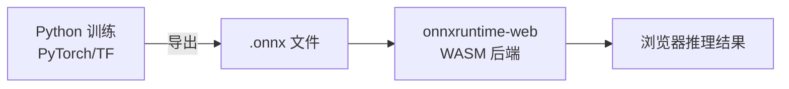

# 浏览器端推理：WebLLM / Transformers.js / ONNX Runtime Web

> 不经服务器，把模型直接跑在用户浏览器里。省钱、离线可用、隐私更好。

::: tip 本地演示
`npm run dev` 后访问 → **[/demo-browser-inference.html](http://localhost:5173/demo-browser-inference.html)**（需联网下载模型，约 30 MB）
:::

## 三种方案对比

| 方案 | 核心能力 | 模型来源 | 适用场景 |
|---|---|---|---|
| **Transformers.js** | NLP 任务为主（分类/摘要/翻译/生成） | HuggingFace Hub | 轻量 NLP、快速集成 |
| **ONNX Runtime Web** | 任意 ONNX 格式模型，视觉/NLP 皆可 | 自行导出 `.onnx` | 自定义模型，精细控制 |
| **WebLLM** | 完整 LLM 对话（Llama/Qwen 等） | MLC 预编译 | 本地 ChatGPT 替代 |



---

## 1. Transformers.js — 情感分析示例

**最容易上手**：`npm install @huggingface/transformers` 或直接用 CDN。

### 可运行代码

把以下代码保存为 `transformers_demo.html`，用浏览器打开即可（需要联网下载模型，约 30 MB）：

```html
<!DOCTYPE html>
<html lang="zh">
<head>
  <meta charset="UTF-8" />
  <title>Transformers.js 情感分析</title>
  <style>
    body { font-family: sans-serif; max-width: 600px; margin: 40px auto; padding: 0 20px; }
    textarea { width: 100%; height: 80px; margin: 8px 0; }
    button { padding: 8px 20px; cursor: pointer; }
    #result { margin-top: 16px; padding: 12px; background: #f0f0f0; border-radius: 6px; }
    #log { font-size: 12px; color: #888; margin-top: 8px; }
  </style>
</head>
<body>
  <h2>🤖 Transformers.js 情感分析</h2>
  <p>模型在浏览器本地运行，不经过任何服务器。</p>
  <textarea id="input" placeholder="输入一段英文文本，如：I love this product!">I love this product! It works perfectly.</textarea>
  <button onclick="analyze()">分析情感</button>
  <div id="log">状态：等待中...</div>
  <div id="result" style="display:none"></div>

  <script type="module">
    import { pipeline } from 'https://cdn.jsdelivr.net/npm/@huggingface/transformers@3/dist/transformers.min.js';

    let classifier = null;

    async function loadModel() {
      document.getElementById('log').textContent = '状态：正在加载模型（首次约 30s）...';
      // 使用量化 int8 版本，体积更小
      classifier = await pipeline(
        'sentiment-analysis',
        'Xenova/distilbert-base-uncased-finetuned-sst-2-english',
        { quantized: true }
      );
      document.getElementById('log').textContent = '状态：模型已就绪 ✅';
    }

    window.analyze = async function () {
      if (!classifier) {
        await loadModel();
      }
      const text = document.getElementById('input').value.trim();
      if (!text) return;

      document.getElementById('log').textContent = '状态：推理中...';
      const t0 = performance.now();
      const output = await classifier(text);
      const ms = (performance.now() - t0).toFixed(1);

      const { label, score } = output[0];
      const emoji = label === 'POSITIVE' ? '😊' : '😞';
      document.getElementById('result').style.display = 'block';
      document.getElementById('result').innerHTML = `
        <strong>结果：${emoji} ${label}</strong><br/>
        置信度：${(score * 100).toFixed(1)}%<br/>
        推理耗时：${ms} ms
      `;
      document.getElementById('log').textContent = '状态：完成';
    };

    // 页面加载后自动预热模型
    loadModel();
  </script>
</body>
</html>
```

### 关键 API 解读

```javascript
import { pipeline } from '@huggingface/transformers';

// pipeline(task, model, options)
// task: 'sentiment-analysis' | 'translation' | 'summarization' | 'text-generation' | ...
// quantized: true 使用 int8 量化，体积缩小约 4x
const classifier = await pipeline('sentiment-analysis', 'model-id', { quantized: true });

// 推理：接受字符串或字符串数组
const result = await classifier('I love this!');
// => [{ label: 'POSITIVE', score: 0.9998 }]
```

---

## 2. ONNX Runtime Web — 图像分类示例

适合你已经有训练好的模型，导出成 `.onnx` 格式后直接在浏览器跑。

### 工作流程



### 核心代码结构

```javascript
import * as ort from 'onnxruntime-web';

// 1. 加载模型
const session = await ort.InferenceSession.create('./model.onnx', {
  executionProviders: ['webgpu', 'wasm'], // 优先 WebGPU，降级 WASM
});

// 2. 准备输入张量（Float32Array）
const inputData = new Float32Array([/* 预处理后的数据 */]);
const inputTensor = new ort.Tensor('float32', inputData, [1, 3, 224, 224]);

// 3. 推理
const feeds = { input: inputTensor };   // key 对应模型的输入节点名
const results = await session.run(feeds);

// 4. 读取输出
const outputData = results['output'].data;  // Float32Array
```

### Python 导出模型（参考）

```python
import torch
import torchvision.models as models

model = models.mobilenet_v2(pretrained=True)
model.eval()

dummy_input = torch.randn(1, 3, 224, 224)
torch.onnx.export(
    model, dummy_input, 'mobilenet_v2.onnx',
    input_names=['input'], output_names=['output'],
    opset_version=13
)
```

---

## 3. WebLLM — 本地 LLM 对话

需要支持 **WebGPU** 的浏览器（Chrome 113+），显存至少 4GB。

### 可运行代码

```html
<!DOCTYPE html>
<html lang="zh">
<head>
  <meta charset="UTF-8" />
  <title>WebLLM 本地对话</title>
  <style>
    body { font-family: sans-serif; max-width: 700px; margin: 40px auto; padding: 0 20px; }
    #chat { height: 300px; overflow-y: auto; border: 1px solid #ddd; padding: 12px; border-radius: 8px; }
    .msg { margin: 8px 0; } .user { color: #1a73e8; } .ai { color: #333; }
    input { width: 80%; padding: 8px; } button { padding: 8px 16px; }
    #progress { margin: 8px 0; font-size: 13px; color: #888; }
  </style>
</head>
<body>
  <h2>🧠 WebLLM 本地 LLM（需 WebGPU）</h2>
  <div id="chat"></div>
  <div id="progress">点击「加载模型」开始（首次下载约 500MB）</div>
  <button onclick="loadModel()">加载模型</button>
  <br/><br/>
  <input id="input" placeholder="输入消息..." disabled />
  <button onclick="send()" disabled id="sendBtn">发送</button>

  <script type="module">
    import { CreateMLCEngine } from 'https://esm.run/@mlc-ai/web-llm';

    let engine = null;
    const messages = [{ role: 'system', content: '你是一个有帮助的 AI 助手。' }];

    window.loadModel = async function () {
      const prog = document.getElementById('progress');
      engine = await CreateMLCEngine(
        'Qwen2.5-0.5B-Instruct-q4f16_1-MLC',  // 0.5B 模型，约 400MB
        {
          initProgressCallback: (p) => {
            prog.textContent = `加载进度：${(p.progress * 100).toFixed(0)}% - ${p.text}`;
          },
        }
      );
      prog.textContent = '✅ 模型已就绪';
      document.getElementById('input').disabled = false;
      document.getElementById('sendBtn').disabled = false;
    };

    window.send = async function () {
      const input = document.getElementById('input');
      const text = input.value.trim();
      if (!text || !engine) return;

      addMsg('user', text);
      messages.push({ role: 'user', content: text });
      input.value = '';

      const reply = addMsg('ai', '');
      // 流式输出
      const stream = await engine.chat.completions.create({
        messages,
        stream: true,
        temperature: 0.7,
      });

      let full = '';
      for await (const chunk of stream) {
        const delta = chunk.choices[0]?.delta?.content ?? '';
        full += delta;
        reply.textContent = `AI：${full}`;
      }
      messages.push({ role: 'assistant', content: full });
    };

    function addMsg(role, text) {
      const chat = document.getElementById('chat');
      const div = document.createElement('div');
      div.className = `msg ${role}`;
      div.textContent = role === 'user' ? `你：${text}` : `AI：${text}`;
      chat.appendChild(div);
      chat.scrollTop = chat.scrollHeight;
      return div;
    }
  </script>
</body>
</html>
```

---

## 核心要点总结

| 知识点 | 一句话 |
|---|---|
| WASM 后端 | CPU 推理，兼容所有现代浏览器，速度慢 3~5x |
| WebGPU 后端 | GPU 推理，速度接近原生，Chrome 113+ 才支持 |
| 量化（quantized）| int8/int4 压缩，体积减 4x，精度略降 |
| SharedArrayBuffer | WASM 多线程需要 HTTPS + `COOP/COEP` 响应头 |
| 首次加载慢 | 模型会被浏览器缓存到 Cache API，第二次秒开 |
