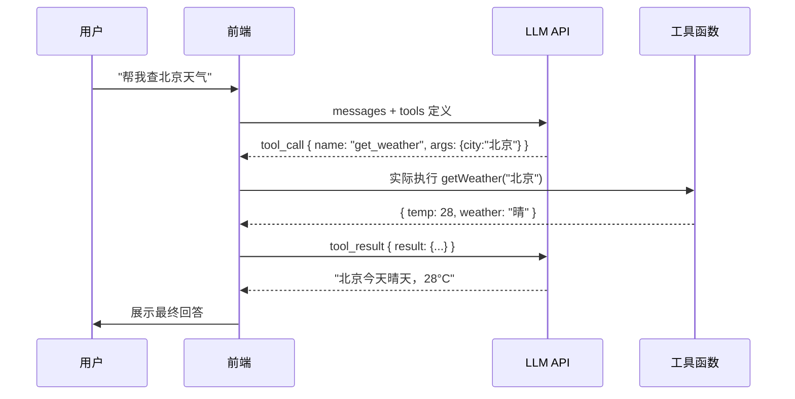

# Function Calling（工具调用）

> 前端定义工具，把用户操作转成模型能理解的 schema，模型决定调哪个，这件事在 UI 上如何呈现出来。

::: tip 本地演示（离线可用）
`npm run dev` 后访问 → **[/demo-function-calling.html](http://localhost:5173/demo-function-calling.html)**（单工具/计算/并行/链式 4 种调用场景）
:::

## 工作流程



---

## Tool Schema 定义

所有主流 LLM Provider（OpenAI / Anthropic / Google）的 tool 定义格式高度相似：

### OpenAI / Vercel AI SDK 格式

```typescript
import { tool } from 'ai';
import { z } from 'zod';

const tools = {
  // 工具名（snake_case）
  get_weather: tool({
    description: '获取指定城市的当前天气信息',
    parameters: z.object({
      city: z.string().describe('城市名，如"北京"、"上海"'),
      unit: z.enum(['celsius', 'fahrenheit']).optional().default('celsius'),
    }),
    execute: async ({ city, unit }) => {
      // 真实逻辑：调用天气 API
      const response = await fetch(`https://api.weather.com/v1?city=${city}`);
      return await response.json();
    },
  }),

  search_docs: tool({
    description: '在知识库中搜索相关文档',
    parameters: z.object({
      query: z.string().describe('搜索关键词'),
      topK: z.number().int().min(1).max(10).default(3),
    }),
    execute: async ({ query, topK }) => {
      return await vectorStore.search(query, topK);
    },
  }),

  create_calendar_event: tool({
    description: '创建日历事件',
    parameters: z.object({
      title: z.string(),
      date: z.string().describe('ISO 8601 格式，如 2024-01-15T10:00:00'),
      duration: z.number().describe('时长，单位分钟'),
    }),
    execute: async (params) => {
      return await calendarAPI.create(params);
    },
  }),
};
```

### Anthropic 原生格式

```typescript
const tools = [
  {
    name: 'get_weather',
    description: '获取指定城市的当前天气',
    input_schema: {
      type: 'object',
      properties: {
        city: { type: 'string', description: '城市名' },
        unit: { type: 'string', enum: ['celsius', 'fahrenheit'], default: 'celsius' },
      },
      required: ['city'],
    },
  },
];
```

---

## 前端完整处理流程

```typescript
// 多轮工具调用循环（支持模型连续调用多个工具）
async function runWithTools(userMessage: string) {
  const messages: Message[] = [{ role: 'user', content: userMessage }];

  while (true) {
    const response = await anthropic.messages.create({
      model: 'claude-sonnet-4-6',
      max_tokens: 1024,
      tools,
      messages,
    });

    // 把模型回复加入历史
    messages.push({ role: 'assistant', content: response.content });

    // 如果模型选择停止（没有工具调用），返回最终文本
    if (response.stop_reason === 'end_turn') {
      return response.content.find(b => b.type === 'text')?.text ?? '';
    }

    // 处理工具调用
    if (response.stop_reason === 'tool_use') {
      const toolResults: ToolResultBlock[] = [];

      for (const block of response.content) {
        if (block.type !== 'tool_use') continue;

        console.log(`调用工具: ${block.name}`, block.input);

        // 执行对应工具
        const executor = toolExecutors[block.name];
        const result = executor ? await executor(block.input) : { error: 'Unknown tool' };

        toolResults.push({
          type: 'tool_result',
          tool_use_id: block.id,
          content: JSON.stringify(result),
        });
      }

      // 把工具结果作为 user 消息发回
      messages.push({ role: 'user', content: toolResults });
      // 继续循环，让模型根据结果继续生成
    }
  }
}
```

---

## UI 呈现层

### 工具调用时间线组件

```tsx
type ToolStep = {
  id: string;
  name: string;
  args: Record<string, unknown>;
  status: 'running' | 'done' | 'error';
  result?: unknown;
  durationMs?: number;
};

function ToolTimeline({ steps }: { steps: ToolStep[] }) {
  return (
    <div className="space-y-2 my-3">
      {steps.map((step, i) => (
        <div key={step.id} className="flex items-start gap-3">
          {/* 序号线 */}
          <div className="flex flex-col items-center">
            <div className={`w-6 h-6 rounded-full flex items-center justify-center text-xs text-white font-bold ${
              step.status === 'done' ? 'bg-green-500'
              : step.status === 'error' ? 'bg-red-500'
              : 'bg-yellow-500'
            }`}>
              {step.status === 'running' ? '…' : i + 1}
            </div>
            {i < steps.length - 1 && <div className="w-px h-4 bg-gray-200 mt-1" />}
          </div>

          {/* 内容 */}
          <div className="flex-1 pb-2">
            <div className="flex items-center gap-2">
              <span className="font-mono text-sm font-semibold">{step.name}</span>
              {step.durationMs && (
                <span className="text-xs text-gray-400">{step.durationMs}ms</span>
              )}
            </div>
            <div className="text-xs text-gray-500 mt-1">
              <span className="text-gray-400">参数：</span>
              <code className="bg-gray-100 px-1 rounded">{JSON.stringify(step.args)}</code>
            </div>
            {step.status === 'done' && step.result && (
              <div className="text-xs text-green-700 mt-1">
                <span className="text-gray-400">结果：</span>
                <code className="bg-green-50 px-1 rounded">{JSON.stringify(step.result)}</code>
              </div>
            )}
            {step.status === 'error' && (
              <div className="text-xs text-red-600 mt-1">调用失败</div>
            )}
          </div>
        </div>
      ))}
    </div>
  );
}
```

---

## 完整可运行示例（纯前端模拟）

```html
<!DOCTYPE html>
<html lang="zh">
<head>
  <meta charset="UTF-8" />
  <title>Function Calling 模拟演示</title>
  <style>
    body { font-family: sans-serif; max-width: 700px; margin: 40px auto; padding: 0 20px; }
    .step { display: flex; gap: 12px; margin: 8px 0; }
    .badge { width: 24px; height: 24px; border-radius: 50%; display: flex; align-items: center;
             justify-content: center; font-size: 12px; font-weight: bold; color: white; flex-shrink: 0; }
    .running { background: #f59e0b; } .done { background: #10b981; } .error { background: #ef4444; }
    code { background: #f3f4f6; padding: 2px 6px; border-radius: 4px; font-size: 12px; }
    .result-text { margin-top: 12px; padding: 12px; background: #f0f7ff; border-radius: 8px; }
    button { padding: 8px 20px; cursor: pointer; margin: 4px; }
    select { padding: 6px; }
  </style>
</head>
<body>
  <h2>🔧 Function Calling 演示</h2>
  <p>选择一个场景，观察模型如何决定调用哪些工具：</p>

  <select id="scene">
    <option value="weather">查询天气</option>
    <option value="calc">数学计算</option>
    <option value="multi">多工具：天气 + 日历</option>
  </select>
  <button onclick="runDemo()">运行演示</button>

  <div id="output"></div>

  <script>
  // 模拟工具定义
  const TOOLS = {
    get_weather: {
      description: '获取城市天气',
      execute: async ({ city }) => {
        await delay(800);
        return { city, temp: Math.floor(20 + Math.random() * 15), weather: ['晴', '多云', '阴', '小雨'][Math.floor(Math.random() * 4)] };
      }
    },
    calculate: {
      description: '数学计算',
      execute: async ({ expression }) => {
        await delay(300);
        try { return { result: eval(expression) }; }
        catch { return { error: '计算失败' }; }
      }
    },
    create_event: {
      description: '创建日历事件',
      execute: async ({ title, date }) => {
        await delay(600);
        return { success: true, eventId: `EVT_${Date.now()}`, title, date };
      }
    },
  };

  const SCENES = {
    weather: {
      user: '帮我查北京的天气',
      calls: [{ name: 'get_weather', args: { city: '北京' } }],
      finalAnswer: (results) => `北京今天${results[0].weather}，气温 ${results[0].temp}°C。`,
    },
    calc: {
      user: '计算 (123 + 456) * 2 等于多少',
      calls: [{ name: 'calculate', args: { expression: '(123 + 456) * 2' } }],
      finalAnswer: (results) => `计算结果：(123 + 456) × 2 = **${results[0].result}**`,
    },
    multi: {
      user: '查北京天气，如果天气好就帮我创建"公园跑步"事件',
      calls: [
        { name: 'get_weather', args: { city: '北京' } },
        { name: 'create_event', args: { title: '公园跑步', date: '2026-06-12T07:00:00' } },
      ],
      finalAnswer: (results) => `北京今天${results[0].weather}，气温${results[0].temp}°C，${
        ['晴','多云'].includes(results[0].weather) ? '天气不错，' : ''
      }已帮您创建「公园跑步」事件（ID: ${results[1].eventId}）。`,
    },
  };

  function delay(ms) { return new Promise(r => setTimeout(r, ms)); }

  async function runDemo() {
    const scene = SCENES[document.getElementById('scene').value];
    const out = document.getElementById('output');
    out.innerHTML = `<p><strong>用户：</strong>${scene.user}</p><div id="steps"></div>`;

    const steps = document.getElementById('steps');
    const results = [];

    for (let i = 0; i < scene.calls.length; i++) {
      const call = scene.calls[i];
      const stepEl = document.createElement('div');
      stepEl.className = 'step';
      stepEl.innerHTML = `
        <div class="badge running" id="badge-${i}">…</div>
        <div>
          <strong>${call.name}</strong><br/>
          参数：<code>${JSON.stringify(call.args)}</code><br/>
          <span id="result-${i}" style="font-size:12px;color:#888">执行中...</span>
        </div>`;
      steps.appendChild(stepEl);

      const result = await TOOLS[call.name].execute(call.args);
      results.push(result);

      document.getElementById(`badge-${i}`).className = 'badge done';
      document.getElementById(`badge-${i}`).textContent = '✓';
      document.getElementById(`result-${i}`).textContent = `结果：${JSON.stringify(result)}`;
    }

    const answer = document.createElement('div');
    answer.className = 'result-text';
    answer.innerHTML = `<strong>AI 最终回答：</strong><br/>${scene.finalAnswer(results)}`;
    out.appendChild(answer);
  }
  </script>
</body>
</html>
```

---

## 设计工具时的原则

| 原则 | 说明 |
|---|---|
| **单一职责** | 每个工具做一件事，不要把"查天气+创建日历"合成一个工具 |
| **描述要清晰** | `description` 是给模型看的，越具体模型越不会误调用 |
| **参数用 enum** | 有限选项的参数用枚举，防止模型传入非法值 |
| **返回结构化数据** | 返回 JSON 对象而非自然语言，方便模型理解并继续推理 |
| **幂等性** | 读操作天然幂等；写操作要防重复调用（用 idempotency key） |
| **超时处理** | 工具执行设置超时，避免模型无限等待 |

---

## 核心要点总结

| 知识点 | 一句话 |
|---|---|
| `stop_reason: 'tool_use'` | 模型说"我要调工具"，由前端/后端实际执行 |
| `tool_result` 消息 | 把执行结果以 `user` 角色发回，模型继续生成 |
| `maxSteps` | Vercel AI SDK 的参数，控制最多循环几轮，防止无限调用 |
| 并行工具调用 | 模型可以一次返回多个 `tool_use`，可并行执行后一起回传 |
| 工具错误处理 | 执行失败也要返回 `tool_result`（带 `is_error: true`），模型会重试或换策略 |
