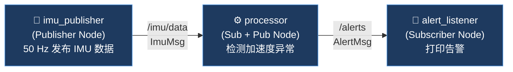
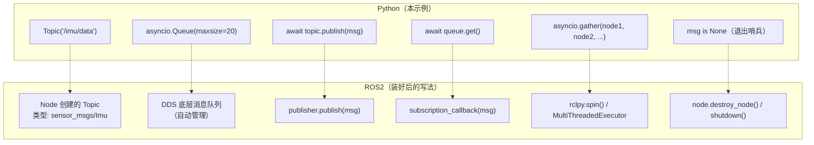
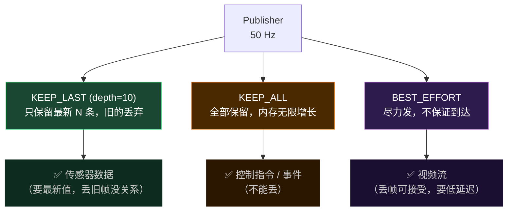

# Pub/Sub 模型：从 Python 到 ROS2

> 在 ROS2 装好之前，用纯 Python 把发布/订阅的核心机制跑通，建立直觉。

## 系统结构

三个节点并发运行，通过两个 Topic 传递消息：



**数据流**：IMU 传感器每秒 50 帧 → 处理节点判断加速度是否超阈值 → 超了就发告警。

---

## 可运行示例

将以下代码保存为 `pubsub_demo.py`，直接 `python3 pubsub_demo.py` 运行：

```python
import asyncio
import numpy as np
from dataclasses import dataclass, field
from time import monotonic

# ── 消息类型（对应 ROS2 里的 .msg 定义）─────────────────────────
@dataclass
class ImuMsg:
    stamp: float
    accel: np.ndarray = field(default_factory=lambda: np.zeros(3))
    gyro:  np.ndarray = field(default_factory=lambda: np.zeros(3))

@dataclass
class AlertMsg:
    stamp: float
    text: str

# ── Topic（带广播能力的异步队列）────────────────────────────────
class Topic:
    def __init__(self, name: str):
        self.name = name
        self._subscribers: list[asyncio.Queue] = []

    def subscribe(self) -> asyncio.Queue:
        q = asyncio.Queue(maxsize=20)       # QoS: 最多缓存 20 条
        self._subscribers.append(q)
        return q

    async def publish(self, msg):
        for q in self._subscribers:
            if not q.full():                # 满了就丢，对应 KEEP_LAST 策略
                await q.put(msg)

# ── 节点 1：IMU 发布者 ──────────────────────────────────────────
async def imu_publisher(topic: Topic, hz: int = 50):
    interval = 1.0 / hz
    count = 0
    while count < 100:                      # 发 100 帧退出
        msg = ImuMsg(
            stamp=monotonic(),
            accel=np.array([0.0, 0.0, 9.8]) + np.random.randn(3) * 0.1,
            gyro=np.random.randn(3) * 0.05,
        )
        await topic.publish(msg)
        await asyncio.sleep(interval)
        count += 1
    await topic.publish(None)               # None 是退出哨兵

# ── 节点 2：处理节点（订阅 IMU，发布告警）──────────────────────
async def processor(imu_topic: Topic, alert_topic: Topic):
    imu_queue = imu_topic.subscribe()
    threshold = 9.9                         # 加速度异常阈值 (m/s²)
    received = 0
    while True:
        msg: ImuMsg = await imu_queue.get()
        if msg is None:
            await alert_topic.publish(None)
            break
        received += 1
        norm = np.linalg.norm(msg.accel)
        if norm > threshold:
            await alert_topic.publish(
                AlertMsg(stamp=msg.stamp, text=f"|accel|={norm:.2f} 超阈值!")
            )
    print(f"[processor] 共处理 {received} 帧")

# ── 节点 3：告警订阅者 ──────────────────────────────────────────
async def alert_listener(alert_topic: Topic):
    queue = alert_topic.subscribe()
    count = 0
    while True:
        msg: AlertMsg = await queue.get()
        if msg is None:
            break
        count += 1
        print(f"  ⚠  t={msg.stamp:.3f}s  {msg.text}")
    print(f"[alert_listener] 共收到 {count} 条告警")

# ── 启动：三个节点并发运行 ──────────────────────────────────────
async def main():
    imu_topic   = Topic("/imu/data")
    alert_topic = Topic("/alerts")
    print("=== 系统启动 ===\n")
    await asyncio.gather(
        imu_publisher(imu_topic, hz=50),
        processor(imu_topic, alert_topic),
        alert_listener(alert_topic),
    )
    print("\n=== 所有节点退出 ===")

asyncio.run(main())
```

---

## Python 与 ROS2 API 的对照



---

## QoS 策略：消费者跟不上时怎么办

代码里 `maxsize=20` + 满了丢弃，这对应 ROS2 的 **QoS（服务质量）** 配置：



---

## 运行预期输出

```
=== 系统启动 ===

  ⚠  t=123.456s  |accel|=10.01 超阈值!
  ⚠  t=123.476s  |accel|=9.93 超阈值!
  ...
[processor] 共处理 99 帧
[alert_listener] 共收到 N 条告警

=== 所有节点退出 ===
```

---

## 下一步

ROS2 Jazzy 装好后，把 `processor` 改成真正的 ROS2 节点只需要：

```python
# 把这两行
imu_queue = imu_topic.subscribe()
msg = await imu_queue.get()

# 换成这两行
self.sub = self.create_subscription(Imu, '/imu/data', self.callback, 10)
def callback(self, msg: Imu): ...
```

其余逻辑完全不变。
