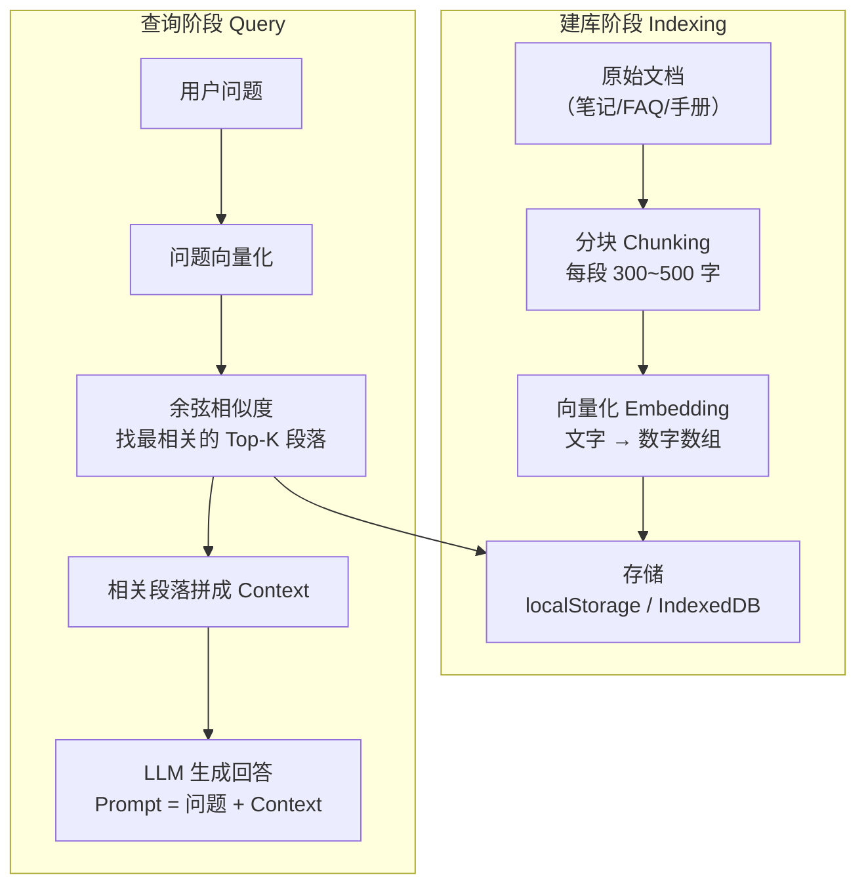

# RAG 在前端的应用

> RAG = Retrieval-Augmented Generation，先检索相关文档片段，再把片段塞进 Prompt 让模型回答，避免模型瞎编。

::: tip 本地演示（离线可用）
`npm run dev` 后访问 → **[/demo-rag.html](http://localhost:5173/demo-rag.html)**（纯 JS，无需 API Key，无需联网）
:::

## 工作原理



---

## 核心概念

### 向量 (Vector) & 余弦相似度

```javascript
// 两个文本越"语义相近"，它们的向量夹角越小，余弦值越接近 1
function cosineSimilarity(a, b) {
  const dot = a.reduce((sum, v, i) => sum + v * b[i], 0);
  const normA = Math.sqrt(a.reduce((sum, v) => sum + v * v, 0));
  const normB = Math.sqrt(b.reduce((sum, v) => sum + v * v, 0));
  return dot / (normA * normB);
}

// 示例
const vecA = [0.9, 0.1, 0.0];  // 代表"苹果"
const vecB = [0.8, 0.2, 0.1];  // 代表"水果"
const vecC = [0.0, 0.0, 0.9];  // 代表"汽车"

console.log(cosineSimilarity(vecA, vecB)); // ≈ 0.99  语义相近
console.log(cosineSimilarity(vecA, vecC)); // ≈ 0.00  语义无关
```

### Embedding（嵌入向量）

实际项目中不会手写向量，而是调用 Embedding 模型把文字自动转成高维向量：

```javascript
// 方案 A：调用 OpenAI / Anthropic Embedding API（需联网）
const response = await fetch('https://api.openai.com/v1/embeddings', {
  method: 'POST',
  headers: { 'Authorization': `Bearer ${API_KEY}`, 'Content-Type': 'application/json' },
  body: JSON.stringify({ model: 'text-embedding-3-small', input: text }),
});
const { data } = await response.json();
const vector = data[0].embedding;  // 1536 维 Float32Array

// 方案 B：Transformers.js 本地 Embedding（离线可用）
import { pipeline } from '@huggingface/transformers';
const embedder = await pipeline('feature-extraction', 'Xenova/all-MiniLM-L6-v2');
const output = await embedder(text, { pooling: 'mean', normalize: true });
const vector = Array.from(output.data);  // 384 维
```

---

## 完整可运行示例

把以下代码保存为 `rag_demo.html`，浏览器直接打开（使用本地 TF-IDF 向量，无需 API Key）：

```html
<!DOCTYPE html>
<html lang="zh">
<head>
  <meta charset="UTF-8" />
  <title>RAG 前端示例</title>
  <style>
    body { font-family: sans-serif; max-width: 700px; margin: 40px auto; padding: 0 20px; }
    textarea, input { width: 100%; box-sizing: border-box; padding: 8px; margin: 4px 0; }
    button { padding: 8px 20px; cursor: pointer; margin: 4px 2px; }
    .chunk { border: 1px solid #ddd; padding: 8px; margin: 4px 0; border-radius: 4px; font-size: 13px; }
    .score { color: #888; font-size: 11px; }
    #answer { background: #f0f7ff; padding: 12px; border-radius: 6px; margin-top: 12px; white-space: pre-wrap; }
  </style>
</head>
<body>
  <h2>📚 前端 RAG 示例（纯 JS，无需后端）</h2>

  <h3>步骤 1：添加知识库文档</h3>
  <textarea id="docInput" rows="4" placeholder="输入一段知识，如：Vue 是一个渐进式 JavaScript 框架..."></textarea>
  <button onclick="addDoc()">添加到知识库</button>
  <div id="docList"></div>

  <h3>步骤 2：提问</h3>
  <input id="queryInput" placeholder="输入问题，如：Vue 是什么？" />
  <button onclick="search()">搜索相关段落</button>
  <div id="results"></div>
  <div id="answer" style="display:none"></div>

  <script>
  // ── TF-IDF 简化版 Embedding（仅作演示，真实项目用神经网络 Embedding）────────
  class TFIDFEmbedder {
    constructor() { this.vocab = new Map(); this.docs = []; }

    tokenize(text) {
      return text.toLowerCase().replace(/[^一-龥a-z0-9\s]/g, '').split(/\s+/).filter(Boolean);
    }

    addDoc(text) {
      const tokens = this.tokenize(text);
      tokens.forEach(t => { if (!this.vocab.has(t)) this.vocab.set(t, this.vocab.size); });
      this.docs.push(tokens);
      return this.docs.length - 1;
    }

    embed(text) {
      const tokens = this.tokenize(text);
      const tf = new Map();
      tokens.forEach(t => tf.set(t, (tf.get(t) || 0) + 1));

      const vec = new Array(this.vocab.size).fill(0);
      tf.forEach((count, term) => {
        const idx = this.vocab.get(term);
        if (idx !== undefined) {
          const idf = Math.log((this.docs.length + 1) / (1 + this.docs.filter(d => d.includes(term)).length));
          vec[idx] = (count / tokens.length) * idf;
        }
      });
      return vec;
    }
  }

  function cosine(a, b) {
    let dot = 0, na = 0, nb = 0;
    for (let i = 0; i < a.length; i++) { dot += a[i] * b[i]; na += a[i]*a[i]; nb += b[i]*b[i]; }
    return na && nb ? dot / (Math.sqrt(na) * Math.sqrt(nb)) : 0;
  }

  // ── 状态 ─────────────────────────────────────────────────────────────────────
  const embedder = new TFIDFEmbedder();
  const knowledgeBase = [];  // [{ text, vector }]

  // 预置一些知识
  const seed = [
    'Vue 是一个渐进式 JavaScript 框架，用于构建用户界面，特别适合单页应用程序开发。',
    'React 是 Facebook 开发的前端库，使用虚拟 DOM 和组件化思想，性能优秀。',
    'Transformers.js 是 HuggingFace 的浏览器端机器学习库，支持 WASM 和 WebGPU 后端。',
    'RAG 是 Retrieval-Augmented Generation 的缩写，先检索相关文档再生成回答，可以减少模型幻觉。',
    'IndexedDB 是浏览器内置的本地数据库，支持存储大量结构化数据，适合离线应用。',
    'WebGPU 是新一代浏览器图形 API，比 WebGL 性能更高，可用于 AI 推理加速。',
  ];
  seed.forEach(addDocInternal);

  function addDocInternal(text) {
    embedder.addDoc(text);
    knowledgeBase.forEach(item => { item.vector = embedder.embed(item.text); });
    const vector = embedder.embed(text);
    knowledgeBase.push({ text, vector });
    renderDocs();
  }

  window.addDoc = function() {
    const text = document.getElementById('docInput').value.trim();
    if (!text) return;
    addDocInternal(text);
    document.getElementById('docInput').value = '';
  };

  function renderDocs() {
    document.getElementById('docList').innerHTML =
      `<p style="color:#888;font-size:13px">知识库共 ${knowledgeBase.length} 条</p>`;
  }

  window.search = function() {
    const query = document.getElementById('queryInput').value.trim();
    if (!query || knowledgeBase.length === 0) return;

    embedder.addDoc(query);  // 更新词表
    knowledgeBase.forEach(item => { item.vector = embedder.embed(item.text); });
    const qVec = embedder.embed(query);

    // 计算相似度并排序，取 Top-3
    const ranked = knowledgeBase
      .map(item => ({ ...item, score: cosine(qVec, item.vector) }))
      .sort((a, b) => b.score - a.score)
      .slice(0, 3);

    const resultsEl = document.getElementById('results');
    resultsEl.innerHTML = '<p><strong>最相关的段落（Top-3）：</strong></p>' +
      ranked.map((r, i) => `
        <div class="chunk">
          <span class="score">#${i+1} 相似度：${(r.score * 100).toFixed(1)}%</span><br/>
          ${r.text}
        </div>
      `).join('');

    // 模拟 RAG Prompt（真实项目里把 context 发给 LLM）
    const context = ranked.map(r => r.text).join('\n\n');
    const prompt = `根据以下知识回答问题：\n\n${context}\n\n问题：${query}`;

    const answerEl = document.getElementById('answer');
    answerEl.style.display = 'block';
    answerEl.innerHTML = `<strong>构建好的 RAG Prompt（发给 LLM）：</strong>\n\n${prompt}`;
  };

  renderDocs();
  </script>
</body>
</html>
```

---

## 用 IndexedDB 持久化向量库

```javascript
// 封装一个简单的向量存储
class VectorStore {
  constructor(dbName = 'rag_store') {
    this.dbName = dbName;
    this.db = null;
  }

  async open() {
    this.db = await new Promise((resolve, reject) => {
      const req = indexedDB.open(this.dbName, 1);
      req.onupgradeneeded = (e) => {
        e.target.result.createObjectStore('chunks', { keyPath: 'id', autoIncrement: true });
      };
      req.onsuccess = (e) => resolve(e.target.result);
      req.onerror = reject;
    });
  }

  async add(text, vector) {
    const tx = this.db.transaction('chunks', 'readwrite');
    tx.objectStore('chunks').add({ text, vector });
    return new Promise((res, rej) => { tx.oncomplete = res; tx.onerror = rej; });
  }

  async getAll() {
    const tx = this.db.transaction('chunks', 'readonly');
    const req = tx.objectStore('chunks').getAll();
    return new Promise((res) => { req.onsuccess = () => res(req.result); });
  }

  async search(queryVector, topK = 3) {
    const all = await this.getAll();
    return all
      .map(item => ({ ...item, score: cosineSimilarity(queryVector, item.vector) }))
      .sort((a, b) => b.score - a.score)
      .slice(0, topK);
  }
}

// 使用
const store = new VectorStore();
await store.open();
await store.add('Vue 是渐进式框架', [0.1, 0.9, ...]);  // 存储文本+向量
const results = await store.search(queryVector, 3);      // 检索 Top-3
```

---

## 生产级方案选择

| 需求 | 推荐方案 |
|---|---|
| 小型文档（<100条），离线可用 | Transformers.js Embedding + localStorage |
| 中等规模（<10000条），需持久化 | Transformers.js + IndexedDB |
| 大规模/多用户 | 后端向量数据库（Pinecone/Weaviate/pgvector） |
| 快速验证 | OpenAI Embedding API + 内存数组 |

---

## 核心要点总结

| 知识点 | 一句话 |
|---|---|
| 分块大小 | 300~500 词为宜，太长丢失重点，太短缺乏上下文 |
| 重叠分块 | 相邻块重叠 50 词，避免关键信息被切断 |
| Top-K 检索 | 通常取 3~5 个最相关段落塞入 Prompt |
| 向量维度 | all-MiniLM-L6-v2 是 384 维，text-embedding-3-small 是 1536 维 |
| 余弦 vs 点积 | 向量已归一化时两者等价；未归一化用余弦 |
