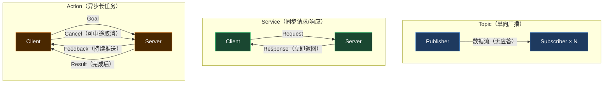
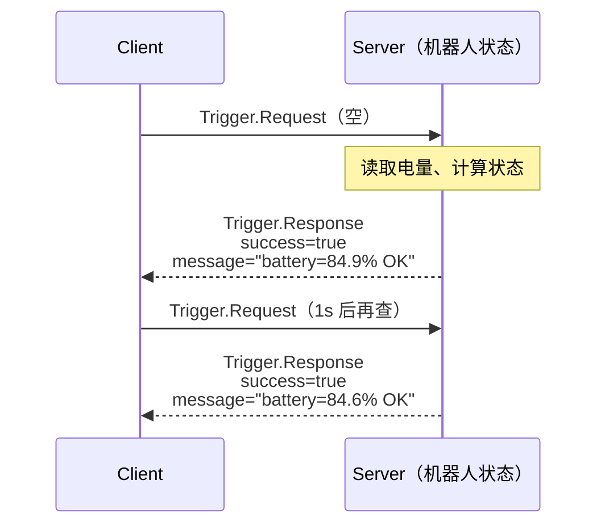
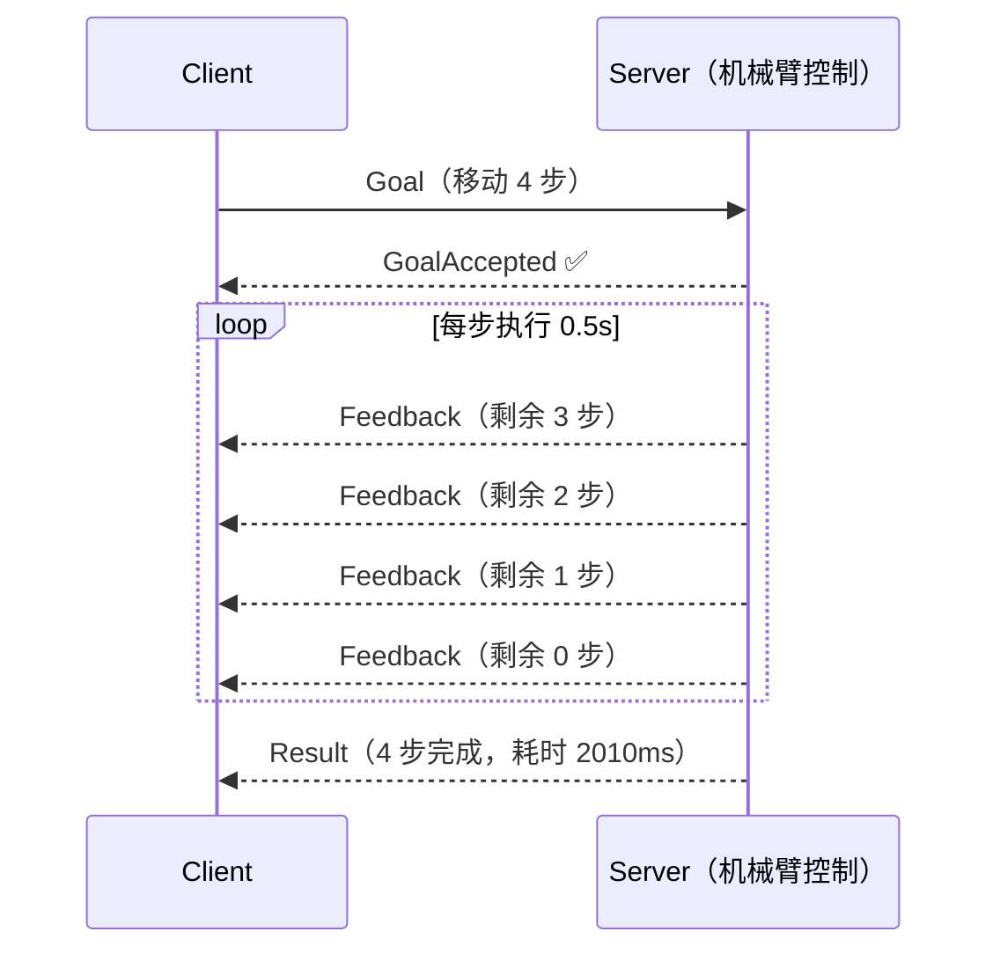

# ROS2 Service & Action：有来有回的通信

> Topic 是单向广播（发了不管有没有人收）。Service 和 Action 是双向通信——客户端发请求，服务端必须给响应。

## 三种通信模式对比



| 模式 | 应答 | 耗时 | 典型场景 |
|------|------|------|---------|
| **Topic** | 无 | 实时 | 传感器数据、状态广播 |
| **Service** | 立即返回 | 毫秒级 | 查电量、设参数、触发急停 |
| **Action** | 分阶段返回 | 秒~分钟级 | 导航到目标点、执行抓取动作 |

---

## Service Demo：机器人状态查询

### 时序图



### 代码

```python
import rclpy
from rclpy.node import Node
from std_srvs.srv import Trigger
import random

# ── Server ──────────────────────────────────────────────────────
class RobotStatusServer(Node):
    def __init__(self):
        super().__init__('robot_status_server')
        self.srv = self.create_service(
            Trigger, '/robot/status', self.handle_request
        )
        self.battery = 85.0

    def handle_request(self, request, response):
        self.battery -= random.uniform(0.1, 0.5)
        response.success = self.battery > 20.0
        response.message = f'battery={self.battery:.1f}%  {"OK" if response.success else "LOW BATTERY"}'
        self.get_logger().info(f'收到查询 → {response.message}')
        return response

# ── Client ──────────────────────────────────────────────────────
class RobotStatusClient(Node):
    def __init__(self):
        super().__init__('robot_status_client')
        self.cli = self.create_client(Trigger, '/robot/status')
        self.timer = self.create_timer(1.0, self.query)
        self.query_count = 0

    def query(self):
        if self.query_count >= 5:
            self.timer.cancel()
            return
        future = self.cli.call_async(Trigger.Request())
        future.add_done_callback(
            lambda f: self.get_logger().info(f'← 响应: {f.result().message}')
        )
        self.query_count += 1

def main():
    rclpy.init()
    from rclpy.executors import MultiThreadedExecutor
    ex = MultiThreadedExecutor()
    ex.add_node(RobotStatusServer())
    ex.add_node(RobotStatusClient())
    try:
        ex.spin()
    except KeyboardInterrupt:
        pass
    finally:
        if rclpy.ok(): rclpy.shutdown()

if __name__ == '__main__':
    main()
```

### 实际运行输出

```
[INFO] [robot_status_server]: 状态服务已就绪，等待查询...
[INFO] [robot_status_server]: 收到查询 → battery=84.9%  OK
[INFO] [robot_status_client]: ← 响应: battery=84.9%  OK
[INFO] [robot_status_server]: 收到查询 → battery=84.6%  OK
[INFO] [robot_status_client]: ← 响应: battery=84.6%  OK
...（共 5 次查询）
```

---

## Action Demo：机械臂执行移动

### 时序图



### 代码

```python
import rclpy, time, threading
from rclpy.node import Node
from rclpy.action import ActionServer, ActionClient
from rclpy.action.server import ServerGoalHandle
from example_interfaces.action import Fibonacci

# ── Action Server ───────────────────────────────────────────────
class ArmMoveServer(Node):
    def __init__(self):
        super().__init__('arm_move_server')
        self._server = ActionServer(
            self, Fibonacci, '/arm/move', self.execute
        )

    def execute(self, goal_handle: ServerGoalHandle):
        steps = goal_handle.request.order
        self.get_logger().info(f'收到目标：移动 {steps} 步')
        feedback = Fibonacci.Feedback()
        start = time.time()

        for i in range(1, steps + 1):
            if goal_handle.is_cancel_requested:
                goal_handle.canceled()
                return Fibonacci.Result()

            time.sleep(0.5)
            remaining = steps - i
            feedback.sequence = [remaining]
            goal_handle.publish_feedback(feedback)
            self.get_logger().info(f'  执行中 {i}/{steps}，剩余 {remaining} 步...')

        elapsed = time.time() - start
        goal_handle.succeed()
        result = Fibonacci.Result()
        result.sequence = [steps, int(elapsed * 1000)]
        self.get_logger().info(f'✅ 完成！共 {steps} 步，耗时 {elapsed:.1f}s')
        return result

# ── Action Client ───────────────────────────────────────────────
class ArmMoveClient(Node):
    def __init__(self):
        super().__init__('arm_move_client')
        self._client = ActionClient(self, Fibonacci, '/arm/move')

    def send_goal(self, steps: int):
        self._client.wait_for_server()
        goal = Fibonacci.Goal()
        goal.order = steps
        future = self._client.send_goal_async(
            goal, feedback_callback=self.on_feedback
        )
        future.add_done_callback(self.on_goal_accepted)

    def on_feedback(self, msg):
        self.get_logger().info(f'  [反馈] 剩余 {msg.feedback.sequence[0]} 步')

    def on_goal_accepted(self, future):
        handle = future.result()
        result_future = handle.get_result_async()
        result_future.add_done_callback(self.on_result)

    def on_result(self, future):
        res = future.result().result
        steps, ms = res.sequence[0], res.sequence[1]
        self.get_logger().info(f'← 最终结果：{steps} 步完成，耗时 {ms}ms')
        rclpy.shutdown()

def main():
    rclpy.init()
    server = ArmMoveServer()
    client = ArmMoveClient()
    from rclpy.executors import MultiThreadedExecutor
    ex = MultiThreadedExecutor()
    ex.add_node(server)
    ex.add_node(client)
    threading.Timer(0.5, lambda: client.send_goal(4)).start()
    try:
        ex.spin()
    except (KeyboardInterrupt, Exception):
        pass
    finally:
        server.destroy_node()
        client.destroy_node()

if __name__ == '__main__':
    main()
```

### 实际运行输出

```
[INFO] [arm_move_server]:  机械臂 Action Server 已就绪
[INFO] [arm_move_client]:  发送目标：移动 4 步
[INFO] [arm_move_server]:  收到目标：移动 4 步
[INFO] [arm_move_client]:  目标已接受，等待结果...
[INFO] [arm_move_server]:    执行中 1/4，剩余 3 步...
[INFO] [arm_move_client]:    [反馈] 剩余 3 步
[INFO] [arm_move_server]:    执行中 2/4，剩余 2 步...
[INFO] [arm_move_client]:    [反馈] 剩余 2 步
[INFO] [arm_move_server]:    执行中 3/4，剩余 1 步...
[INFO] [arm_move_client]:    [反馈] 剩余 1 步
[INFO] [arm_move_server]:    执行中 4/4，剩余 0 步...
[INFO] [arm_move_client]:    [反馈] 剩余 0 步
[INFO] [arm_move_server]:  ✅ 完成！共 4 步，耗时 2.0s
[INFO] [arm_move_client]:  ← 最终结果：4 步完成，耗时 2010ms
```

---

## 面试高频问题

**Q：Service 和 Action 的核心区别是什么？**

> Service 是同步的——Client 发出请求后**阻塞等待**，Server 处理完才返回。适合快速查询。  
> Action 是异步的——Client 发出 Goal 后**继续运行**，Server 边执行边推送 Feedback，执行完才推送 Result。适合耗时操作，且支持**中途取消**。

**Q：导航到某个坐标点，用 Service 还是 Action？为什么？**

> 用 **Action**。导航可能需要几秒到几分钟，期间需要实时知道"还剩多远"（Feedback），也需要能随时取消（障碍物出现时立即停止）。如果用 Service，Client 会一直阻塞，整个系统冻住。

---

## CLI 验证命令

```bash
# 查看可用 Service
ros2 service list

# 手动调用一次 Service
ros2 service call /robot/status std_srvs/srv/Trigger

# 查看 Action 列表
ros2 action list

# 手动发送 Action Goal
ros2 action send_goal /arm/move example_interfaces/action/Fibonacci "order: 3"
```

---

## 下一步

| 编号 | 主题 |
|------|------|
| 04 | TF2 坐标变换：机器人定位的基础，传感器融合的前提 |
| 05 | C++ 版本（rclcpp）：同样的三个通信模式用 C++ 实现 |
