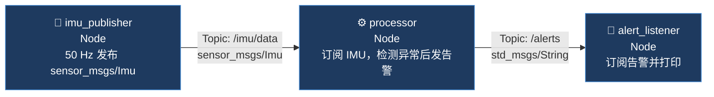
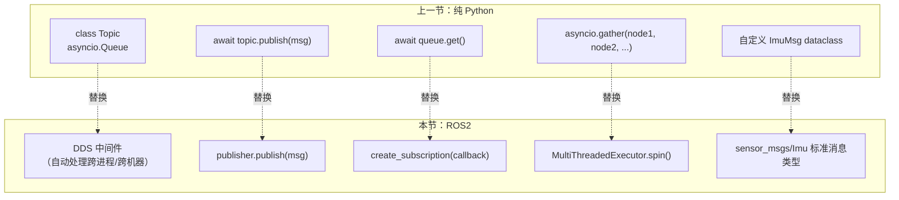

# ROS2 三节点 Demo：真实环境运行

> 上一节用纯 Python 实现了 Pub/Sub 模型，本节把同一套逻辑迁移到 ROS2，在 WSL2 + Jazzy 下实际跑通。

## 系统结构（与上一节完全一致）



---

## 代码

保存为 `three_nodes.py`，用 `python3 three_nodes.py` 直接运行：

```python
#!/usr/bin/env python3
import rclpy
from rclpy.node import Node
from rclpy.executors import MultiThreadedExecutor
import numpy as np
from sensor_msgs.msg import Imu
from std_msgs.msg import String

# ── 节点 1：IMU 发布者 ───────────────────────────────────────────
class ImuPublisher(Node):
    def __init__(self):
        super().__init__('imu_publisher')
        self.pub = self.create_publisher(Imu, '/imu/data', 10)
        self.timer = self.create_timer(0.02, self.publish_imu)   # 50 Hz
        self.count = 0
        self.get_logger().info('imu_publisher 启动，50 Hz 发布中...')

    def publish_imu(self):
        if self.count >= 100:
            self.timer.cancel()
            return
        msg = Imu()
        msg.header.stamp = self.get_clock().now().to_msg()
        msg.header.frame_id = 'imu_link'
        accel = np.array([0.0, 0.0, 9.8]) + np.random.randn(3) * 0.1
        msg.linear_acceleration.x = float(accel[0])
        msg.linear_acceleration.y = float(accel[1])
        msg.linear_acceleration.z = float(accel[2])
        self.pub.publish(msg)
        self.count += 1

# ── 节点 2：处理节点 ────────────────────────────────────────────
class Processor(Node):
    def __init__(self):
        super().__init__('processor')
        self.sub = self.create_subscription(
            Imu, '/imu/data', self.on_imu, 10
        )
        self.pub = self.create_publisher(String, '/alerts', 10)
        self.threshold = 9.9
        self.count = 0

    def on_imu(self, msg: Imu):
        self.count += 1
        a = msg.linear_acceleration
        norm = (a.x**2 + a.y**2 + a.z**2) ** 0.5
        if norm > self.threshold:
            alert = String()
            alert.data = f'|accel|={norm:.2f} 超阈值! (帧#{self.count})'
            self.pub.publish(alert)

# ── 节点 3：告警订阅者 ──────────────────────────────────────────
class AlertListener(Node):
    def __init__(self):
        super().__init__('alert_listener')
        self.sub = self.create_subscription(
            String, '/alerts', self.on_alert, 10
        )
        self.count = 0

    def on_alert(self, msg: String):
        self.count += 1
        self.get_logger().warn(f'⚠  {msg.data}  (累计 {self.count} 条)')

# ── 主函数 ──────────────────────────────────────────────────────
def main():
    rclpy.init()
    nodes = [ImuPublisher(), Processor(), AlertListener()]
    executor = MultiThreadedExecutor()
    for n in nodes:
        executor.add_node(n)
    try:
        executor.spin()
    except KeyboardInterrupt:
        pass
    finally:
        for n in nodes:
            n.destroy_node()
        if rclpy.ok():
            rclpy.shutdown()

if __name__ == '__main__':
    main()
```

---

## 实际运行输出

```
[INFO]  [imu_publisher]:   imu_publisher 启动，50 Hz 发布中...
[INFO]  [processor]:       processor 启动，阈值 = 9.9 m/s²
[INFO]  [alert_listener]:  alert_listener 启动，等待告警...
[WARN]  [alert_listener]:  ⚠  |accel|=9.94 超阈值! (帧#1)   (累计 1 条)
[WARN]  [alert_listener]:  ⚠  |accel|=9.97 超阈值! (帧#8)   (累计 2 条)
[WARN]  [alert_listener]:  ⚠  |accel|=10.11 超阈值! (帧#21)  (累计 4 条)
...
[INFO]  [imu_publisher]:   发布完毕，停止计时器
```

---

## Python 版本 → ROS2 版本：改了什么



**最重要的区别**：Python 版的 `Topic` 只能在同一个进程内通信；ROS2 的 Topic 经过 DDS 层，**自动支持跨进程、跨机器**——这就是机器人系统用 ROS2 的核心原因。

---

## 关键 API 速查

| API | 作用 | 类比 |
|-----|------|------|
| `create_publisher(MsgType, topic, qos_depth)` | 创建发布者 | 注册一个"写端" |
| `create_subscription(MsgType, topic, cb, qos_depth)` | 创建订阅者 | 注册一个"读端" + 回调 |
| `create_timer(period_sec, callback)` | 定时触发回调 | `setInterval` |
| `MultiThreadedExecutor` | 多线程并发跑多个节点 | `asyncio.gather` |
| `get_clock().now().to_msg()` | 获取 ROS 时间戳 | `time.monotonic()` |
| `get_logger().info/warn/error` | 结构化日志 | `print` 的替代 |

---

## 进一步验证：用 CLI 观察 Topic

ROS2 装好后，另开一个终端可以实时查看系统状态：

```bash
# 查看当前活跃的所有 Topic
ros2 topic list

# 实时打印 /imu/data 的内容
ros2 topic echo /imu/data

# 查看发布频率
ros2 topic hz /imu/data

# 查看节点图（谁连着谁）
ros2 run rqt_graph rqt_graph
```

---

## 下一步

| 编号 | 主题 |
|------|------|
| 03 | C++ 版本的三节点 Demo（用 `rclcpp`，这才是面试考的） |
| 04 | Service / Action：有来有回的通信模式 |
| 05 | TF2：坐标变换，机器人定位的基础 |
