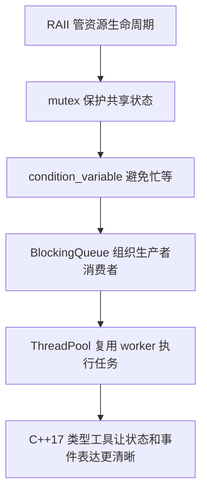

# 第 1 周并发面试笔记

目标：把本周的 C++ 系统开发练习整理成面试时能讲清楚的一页材料。

对应练习：

- [2026-07-13：RAII 与智能指针所有权](/roadmap/daily/2026-07-13)
- [2026-07-14：生产者消费者队列](/roadmap/daily/2026-07-14)
- [2026-07-15：线程池最小实现](/roadmap/daily/2026-07-15)
- [2026-07-16：C++17 机器人场景类型表达](/roadmap/daily/2026-07-16)

## 1. RAII 如何保证资源释放

RAII 把资源生命周期绑定到对象生命周期：构造函数获取资源，析构函数释放资源。这样即使函数提前返回或后续代码抛异常，栈对象析构时也会释放资源。

本周代码例子：`practice/today_2026_07_13_raii.cpp` 里的 `ResourceGuard` 在析构时关闭 `imu-driver`，移动后原对象不再负责关闭资源。

面试追问：为什么 `ResourceGuard` 要禁止拷贝？  
回答：因为资源通常只有一个明确 owner，允许拷贝会导致两个对象都认为自己负责关闭同一个底层句柄，产生 double close。

## 2. mutex 保护什么，不应该保护什么

`mutex` 保护共享状态，例如队列、停止标志、计数器、结果数组。临界区应该尽量小，只包住读写共享状态的部分，不应该包住耗时业务逻辑。

本周代码例子：`practice/today_2026_07_14_queue.cpp` 用 `mutex_` 保护 `queue_` 和 `stopped_`；`practice/today_2026_07_15_thread_pool.cpp` 取出任务后立刻释放锁，再执行 `task()`。

面试追问：为什么执行 `task()` 前必须释放任务队列锁？  
回答：如果持锁执行任务，所有 worker 都要等同一把锁，线程池会退化成串行执行。

## 3. condition_variable 的正确等待方式

`condition_variable` 用来避免线程空转。消费者没有任务时阻塞等待，生产者推入任务后唤醒。正确写法是 `wait(lock, predicate)`，谓词要检查队列非空或系统停止。

本周代码例子：`BlockingQueue::pop()` 使用 `cv_.wait(lock, [this] { return stopped_ || !queue_.empty(); });`，线程池 worker 也使用同样模式等待任务。

面试追问：为什么不能只写 `cv_.wait(lock)`？  
回答：线程可能虚假唤醒，醒来后条件不一定满足；谓词能保证继续执行前条件确实成立。

## 4. 死锁四条件与规避策略

死锁四个必要条件是互斥、持有并等待、不可抢占、循环等待。工程里常见策略是固定加锁顺序、缩短临界区、避免持锁调用外部回调、必要时使用 `std::scoped_lock` 同时锁多把锁。

本周代码例子：线程池把任务从队列取出后释放锁再执行，避免 task 内部再拿其他锁时形成复杂锁链。

面试追问：机器人系统里持锁调用回调有什么风险？  
回答：回调可能再调用系统其他接口并尝试拿锁，导致锁顺序不可控，最终形成死锁或长时间阻塞实时路径。

## 5. 生产者消费者队列怎么退出

生产者消费者队列需要明确停止标志。生产者完成后调用 `shutdown()`，设置 `stopped_ = true` 并 `notify_all()`，消费者醒来后如果队列为空就返回 `false` 退出循环。

本周代码例子：`BlockingQueue::shutdown()` 唤醒消费者，`pop()` 在 `queue_.empty()` 时返回 `false`。运行结果验证 `produced: 1000`、`consumed: 1000`、`sum: 499500`。

面试追问：为什么 shutdown 时用 `notify_all()` 而不是只用 `notify_one()`？  
回答：真实系统可能有多个消费者都阻塞在队列上，停止时必须让所有等待线程醒来检查停止条件。

## 6. 线程池析构为什么不能丢任务

线程池析构时不能直接让 worker 退出，否则已提交但未执行的任务会丢。正确流程是设置停止标志、唤醒全部 worker，然后 worker 继续消费队列，只有 `stopped_ && tasks_.empty()` 时才退出。

本周代码例子：`ThreadPool::workerLoop()` 只有在停止且任务队列为空时返回；析构函数最后 `join()` 所有 worker。运行结果验证 `submitted: 20`、`completed: 20`、`sum: 2470`。

面试追问：析构函数为什么必须 `join()`？  
回答：`std::thread` 对象析构时如果仍然 joinable 会触发 `std::terminate`；同时不 join 也可能留下后台线程访问已销毁对象。

## 7. C++17 类型工具解决什么表达问题

`optional` 解决“可能没有值”的表达，`variant` 解决“有限几种互斥类型”的表达，`string_view` 解决“只读观察字符串、避免拷贝”的表达。它们让系统代码的状态和事件更清晰。

本周代码例子：`readImu()` 返回 `std::optional<ImuSample>` 表达 IMU 读取失败；`RobotEvent` 用 `variant` 表达 start/stop/fault；`commandName()` 用 `string_view` 解析命令。

面试追问：`string_view` 最大风险是什么？  
回答：它不拥有内存，原字符串销毁后 view 会悬空；异步队列和长期对象里应该保存 `std::string`。

## 10 个自测问答

### 1. 为什么 RAII 对机器人系统软件重要？

机器人系统里有传感器连接、CAN 设备、日志文件、线程句柄等资源。RAII 能保证资源在对象析构时释放，减少异常路径、提前返回路径里的泄漏和重复释放。

### 2. unique_ptr 和 shared_ptr 在所有权表达上有什么区别？

`unique_ptr` 表示独占所有权，适合单 owner 的硬件句柄和会话对象。`shared_ptr` 表示共享所有权，适合确实需要多个模块共同延长生命周期的对象，但会让释放时机变得不直观。

### 3. mutex 的临界区应该尽量小，为什么？

临界区越大，其他线程等待时间越长，系统吞吐下降。机器人系统里如果持锁执行耗时逻辑，还可能放大控制链路延迟。

### 4. condition_variable 为什么要用 wait(lock, predicate)？

因为条件变量可能虚假唤醒，醒来不代表条件满足。谓词会在醒来后重新检查条件，只有队列非空或停止标志成立才继续。

### 5. shutdown 时为什么常用 notify_all？

停止是全局状态变化，所有等待线程都应该醒来检查是否退出。只唤醒一个线程可能导致其他消费者永远睡眠，主线程 join 卡死。

### 6. 死锁四个必要条件是什么？

互斥、持有并等待、不可抢占、循环等待。破坏任意一个条件都能规避死锁，工程里最常用的是固定锁顺序和减少持锁范围。

### 7. 生产者消费者队列如何保证退出不丢数据？

`shutdown()` 只设置停止标志，不清空队列。消费者醒来后继续消费剩余数据，直到队列为空且停止标志为真，才返回退出。

### 8. 线程池 worker 为什么不能看到 stopped_ 就立刻退出？

因为停止标志只表示“不再接收新任务”或“准备关闭”，队列里可能还有已提交任务。worker 必须等任务队列清空后再退出。

### 9. 执行 task() 前为什么要释放任务队列锁？

任务执行时间不可控，可能很慢，也可能再调用其他接口。如果持锁执行，其他 worker 无法取任务，线程池并发能力会被破坏。

### 10. string_view 最大的生命周期风险是什么？

`string_view` 只是指针和长度，不拥有字符内存。如果原始 `std::string` 是临时对象或已经销毁，`string_view` 会变成悬空引用。

## 本周并发主线

## 5 分钟讲法

先讲 RAII 解决资源释放问题，再讲多线程共享状态必须用 `mutex` 控制临界区。为了避免消费者空转，用 `condition_variable` 做阻塞等待，并用谓词处理虚假唤醒。基于这两个机制，可以实现生产者消费者队列；再把队列和固定 worker 封装起来，就是最小线程池。最后，`optional`、`variant`、`string_view` 不直接解决并发问题，但它们能让系统里的缺失值、事件类型和命令解析表达更清楚，减少状态混乱。
