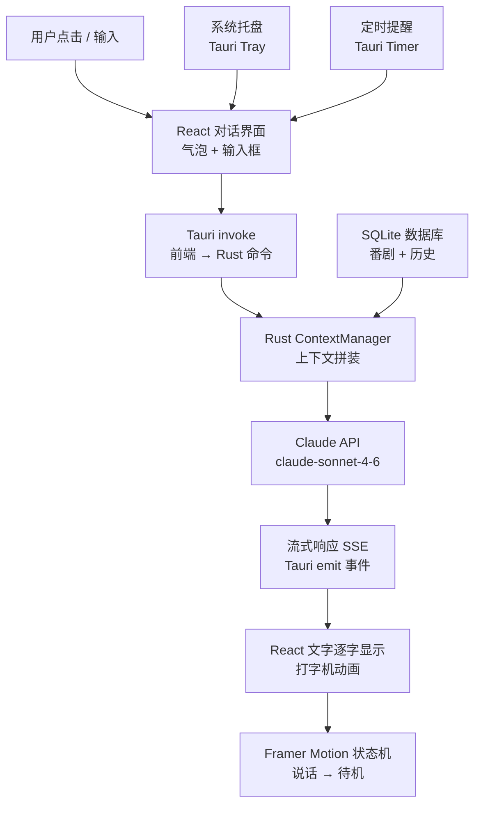
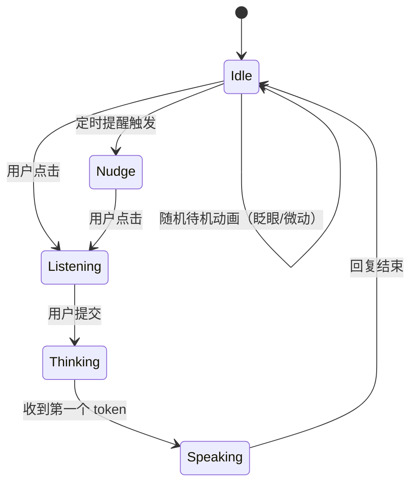

# 方向四：AI 番剧角色桌面助手

> 你定义角色，它常驻桌面，陪你追番、聊音乐、提醒你该干啥。

## 项目概述

一个半透明的动漫角色挂在桌面右下角，始终置顶但不抢焦点。点它、和它对话，它能帮你管番剧进度、聊你在听的歌、当你的日程提醒工具——角色人格和名字完全由你定义。

**本质是一个有"脸"的本地 AI 客户端，接入 Claude API。**

---

## 技术栈

| 层次 | 技术 | 用途 |
|------|------|------|
| 应用框架 | Tauri v2 (Rust) | 透明窗口、置顶、系统托盘、打包 |
| 前端 UI | React + TypeScript | 角色动画、对话气泡、交互界面 |
| 动画 | Framer Motion + CSS | 待机 / 说话 / 点击反馈动画 |
| AI 对话 | Claude API (claude-sonnet-4-6) | 角色人格、流式对话逻辑 |
| 网络请求 | Rust reqwest (Tauri 命令) | 服务端调用 Claude API（保护 Key） |
| 本地数据 | SQLite (rusqlite) | 番剧记录、对话历史、用户偏好 |
| 系统集成 | Tauri Plugin (autostart / tray) | 开机自启、系统托盘 |

---

## 架构图



---

## 核心功能规划

### MVP（2 周，能跑起来就爽）
- [ ] 半透明 Tauri 窗口，常驻桌面右下角，可拖动
- [ ] 点击展开对话框，输入文字，Claude 流式回复
- [ ] 角色有基本待机动画（CSS + Framer Motion 缓动）
- [ ] 系统托盘图标，右键菜单（显示/隐藏/退出）

### 核心功能（第 3-5 周）
- [ ] 番剧追踪：告诉它"我看完了某某第3集"，它记下来，问它进度它能回答
- [ ] 角色人格配置文件（JSON 定义角色名、口吻、设定）
- [ ] 对话历史持久化，下次启动记得上次聊了什么
- [ ] 定时提醒："每周五晚提醒我某某更新了"

### 可选扩展
- [ ] 集成 Last.fm 或本地播放器，知道你在听什么歌，主动评论
- [ ] 读取今日日历/待办，早上打招呼时顺带说今天有什么
- [ ] 角色换装（换不同的 React 主题皮肤/CSS 变量）

---

## 关键实现细节

### 透明置顶窗口（Tauri v2）

```rust
// src-tauri/src/main.rs
fn main() {
    tauri::Builder::default()
        .setup(|app| {
            let window = app.get_webview_window("main").unwrap();
            window.set_always_on_top(true)?;
            window.set_decorations(false)?;
            // 定位到右下角
            if let Some(monitor) = window.current_monitor()? {
                let size = monitor.size();
                window.set_position(tauri::PhysicalPosition {
                    x: (size.width - 220) as i32,
                    y: (size.height - 320) as i32,
                })?;
            }
            Ok(())
        })
        .run(tauri::generate_context!())
        .unwrap();
}
```

```json
// tauri.conf.json (窗口配置)
{
  "windows": [{
    "label": "main",
    "transparent": true,
    "decorations": false,
    "alwaysOnTop": true,
    "width": 220,
    "height": 300,
    "skipTaskbar": true
  }]
}
```

### 角色人格注入（System Prompt）

```json
// character_config.json
{
  "name": "Hana",
  "persona": "你是 Hana，一个话不多但很懂用户心思的二次元少女助手。你记得用户在追的每部番剧进度，偶尔会主动提一句'那部番这周更新了'。说话简洁，偶尔用颜文字，不用过度热情。",
  "language": "zh-CN",
  "memory_prompt": "以下是用户的番剧记录和近期对话摘要：{context}"
}
```

### Claude API 流式调用（Rust）

```rust
// src-tauri/src/claude.rs
#[tauri::command]
pub async fn send_message(
    window: tauri::Window,
    user_msg: String,
    api_key: String,
    system_prompt: String,
) -> Result<(), String> {
    let client = reqwest::Client::new();
    let mut stream = client
        .post("https://api.anthropic.com/v1/messages")
        .header("x-api-key", &api_key)
        .header("anthropic-version", "2023-06-01")
        .json(&serde_json::json!({
            "model": "claude-sonnet-4-6",
            "max_tokens": 512,
            "stream": true,
            "system": system_prompt,
            "messages": [{"role": "user", "content": user_msg}]
        }))
        .send()
        .await
        .map_err(|e| e.to_string())?
        .bytes_stream();

    while let Some(chunk) = stream.next().await {
        if let Ok(bytes) = chunk {
            // 解析 SSE data: {...} 逐 token emit 到前端
            if let Some(token) = parse_sse_token(&bytes) {
                window.emit("token", token).ok();
            }
        }
    }
    window.emit("done", ()).ok();
    Ok(())
}
```

### 前端流式接收（React + TypeScript）

```tsx
// src/hooks/useChat.ts
import { listen } from '@tauri-apps/api/event';
import { invoke } from '@tauri-apps/api/core';

export function useChat() {
  const [text, setText] = useState('');

  const sendMessage = async (msg: string) => {
    setText('');
    const unlisten = await listen<string>('token', (e) => {
      setText(prev => prev + e.payload);
    });
    await invoke('send_message', { userMsg: msg, /* ... */ });
    unlisten();
  };

  return { text, sendMessage };
}
```

---

## 角色动画状态机



---

## 与求职技能的连接

| 项目技术点 | 对应 JD 高频要求 |
|-----------|-----------------|
| Tauri 透明窗口 + 系统集成 | 桌面客户端开发 |
| Rust 异步 HTTP + SSE 流式解析 | 网络编程 / Rust |
| React + TypeScript + Framer Motion | 现代前端开发 |
| JSON 配置 + SQLite 持久化 | 工程实践能力 |
| Claude API 集成 + Tauri 命令桥接 | AI 应用开发 |

---

## 参考资料

- [Tauri v2 官方文档](https://v2.tauri.app/)
- [Tauri 透明窗口配置](https://v2.tauri.app/reference/config/#windowconfig)
- [Claude API 文档](https://docs.anthropic.com/en/api/messages)
- [Framer Motion 动画](https://www.framer.com/motion/)
- [reqwest 异步 HTTP](https://docs.rs/reqwest/latest/reqwest/)
