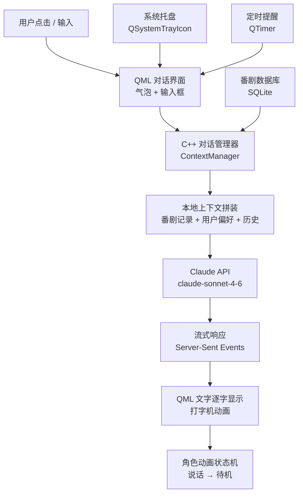
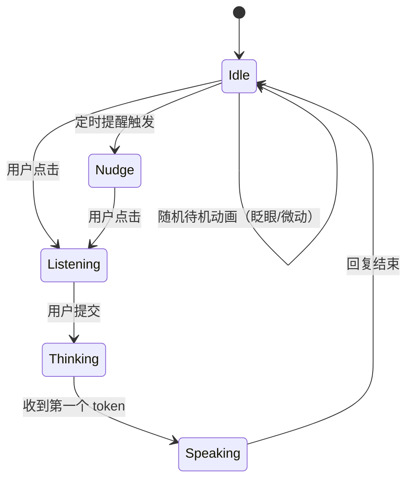

# 方向四：AI 番剧角色桌面助手

> 你定义角色，它常驻桌面，陪你追番、聊音乐、提醒你该干啥。

## 项目概述

一个半透明的动漫角色挂在桌面右下角，始终置顶但不抢焦点。点它、和它对话，它能帮你管番剧进度、聊你在听的歌、当你的日程提醒工具——角色人格和名字完全由你定义。

**本质是一个有"脸"的本地 AI 客户端，接入 Claude API。**

---

## 技术栈

| 层次 | 技术 | 用途 |
|------|------|------|
| UI 框架 | Qt Quick / QML | 透明窗口、角色动画、对话气泡 |
| AI 对话 | Claude API（claude-sonnet） | 角色人格、对话逻辑 |
| 网络请求 | Qt Network / C++ HTTP | 调用 Claude API |
| 本地数据 | SQLite | 番剧记录、对话历史、用户偏好 |
| 系统集成 | Windows API / Qt | 置顶窗口、系统托盘、开机自启 |
| 角色动画 | QML Animation / State Machine | 待机 / 说话 / 点击反馈动画 |

---

## 架构图



---

## 核心功能规划

### MVP（2 周，能跑起来就爽）
- [ ] 半透明 QML 窗口，常驻桌面右下角，可拖动
- [ ] 点击展开对话框，输入文字，Claude 回复
- [ ] 角色有基本待机动画（简单 QML 缓动即可，不需要 Live2D）
- [ ] 系统托盘图标，右键菜单（显示/隐藏/退出）

### 核心功能（第 3-5 周）
- [ ] 番剧追踪：告诉它"我看完了某某第3集"，它记下来，问它进度它能回答
- [ ] 角色人格配置文件（JSON 定义角色名、口吻、设定）
- [ ] 对话历史持久化，下次启动记得上次聊了什么
- [ ] 定时提醒："每周五晚提醒我某某更新了"

### 可选扩展
- [ ] 集成 Last.fm 或本地播放器，知道你在听什么歌，主动评论
- [ ] 读取今日日历/待办，早上打招呼时顺带说今天有什么
- [ ] 角色换装（换不同的 QML 主题皮肤）

---

## 关键实现细节

### 透明置顶窗口（QML）

```qml
Window {
    id: companionWindow
    flags: Qt.FramelessWindowHint | Qt.WindowStaysOnTopHint | Qt.Tool
    color: "transparent"
    opacity: 0.95
    width: 200
    height: 280

    // 可拖动
    MouseArea {
        anchors.fill: parent
        property point lastPos
        onPressed: lastPos = Qt.point(mouseX, mouseY)
        onPositionChanged: {
            companionWindow.x += mouseX - lastPos.x
            companionWindow.y += mouseY - lastPos.y
        }
    }
}
```

### 角色人格注入（System Prompt）

```json
// character_config.json
{
  "name": "Hana",
  "persona": "你是 Hana，一个话不多但很懂用户心思的二次元少女助手。你记得用户在追的每部番剧进度，偶尔会主动提一句'那部番这周更新了'。说话简洁，偶尔用颜文字，不用过度热情。",
  "language": "zh-CN",
  "memory_prompt": "以下是用户的番剧记录和近期对话摘要：{context}"
}
```

### Claude API 调用（C++）

```cpp
// 流式调用，逐 token 推给 QML
void ClaudeClient::sendMessage(const QString& userMsg) {
    QNetworkRequest req(QUrl("https://api.anthropic.com/v1/messages"));
    req.setHeader(QNetworkRequest::ContentTypeHeader, "application/json");
    req.setRawHeader("x-api-key", m_apiKey.toUtf8());
    req.setRawHeader("anthropic-version", "2023-06-01");

    QJsonObject body {
        {"model", "claude-sonnet-4-6"},
        {"max_tokens", 512},
        {"stream", true},
        {"system", buildSystemPrompt()},  // 角色设定 + 番剧上下文
        {"messages", buildMessages(userMsg)}
    };

    auto* reply = m_nam.post(req, QJsonDocument(body).toJson());
    connect(reply, &QNetworkReply::readyRead, this, [this, reply]() {
        // 解析 SSE data: {...} 逐 token emit tokenReceived(token)
        parseSSEChunk(reply->readAll());
    });
}
```

---

## 角色动画状态机



---

## 与求职技能的连接

| 项目技术点 | 对应 JD 高频要求 |
|-----------|-----------------|
| Qt Quick 透明窗口 + 状态机动画 | Qt 高级特性 |
| C++ HTTP 客户端 + SSE 流式解析 | 网络编程 |
| JSON 配置 + SQLite 持久化 | 工程实践能力 |
| Claude API 集成 | AI 应用开发 |
| Windows API 系统集成 | 上位机软件开发 |

---

## 参考资料

- [Claude API 文档](https://docs.anthropic.com/en/api/messages)
- [Qt Network — QNetworkAccessManager](https://doc.qt.io/qt-6/qnetworkaccessmanager.html)
- [QML Window Flags](https://doc.qt.io/qt-6/qml-qtquick-window.html#flags-prop)
- [Server-Sent Events 规范](https://developer.mozilla.org/en-US/docs/Web/API/Server-sent_events)
