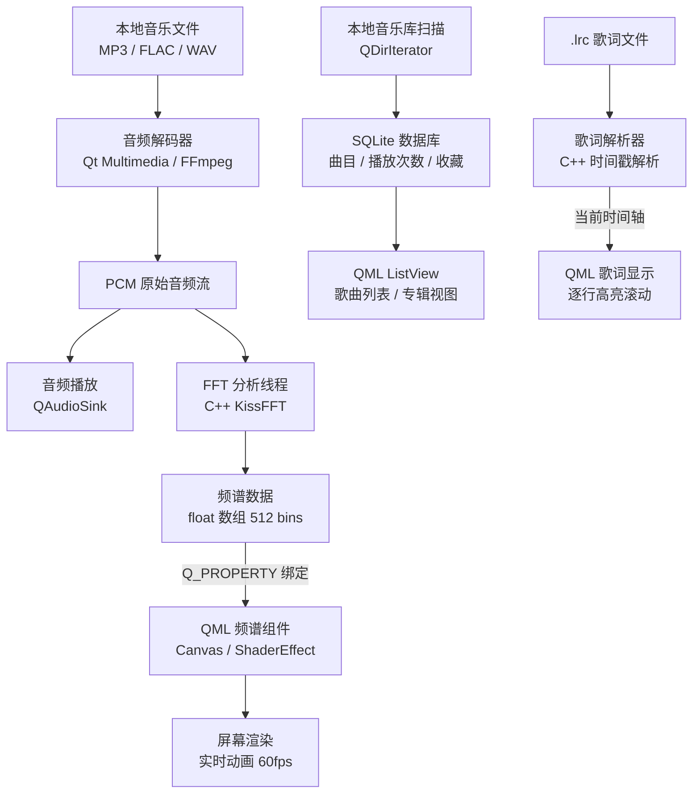

# 方向一：实时音乐频谱可视化播放器

> 把听音乐这件事做得更爽——声音变成动态图形，每首歌都不一样。

## 项目概述

一个完全本地运行的 PC 桌面音乐播放器，核心卖点是**实时音频可视化**：C++ 对音频数据做 FFT 分析，Qt Quick / QML 把频谱数据渲染成动态图形。听什么歌、图形就跳什么节奏。

**不依赖任何云服务，你的音乐库完全本地。**

---

## 技术栈

| 层次 | 技术 | 用途 |
|------|------|------|
| 音频解码 | Qt Multimedia / FFmpeg | 读取 MP3/FLAC/WAV |
| 信号处理 | C++ + FFTW3 / KissFFT | 实时 FFT，提取频谱数据 |
| UI 渲染 | Qt Quick / QML + Canvas / ShaderEffect | 动态频谱动画 |
| 线程模型 | C++ std::thread / QThread | 音频线程与 UI 线程解耦 |
| 数据库 | SQLite（via Qt SQL） | 音乐库、播放历史、收藏 |
| 歌词 | 解析本地 .lrc 文件 | 逐行同步显示 |

---

## 架构图



---

## 核心功能规划

### MVP（可用版本，目标 2 周）
- [ ] 本地音乐文件夹扫描，显示曲目列表
- [ ] 基本播放控制（播放 / 暂停 / 上下曲 / 进度条）
- [ ] 实时频谱柱状图（64 bars，跟着音乐跳动）
- [ ] 黑暗风 QML 界面，封面图显示

### 进阶功能（第 2-4 周）
- [ ] 多种可视化模式（柱状图 / 波形 / 圆形频谱 / 粒子）
- [ ] .lrc 歌词同步滚动显示
- [ ] 播放列表管理，支持收藏
- [ ] 音量均衡器（EQ 调节）

### 可选扩展
- [ ] 专辑封面背景模糊效果（磨砂玻璃 UI）
- [ ] 根据 BPM 自动切换可视化动画速度
- [ ] 播放历史统计图表（"最近一个月你最常听这几首"）

---

## 开发阶段拆解

### 第一步：跑通音频 + 最简单频谱

```cpp
// 核心结构：FFT 分析线程向 QML 暴露频谱数据
class AudioAnalyzer : public QObject {
    Q_OBJECT
    Q_PROPERTY(QList<qreal> spectrum READ spectrum NOTIFY spectrumChanged)

public:
    QList<qreal> spectrum() const { return m_spectrum; }

signals:
    void spectrumChanged();

private:
    void processAudioChunk(const QByteArray& pcmData);  // 每帧调用 KissFFT
    QList<qreal> m_spectrum;  // 64~512 个 bin 的幅度值
};
```

```qml
// QML 侧：用 Canvas 每帧重绘频谱柱状图
Canvas {
    id: spectrumCanvas
    anchors.fill: parent

    Connections {
        target: audioAnalyzer
        function onSpectrumChanged() { spectrumCanvas.requestPaint() }
    }

    onPaint: {
        var ctx = getContext("2d")
        ctx.clearRect(0, 0, width, height)
        var bars = audioAnalyzer.spectrum
        var barWidth = width / bars.length
        for (var i = 0; i < bars.length; i++) {
            var h = bars[i] * height
            ctx.fillStyle = Qt.rgba(0.2 + i / bars.length * 0.8, 0.5, 1.0, 0.9)
            ctx.fillRect(i * barWidth, height - h, barWidth - 2, h)
        }
    }
}
```

### 第二步：音乐库 + SQLite

扫描指定文件夹 → 读取 ID3 标签（曲名/艺术家/专辑/封面）→ 存入 SQLite → QML `ListView` 展示。

### 第三步：歌词同步

解析 `.lrc` 格式时间戳，在播放位置更新时找到对应行，QML 做滚动高亮动画。

---

## 与求职技能的连接

| 项目技术点 | 对应 JD 高频要求 |
|-----------|-----------------|
| Qt Quick / QML 动画系统 | Qt 开发、QML 界面 |
| C++ 多线程（音频线程 + UI 线程） | 并发编程、线程安全 |
| Q_PROPERTY / 信号槽跨线程 | Qt 核心机制 |
| FFT 信号处理 | DSP 基础，传感器数据处理同理 |
| SQLite + Qt SQL | 本地数据管理 |

---

## 参考资料

- [Qt Multimedia 文档](https://doc.qt.io/qt-6/qtmultimedia-index.html)
- [KissFFT](https://github.com/mborgerding/kissfft) — 轻量级 FFT 库，单头文件可用
- [Qt Quick Canvas](https://doc.qt.io/qt-6/qml-qtquick-canvas.html)
- [LRC 歌词格式规范](https://en.wikipedia.org/wiki/LRC_(file_format))
