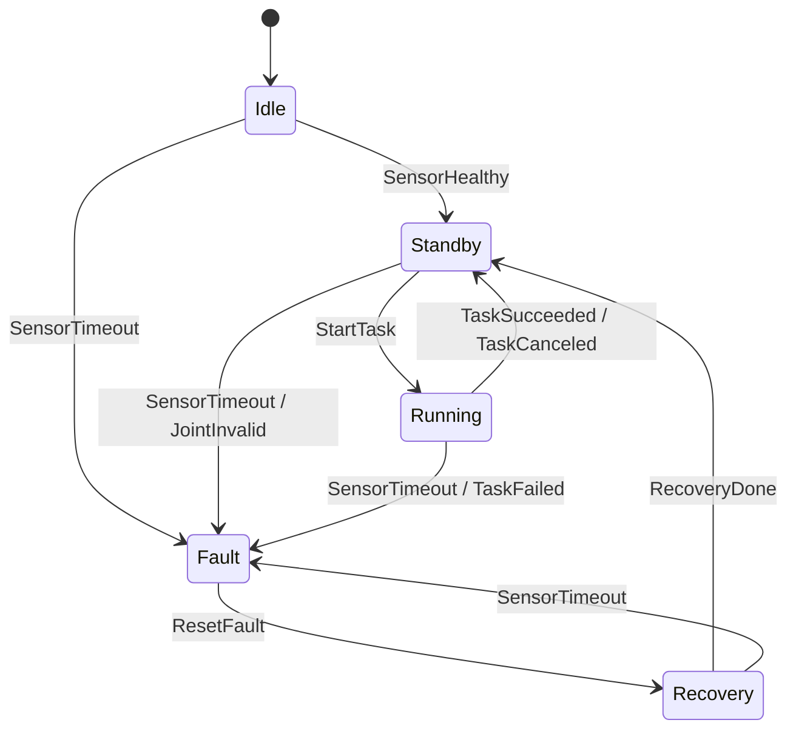

# 2026-07-27：机器人运行时状态表设计

今天是 2026-07-27，周一。按 [工作日 2 小时量化学习计划](/roadmap/weekday_2h_plan)，今天进入**第 3 周周一**。

## 今日目标

把前一周 `robot_runtime_demo` 中零散的字符串状态，整理成一张可以落地到 C++ 状态机的状态转换表。

今天不急着写代码，重点是把状态边界设计清楚：

- 定义 5 个核心状态：`Idle`、`Standby`、`Running`、`Fault`、`Recovery`。
- 定义外部事件：启动、收到健康数据、执行任务、任务完成、故障、复位、恢复完成。
- 写出状态转换表，明确“什么状态下收到什么事件，会转到哪里”。
- 标出每条转换的动作，例如清故障、启动任务、停止任务、记录错误码。
- 写出至少 5 条状态机面试表达笔记。

今天的成果会作为明天 C++ 状态机核心类的设计输入。

## 当前项目背景

现有 ROS2 demo 已经具备：

```txt
Topic:
  /robot/imu
  /robot/joint_states

Service:
  /runtime/query_status
  /runtime/reset_fault

Action:
  /runtime/execute_task
```

当前 `runtime_node` 中已经有一些状态字段：

```txt
runtime_state = BOOTING / RUNNING / FAULT
task_state = IDLE / RUNNING / COMPLETED / CANCELED / FAILED
```

今天要做的是把这些状态升级为一套更清晰的机器人运行时状态模型。

## 2 小时安排

| 时间 | 任务 | 产出 |
|------|------|------|
| 20 分钟 | 复盘第 2 周 Topic / Service / Action 产出 | 写下状态来自哪里 |
| 80 分钟 | 设计状态、事件、转换表和动作 | 1 张状态转换表 |
| 20 分钟 | 整理验收与面试表达 | 完成复盘区 |

## 练习题

### 题目 1：定义状态

先写出 5 个状态的含义。

| 状态 | 含义 | 允许做什么 |
|------|------|------------|
| `Idle` | 节点已启动，但还没有进入可执行任务状态 | 等待传感器数据或复位命令 |
| `Standby` | 传感器数据健康，系统待命 | 可以接受任务 |
| `Running` | 正在执行 Action 任务 | 发布进度、响应查询、允许取消 |
| `Fault` | 数据超时、消息非法或任务失败 | 拒绝新任务，只允许 reset/recovery |
| `Recovery` | 已收到 reset，正在恢复状态 | 清理错误码、等待数据恢复 |

验收：

- 每个状态都有一句话定义。
- 每个状态都能说清楚“允许什么 / 禁止什么”。

### 题目 2：定义事件

建议至少定义这些事件：

| 事件 | 来源 |
|------|------|
| `SensorHealthy` | `/robot/imu` 和 `/robot/joint_states` 持续更新且合法 |
| `SensorTimeout` | topic 超过阈值未更新 |
| `JointInvalid` | JointState 数组长度不一致 |
| `StartTask` | `/runtime/execute_task` 接受合法 goal |
| `TaskSucceeded` | Action result 成功 |
| `TaskCanceled` | Action 被取消 |
| `TaskFailed` | Action abort 或内部错误 |
| `ResetFault` | `/runtime/reset_fault` 被调用 |
| `RecoveryDone` | 恢复动作完成且传感器健康 |

验收：

- 每个事件都能映射到 Topic / Service / Action / Timer 中的一个来源。
- 不要写“莫名其妙自动发生”的事件。

### 题目 3：画状态转换表

建议初版转换表：

| 当前状态 | 事件 | 下一个状态 | 转换动作 |
|----------|------|------------|----------|
| `Idle` | `SensorHealthy` | `Standby` | 清空启动等待标记 |
| `Idle` | `SensorTimeout` | `Fault` | 记录 `SENSOR_TIMEOUT` |
| `Standby` | `StartTask` | `Running` | 记录 goal id，清空进度 |
| `Standby` | `SensorTimeout` | `Fault` | 停止接受任务，记录 `SENSOR_TIMEOUT` |
| `Standby` | `JointInvalid` | `Fault` | 记录 `JOINT_STATE_INVALID` |
| `Running` | `TaskSucceeded` | `Standby` | 清空 active goal，保存 result |
| `Running` | `TaskCanceled` | `Standby` | 清空 active goal，保存取消 step |
| `Running` | `TaskFailed` | `Fault` | 记录 `TASK_FAILED` |
| `Running` | `SensorTimeout` | `Fault` | 请求停止任务，记录 `SENSOR_TIMEOUT` |
| `Fault` | `ResetFault` | `Recovery` | 清错误码，开始恢复检查 |
| `Recovery` | `RecoveryDone` | `Standby` | 恢复接受任务 |
| `Recovery` | `SensorTimeout` | `Fault` | 记录恢复失败 |

验收：

- 至少 10 条转换。
- `Fault` 不能直接因为“等一等”自动回到 `Running`。
- `Running` 遇到传感器超时必须进入 `Fault`，不能继续执行任务。

### 题目 4：写状态图

用 Mermaid 写一版状态图，后续可以直接放到项目文档中。



验收：

- 状态图和转换表一致。
- 图里不要出现表里没有解释的状态。

### 题目 5：映射到当前 ROS2 代码

把事件和当前代码位置对上：

| 事件 | 未来代码位置 |
|------|--------------|
| `SensorHealthy` | heartbeat timer 中检查 IMU / JointState 最近更新时间 |
| `SensorTimeout` | `updateRuntimeState()` 或未来 `RuntimeStateMachine` |
| `JointInvalid` | JointState callback |
| `StartTask` | Action `handleGoal()` / `handleAccepted()` |
| `TaskSucceeded` | Action `executeTask()` succeed 分支 |
| `TaskCanceled` | Action `executeTask()` canceled 分支 |
| `TaskFailed` | Action abort 分支 |
| `ResetFault` | `/runtime/reset_fault` service callback |
| `RecoveryDone` | reset 后下一次健康检查 |

验收：

- 每个事件都能找到未来代码入口。
- 明天实现时可以照着这张表写 enum 和 transition。

## 今日验收标准

- [x] 写出 5 个状态的定义。
- [x] 写出至少 8 个事件。
- [x] 完成至少 10 条状态转换表。
- [x] 完成 Mermaid 状态图。
- [x] 每个事件都映射到当前 ROS2 demo 的 Topic / Service / Action / Timer 来源。
- [x] 写下 5 条状态机面试笔记。

## 已实现内容

实现说明页：[ROS2 Runtime Demo](/projects/ros2_runtime_demo)

修改文件：

- `projects/ros2_runtime_demo/src/robot_runtime_demo/src/runtime_node.cpp`
- `projects/ros2_runtime_demo/scripts/verify_ros2_runtime_demo.sh`
- `projects/ros2_runtime_demo.md`
- `roadmap/daily.md`
- `roadmap/daily/2026-07-27.md`

已完成：

- 新增 `RuntimeState`：`IDLE`、`STANDBY`、`RUNNING`、`FAULT`、`RECOVERY`。
- 新增 `RuntimeEvent`：`SENSOR_HEALTHY`、`SENSOR_TIMEOUT`、`JOINT_INVALID`、`START_TASK`、`TASK_SUCCEEDED`、`TASK_CANCELED`、`TASK_FAILED`、`RESET_FAULT`、`RECOVERY_DONE`。
- 新增 `ErrorCode`：`NONE`、`SENSOR_TIMEOUT`、`JOINT_STATE_INVALID`、`TASK_FAILED`、`RECOVERY_FAILED`。
- 新增 `processRuntimeEvent()`，把今日状态转换表落到代码里。
- `updateRuntimeState()` 不再直接拼字符串，而是根据传感器健康、超时和 JointState 合法性触发状态事件。
- `/runtime/execute_task` 接受 goal 时触发 `StartTask`，完成触发 `TaskSucceeded`，取消触发 `TaskCanceled`，失败触发 `TaskFailed`。
- `/runtime/query_status` 状态摘要新增 `runtime_error`，并能区分待命态 `STANDBY` 和任务态 `RUNNING`。
- 验证脚本更新为检查 `state=STANDBY`、`runtime_error=NONE`，并确认 Action 执行期间 `state=RUNNING`。

## ROS2 环境验收

验证环境：

```txt
WSL2 Ubuntu 24.04.4 LTS
ROS_DISTRO=jazzy
ros2=/opt/ros/jazzy/bin/ros2
colcon=/usr/bin/colcon
```

验证命令：

```bash
cd projects/ros2_runtime_demo
bash scripts/verify_ros2_runtime_demo.sh
```

本次实测结果：

- `colcon build --packages-select robot_runtime_demo` 成功。
- 初始健康状态查询返回 `state=STANDBY runtime_error=NONE`。
- Action 合法 goal `{target_steps: 10}` 被接受，执行期间 `/runtime/query_status` 返回 `state=RUNNING runtime_error=NONE task_state=RUNNING`。
- Action 正常完成返回 `success: true`、`message: task completed`。
- Action 取消测试返回 `task canceled at step 4`，并看到 `runtime transition RUNNING --TaskCanceled--> STANDBY error=NONE`。
- 传感器 topic 频率仍接近 10Hz。
- 最终脚本输出：

```txt
[ok] ROS2 runtime demo verified: typed topics, runtime health, query/reset services, and execute_task Action completion/rejection/cancellation are working
```

注意：

- 普通 PowerShell 用户上下文仍提示 `WSL_E_DISTRO_NOT_FOUND`；本次 ROS2 验收通过提升权限进入 WSL2 Ubuntu 完成。

## 状态机面试笔记问题

学习结束后回答：

```md
1. 为什么机器人运行时不适合长期用字符串和 if-else 管状态？
2. Idle、Standby、Running、Fault、Recovery 的边界分别是什么？
3. 为什么 Fault 不应该自动回到 Running？
4. Running 状态下传感器超时，为什么要优先进入 Fault？
5. 状态转换表如何帮助后续写 C++ 状态机和测试用例？
```

## 常见错误

- 状态和事件混在一起，例如把 `ResetFault` 写成状态。
- `Fault` 状态随便自动恢复，缺少明确的 reset 或 recovery 条件。
- 状态太细，第一版就设计十几个状态，导致明天实现困难。
- 只画图不写转换表，后续无法逐条写测试。
- 没有把事件映射到 ROS2 callback，导致状态机只是文档，落不到代码里。

## 面试表达模板

> 我会先用状态转换表定义机器人运行时的状态边界，而不是直接堆 if-else。比如系统待命是 Standby，执行任务是 Running，关键传感器超时或数据非法进入 Fault，复位后先到 Recovery，只有恢复检查通过才回到 Standby。这样每个事件从哪里来、能触发什么转换、转换时做什么动作都能被测试覆盖，后续接 ROS2 Topic、Service、Action 时也更容易维护。

## 今日复盘

- 今天完成：把运行时状态从字符串升级为显式状态机枚举和事件转换函数，并在 ROS2 环境下完成 Topic / Service / Action 回归验收。
- 修改文件：`runtime_node.cpp`、`verify_ros2_runtime_demo.sh`、`projects/ros2_runtime_demo.md`、`roadmap/daily.md`、`roadmap/daily/2026-07-27.md`。
- 最大卡点：原脚本假设健康状态始终是 `RUNNING`，现在需要区分“待命健康”的 `STANDBY` 和“任务执行中”的 `RUNNING`。
- 明天第一条命令：`sed -n '1,220p' roadmap/daily/2026-07-27.md`
