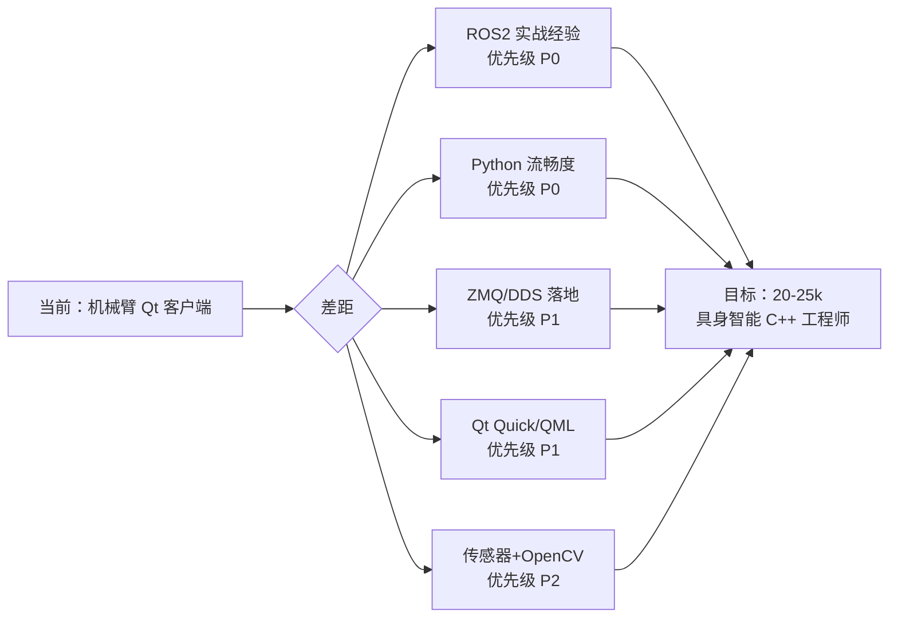

# 24k 月薪目标：知识储备与差距分析

> 基于 2026 年中国 C++ 机器人/具身智能方向的市场行情，结合当前背景做出的分析。

---

## 市场背景

| 城市梯队 | 24k 月薪意味着 | 对应经验 |
|----------|--------------|---------|
| 北京 / 上海 / 深圳 | P6 级，中级工程师 | 3-5 年 |
| 杭州 / 南京 / 广州 | P6-P7，中高级 | 4-6 年 |
| 成都 / 武汉 / 西安 | P7 级，高级工程师 | 5-8 年 |

**具身智能 / 人形机器人赛道**相对于传统工业自动化，薪资溢价约 **20-40%**。2025-2026 年该赛道融资热度持续，供给端人才缺口仍大，是拿高薪的最佳窗口。

---

## 技能层级 vs 薪资锚点

```
薪资区间         核心能力
─────────────────────────────────────────────────────
< 15k            Qt/C++ 基础，仅会 Widgets，无 ROS2
  15k ~ 20k      能用 ROS2，会 Python，有 Linux IPC 基础
  20k ~ 25k      ROS2 有实际项目，ZMQ/DDS 能落地，能做系统方案设计  ← 目标区间
  25k ~ 35k      SLAM / 运动规划经验，架构设计能力，带过人
  35k+           技术专家 / 负责人，核心算法专利 / 论文经历
─────────────────────────────────────────────────────
```

---

## 进入 20-25k 区间的知识清单

### Tier 1：必须（不会则无法过简历关）

| 领域 | 具体要求 | 当前状态 |
|------|---------|---------|
| **C++11/17** | RAII、智能指针、右值/移动语义、模板、多线程 (`std::thread`/`std::atomic`) | 有基础，需深化 |
| **Linux** | 进程/信号/fd、IPC（管道/共享内存/POSIX信号量）、`/proc` 调试 | 有基础，需深化 |
| **ROS2** | Node/Topic/Service/Action/TF2/launch 文件/colcon 构建 | **主要缺口** |
| **Python** | numpy、dataclasses、asyncio、类型注解；能写算法集成脚本 | **主要缺口** |
| **Git 工作流** | branch 策略、rebase vs merge、Code Review 规范 | 已具备 |

### Tier 2：重要加分（有则显著提高竞争力）

| 领域 | 具体要求 |
|------|---------|
| **ZMQ / DDS** | Pub/Sub + Req/Rep；能解释 DDS 的发现机制与 QoS 配置 |
| **Qt Quick / QML** | C++ 后端暴露 `Q_PROPERTY`；Model/View；信号槽跨语言绑定 |
| **OpenCV** | 相机标定、基本图像处理、`cv_bridge` + ROS2 集成 |
| **传感器集成** | LiDAR（PCL 点云）、IMU 坐标系、深度相机 SDK 调用 |
| **CMake / colcon** | 多包构建、`find_package`、target 属性 |
| **SLAM 基础概念** | 能解释 Cartographer / ORB-SLAM2 的前端后端流程（不要求实现） |

### Tier 3：差异化竞争力（决定能否拿到 25k+）

| 领域 | 具体要求 |
|------|---------|
| **仿真** | Gazebo 或 MuJoCo 搭场景、Nav2 导航栈跑通 |
| **运动规划** | MoveIt2 接口使用；能讲轨迹规划的基本框架 |
| **嵌入式部署** | Jetson 或 ARM Linux 的交叉编译、性能调优 |
| **算法能力** | LeetCode 中等题稳定通过；能手写常见图/树算法 |
| **系统设计** | 能在白板上画出多节点 ROS2 系统的数据流，说清楚方案选型理由 |

---

## 关键判断：决定你能否拿到 24k 的核心问题

面试官会这样筛选候选人，问自己能否回答：

1. **你用 ROS2 做过什么实际项目？中间遇到什么问题，怎么解的？**
   - 光回答"跑过 talker/listener" 会被直接 Pass

2. **进程间通信选 ZMQ 还是 DDS，为什么？各自的瓶颈在哪？**
   - 要能从延迟/可靠性/发现机制/序列化成本几个维度比较

3. **你设计过多进程/多节点的机器人系统吗？怎么做故障隔离？**
   - 考察系统架构思维，不只是 coding 能力

4. **给一段有 bug 的多线程代码，分析数据竞争在哪里，怎么修？**
   - 考察 C++ 并发深度，是 24k 以上的门槛题

---

## 你的差距地图



---

## 12 周冲刺后的竞争力预估

| 时间点 | 预计薪资区间 | 前提 |
|--------|------------|------|
| **第 8 周末**（基础补强完成）| 18-20k | Python 能用、ROS2 跑通教程 |
| **第 12 周末**（项目完成）| 20-24k | 有 ROS2 简历项目 + ZMQ Demo |
| **加 3-6 个月实战**（入职后）| 24-28k | 参与真实产品开发，有可量化的交付成果 |

> 24k 不是靠学出来的，是靠**交付出来的**。12 周是拿到 Offer 的最低准备，真正落在 24k 需要入职后 3-6 个月证明自己的系统设计能力。

---

## 行动核心原则

1. **ROS2 > 一切** — 没有 ROS2 项目经验，其他补得再好也进不了具身智能的门
2. **做完一个项目 > 学十个概念** — 面试官看的是「你做过什么」，不是「你知道什么」
3. **能讲清楚 > 会写代码** — 设计模式 / 方案选型 / 取舍理由，比代码本身更重要
4. **算法是保底线** — LeetCode 中等题要能稳定通过，这是所有大厂的筛选门槛
